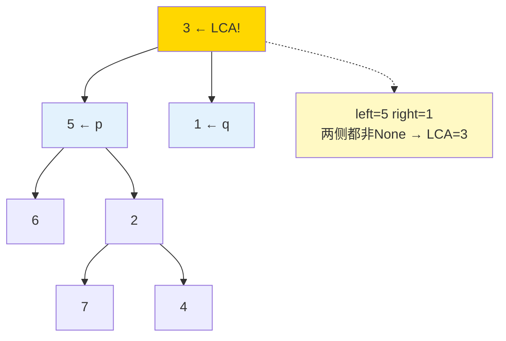
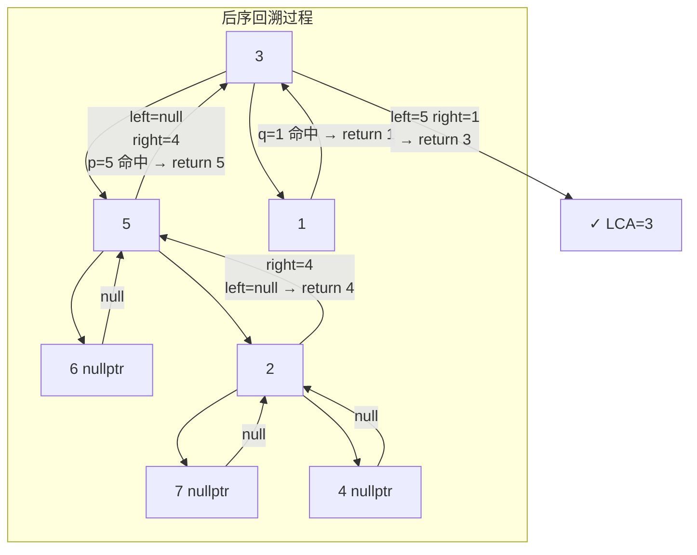

# 236. 二叉树的最近公共祖先（Lowest Common Ancestor of a Binary Tree）

> 难度：中等 | 主题：二叉树、DFS、递归 ⭐常考

## 题目

给定一个二叉树，找到该树中两个指定节点的最近公共祖先（LCA）。

**示例：**
```text
输入：root = [3,5,1,6,2,0,8], p=5, q=1
输出：3
解释：节点 5 和 1 的最近公共祖先是 3
```

---

## 思路

### 先讲个故事：家谱寻祖

你在一本老族谱里找你和某个远亲的**最近共同祖先**。

族谱的查法很特别——从最底层开始往上查：

> 先到你的位置，再到远亲的位置，然后**自底向上**看你们的家族路线从哪里开始重合。

这个"自底向上"的思路就是**后序 DFS**——先看子树，再决定当前节点。

---

### 引导式推导：从路径到递归

**第 1 层：路径比较法**

如果我们可以从根出发走到 p，再走到 q：

```text
根 → ... → LCA → ... → p
根 → ... → LCA → ... → q
```

两条路径的最后一个公共节点就是 LCA。但这个方法需要两遍遍历 + 存路径，空间 O(n)。

**第 2 层：后序 DFS（最优）**

换个角度：**自底向上找，第一个左右子树分别找到了 p 和 q 的节点就是 LCA。**



**递归逻辑：**

对于当前节点 `root`：

1. **终止条件**：空 → None；遇到 p 或 q → 返回该节点（"找到了"）
2. **递归**：左子树找 → left；右子树找 → right
3. **归并判断**：

```text
if left and right → return root    # 分居两侧，root 就是 LCA
if left → return left                # 只在左子树找到
if right → return right              # 只在右子树找到
return None                          # 都没找到
```

**为什么后序能保证找到的是"最近"公共祖先？**

自底向上，第一个满足"左右各找到目标"的节点一定是**最近**的——因为更远的祖先还会满足条件，但已经不会覆盖这个结果了（找到后一路向上返回，不会被覆盖）。



### 优化递进

| 方案 | 时间 | 空间 | 说明 |
|------|------|------|------|
| 路径比较 | O(n) | O(n) | 两次遍历 + 栈记录路径 |
| 后序 DFS | O(n) | O(h) | 递归回溯，最优解 |
| 父指针法 | O(n) | O(h) | 需节点有 parent 域 |

---

## 推荐写法

```python
def lowestCommonAncestor(self, root, p, q):
    if not root or root == p or root == q:
        return root

    left = self.lowestCommonAncestor(root.left, p, q)
    right = self.lowestCommonAncestor(root.right, p, q)

    if left and right:
        return root         # 分居两侧，当前节点是 LCA
    return left or right    # 在同侧
```

**4 行核心逻辑：**
- 终止条件：空 → None；命中 p/q → 返回
- 后序递归：先左右，再判断
- `left and right` → root 是 LCA
- 否则返回非 None 的那个

---

## 复杂度

| 指标 | 值 | 解释 |
|------|----|------|
| 时间 | O(n) | 最坏遍历整棵树 |
| 空间 | O(h) | 递归栈深度，h 为树高 |
| 最坏栈深 | O(n) | 退化为链表时 |

---

## 实战考量

### 频率分析

> **出现在**：字节/阿里/腾讯/美团 高频题。二叉树题中仅次于层序遍历的热门考点。关键在于你**写递归的能力**和**对树遍历的理解深度**。

### 延伸思考

**Q：如果是二叉搜索树（BST）呢？**
A：235二叉搜索树的最近公共祖先 利用大小关系，O(h) 时间 O(1) 空间，不需要 DFS 两边。

**Q：如果节点有父指针呢？**
A：从 p 和 q 分别向上走到根，找第一个交点。或者用哈希集合存 p 的祖先。时间 O(h)，空间 O(h)。

**Q：如果要求多个节点的 LCA 呢？**
A：两两求 LCA，结果再和下一个求。关键性质：LCA(a, b, c) = LCA(LCA(a, b), c)。

**Q：递归和迭代哪个好？**
A：这题递归更简洁。迭代需要手动模拟后序遍历栈，复杂度高，不推荐。

**Q：`return left or right` 怎么理解？**
A：Python 的 `or` 返回第一个真值（非 None）。如果 left 非 None 返回 left，否则返回 right。等价于 `return left if left else right`。

### 易错点

- **漏了终止条件**：`root == p or root == q` 必须要，否则会继续递归到下面
- **返回值的含义混淆**：递归结果可能是 p、q、LCA 或 None，要理清
- **`left and right` 的判断必须在最后**（先递归后判断）

---

## 生活类比

> **后序 DFS 找 LCA → 派对找人**
>
> 你在一个大派对上找两个人。你从门口开始（根节点），让两个助手分别从左边和右边找。
> - 左边助手喊："我找到小明（p）了！"
> - 右边助手喊："我找到小红（q）了！"
> - 那你站的位置就是他们俩的最近碰头点。
>
> 如果只有一个助手找到人，你就继续向上报告。直到有人两个助手都找到了人——**那个人站的位置就是 LCA**。

---

## 相关题目

| 题目 | 关系 |
|------|------|
| 235二叉搜索树的最近公共祖先 | BST 版 LCA，利用大小关系 |
| 124二叉树中的最大路径和 | 也是后序 DFS 经典题 |
| 236二叉树的最近公共祖先 | 本题 |

---

→ 返回题单：[[LeetCode学习清单#五、二叉树]]
