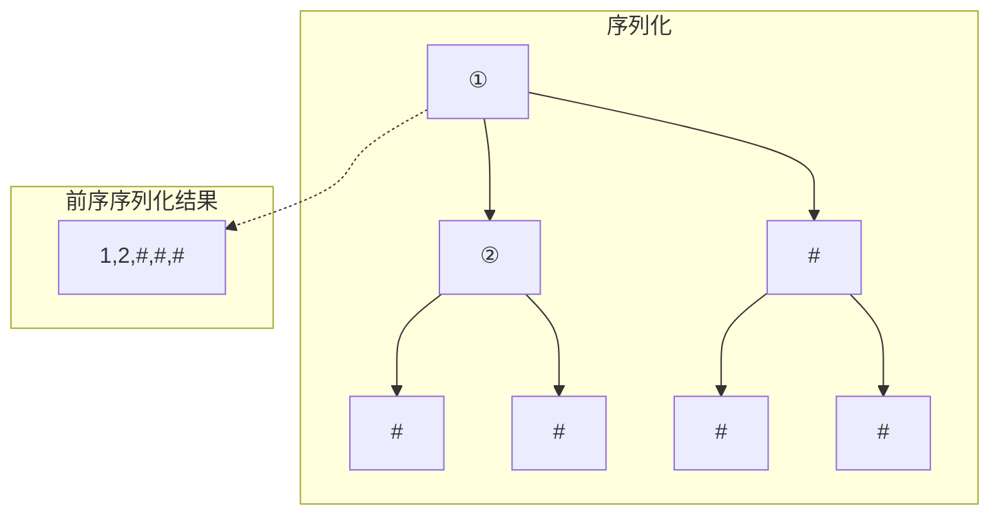
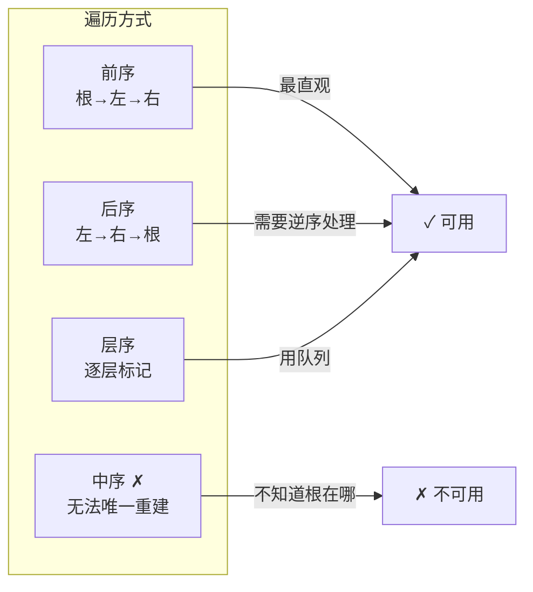

---

title: "二叉树的序列化与反序列化"

difficulty: 困难

category: 二叉树

tags:

  - leetcode

  - 二叉树

created: "2026-07-21"

---

# 297. 二叉树的序列化与反序列化（Serialize and Deserialize Binary Tree）

> 难度：困难 | 主题：二叉树、设计、字符串 ⭐常考

## 题目

设计一个算法，来序列化和反序列化二叉树。序列化是将一棵树转为字符串，反序列化是将字符串还原为树。

**示例：**

```text

输入：root = [1,2,3,null,null,4,5]

输出：[1,2,3,null,null,4,5]（序列化后能还原为原树）

```

---

## 思路
### 先讲个故事：发快递 vs 拆包裹

你在网上买了一棵**盆栽**（二叉树）。卖家要把它打包发快递：

**序列化（打包）**：把一棵立体的树压平成一串字符——就像把盆栽拆解成"根→左枝→右枝"的顺序，每个空杈标记为"空"。

**反序列化（拆包）**：收到字符串后按同样的顺序组装回去。

关键在于：**打包和拆包必须用同一套说明书**（同一遍历顺序），而且空位置必须标记，否则你不知道那个杈上有没有枝。

---

### 引导式推导：为什么空节点必须标记？

先看一个反例。用前序遍历序列化但不标记空节点：

```text

    1         1

   /           \

  2             2

```

两棵树的前序序列都是 `[1, 2]`。不标空节点，反序列化时根本分不清 2 是左子树还是右子树。

**所以空节点必须标记。**



---

### 序列化流派



**为什么中序不行？** 中序序列：左→根→右。反序列化时你不知道序列中哪个值是根节点。

**前序的优势**：第一个 token 一定是根，递归构建左子树和右子树，**很自然地对应了树的递归结构**。

---

## 推荐写法

```python

class Codec:

    def serialize(self, root):

        """前序遍历序列化：根→左→右，# 标记空节点"""

        def dfs(node):

            if not node:

                result.append("#")

                return

            result.append(str(node.val))

            dfs(node.left)

            dfs(node.right)

        result = []

        dfs(root)

        return ",".join(result)

    def deserialize(self, data):

        """前序遍历反序列化：按同一顺序消费 token"""

        vals = data.split(",")

        self.index = 0

        def dfs():

            if vals[self.index] == "#":

                self.index += 1

                return None

            node = TreeNode(int(vals[self.index]))

            self.index += 1

            node.left = dfs()

            node.right = dfs()

            return node

        return dfs()

```

**为什么反序列化能用全局索引？** 前序序列化的字符串是**按顺序"摊平"的**，递归反序列化时 token 顺序和 serialize 的 DFS 顺序完全一致，所以一个全局索引顺序读取就行。

---

### 序列化示例

```text

树：

    1

   / \

  2   3

     / \

    4   5

前序序列化：1,2,#,#,3,4,#,#,5,#,#

反序列化过程：

  索引    token      操作

   0       1     创建节点 1，递归左

   1       2     创建节点 2，递归左

   2       #     left=None，回溯到 2 递归右

   3       #     right=None，回溯到 1 递归右

   4       3     创建节点 3，递归左

   5       4     创建节点 4，递归左

   6       #     left=None，回溯到 4 递归右

   7       #     right=None，回溯到 3 递归右

   8       5     创建节点 5，递归左

   9       #     left=None，回溯到 5 递归右

  10       #     right=None，完成！

```

---

## 复杂度

| 指标 | 值 | 解释 |
|------|----|------|
| 时间 | O(n) | 每个节点访问一次 |
| 空间 | O(n) | 字符串 + 递归栈 |
| 序列化字符串大小 | O(n) | 每个值 + 逗号 + 空标记 |

---

## 实战考量
### 频率分析

> **出现在**：字节/美团/快手 二面或三面设计题。考察**编码设计能力**和**对树结构的理解程度**。约 20% 的二叉树会以此题压轴。

### 延伸思考

**Q：用层序遍历怎么做？**

A：序列化时用队列逐层遍历，空节点也入队。反序列化时同样用队列逐一消费 token。代码比前序长一些，但思路一样。

**Q：如果要求压缩空间呢？**

A：可以用二进制编码代替字符串，或用差分编码。但实践中不需要，提一下即可。

**Q：BST 的序列化能优化吗？**

A：可以。BST 不需要标记空节点——利用上下界就能确定左右子树在哪结束（加分点，不要求实现）。

**Q：为什么中序遍历不行？**

A：反序列化时不知道根节点在序列的哪个位置。前序第一个就是根，后序最后一个就是根，层序也有固定位置——但中序不行。

**Q：`self.index` 改成不用全局变量的写法？**

A：可以用迭代器 `iter(vals)` 配合 `next()`。但实践中全局索引更清晰。

### 易错点

- 空节点忘记标记 → 不同树结构序列化结果相同

- 序列化和反序列化遍历顺序不一致 → 鸡同鸭讲

- 数字转字符串时忘 str，反序列化时忘 int

- 全局索引忘了类变量声明（`self.index`）

---

## 生活类比

> **序列化与反序列化 → 乐高说明书**

>

> 序列化就是拍一张乐高模型的**拼装步骤图"根→左枝→右枝"**，每个空位写上"无零件"。

> 反序列化就是按这张图一步步拼回去——看到"无零件"就跳过，看到零件号就装上。

>

> 另一种理解：**JSON.stringify 和 JSON.parse**——一个把对象压扁成字符串，一个把字符串还原成对象。

---

## 相关题目

| 题目 | 关系 |
|------|------|
| 105从前序与中序遍历序列构造二叉树 | 树重建系列，给定两种遍历序列重建 |
| 297二叉树的序列化与反序列化 | 本题 |

---

→ 返回题单：[[LeetCode学习路线图#五、二叉树]]

## 速记卡（面试闪卡）

**Q1：一句话讲清「297. 二叉树的序列化与反序列化（Serialize and Deserialize Binary Tree）」到底是什么？**

A：把一棵树压平成字符串（序列化），再按同一规则还原成原树（反序列化）；空节点必须标记，否则不同结构会撞车。

**Q2：题目：发快递 vs 拆包裹（serialize/deserialize） —— 怎么理解？**

A：序列化像把盆栽拆成「根→左→右」顺序压成字符，每个空杈标「空」；反序列化按同顺序拼回去。关键是打包拆包用同一套说明书，且空位置必须标记——否则两棵不同树的前序序列可能都是 [1,2]，根本分不清 2 是左还是右。

**Q3：思路：遍历流派与空标记（preorder beats inorder） —— 怎么理解？**

A：前序（根左右）、后序、层序都可用，但中序不行——反序列化时不知根在哪。前序最直观：第一个 token 就是根，递归建左右，天然对应树的递归结构。空节点用 # 占位，保证唯一重建。

**Q4：代码：前序 DFS + 全局索引（Codec） —— 怎么理解？**

A：serialize 前序 DFS，遇空 append('#')；deserialize 用全局 index 顺序消费 token，遇 # 返回 None 并回溯。因序列化是按 DFS 顺序摊平的，反序列化 token 顺序完全一致，一个全局索引就够，不用额外栈。

**Q5：复杂度与实战（O(n)，常考设计题） —— 怎么理解？**

A：时间 O(n) 每节点一次；空间 O(n) 字符串+递归栈。实战：字节/美团/快手设计题压轴，考编码设计与树理解。易错：忘标空→结构撞车；序列化反序列化顺序不一致→鸡同鸭讲；全局索引要写成类变量 self.index。BST 可借上下界省去空标记（加分点）。

**Q6：核心速记主线有哪些？**

- 题目：树⇄字符串，空节点必须标记

- 思路：前序最直观，中序无法重建（不知根）

- 代码：前序 DFS 摊平 + 全局 index 消费

- 复杂度：时间 O(n)，空间 O(n)

- 实战：常考设计题；别忘标空、顺序要一致

**口诀**

A：序列反序树要标，

前序根先莫乱调；

空位不记两树淆，

同序拼回原样好。

## 相关链接

- [[笔记/Leetcode笔记/05_二叉树/236二叉树的最近公共祖先|二叉树的最近公共祖先]]

- [[笔记/Leetcode笔记/05_二叉树/543二叉树的直径|二叉树的直径]]

- [[笔记/Leetcode笔记/05_二叉树/199二叉树的右视图|二叉树的右视图]]

- [[笔记/Leetcode笔记/05_二叉树/145二叉树的后序遍历|二叉树的后序遍历]]

- [[笔记/Leetcode笔记/05_二叉树/104二叉树的最大深度|二叉树的最大深度]]

