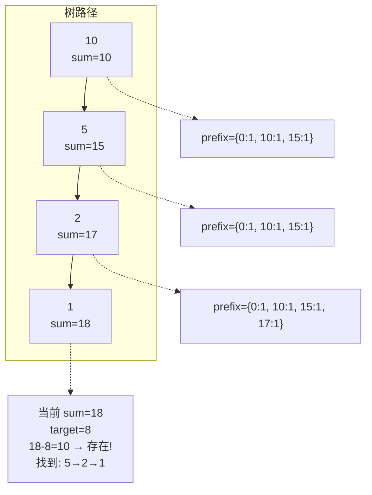
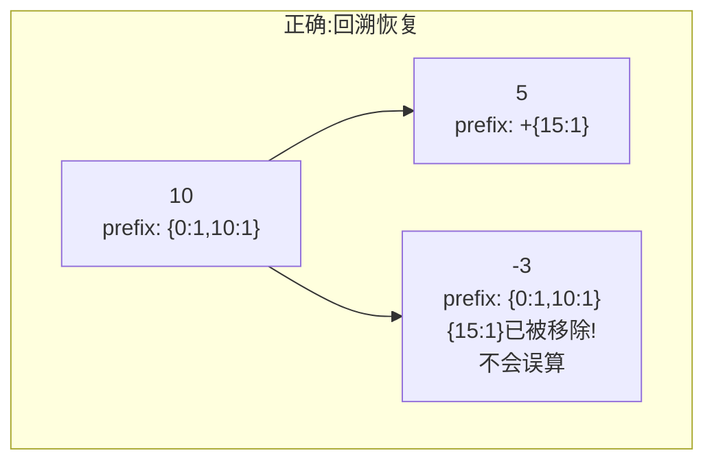

---

title: "路径总和III"

difficulty: 中等

category: 二叉树

tags:

  - leetcode

  - 二叉树

created: "2026-07-21"

---

# 437. 路径总和 III（Path Sum III）

> 难度：中等 | 主题：二叉树、DFS、前缀和 ⭐常考

## 题目

给定一个二叉树的根节点和一个整数 `targetSum`，求该二叉树里节点值之和等于 `targetSum` 的路径的数目。路径不需要从根节点开始，也不需要在叶子节点结束，但必须是向下的（只能从父节点到子节点）。

**示例：**

```text

输入：root = [10,5,-3,3,2,null,11,3,-2,null,1], targetSum = 8

输出：3

```

三条路径：

- 5 → 3

- 5 → 2 → 1

- -3 → 11

---

## 思路
### 先讲个故事：记账本上查流水

你在检查这个月的流水，想看有多少笔连续支出加起来正好等于 **8 元**。

你的记账本长这样——从月初到月底逐日记账，但**中间可能有几天没花钱**（相当于路径不一定要从根开始）。你要找的是：**任意连续几天的支出之和等于 8**。

这个小故事其实就是 **前缀和** 的思想（[[560和为K的子数组]]）。现在把它搬到了树上——"从根到当前节点"的路径相当于"从月初到今天"的账本。

---

### 引导式推导：从双重 DFS 到前缀和

**第 1 层：双重 DFS（O(n²)）**

最直接的想法——每个节点都作为起点试一次：

```python

def dfs(node):

    if not node: return

    check_sum(node, targetSum)  # 从当前节点往下找

    dfs(node.left)              # 换左子树节点当起点

    dfs(node.right)             # 换右子树节点当起点

```

对每个节点都要往下 DFS 一遍。n=5000 时还在可接受范围，再大就慢了。

**第 2 层：前缀和优化（O(n)）——灵光一现**



**核心公式：**

> 路径和 = 前缀和之差

> `curr_sum - prev_sum = targetSum`

> → `prev_sum = curr_sum - targetSum`

如果 `curr_sum - targetSum` 在前缀和哈希表中出现过，说明存在一条以当前节点结尾的路径满足条件。

**关键细节：**

| 步骤 | 说明 |
|------|------|
| `prefix_count[0] = 1` | 处理从根开始的路径（前缀和为 0 的空路径） |
| 遍历时 +1 | 把当前前缀和记入哈希表 |
| 回溯时 -1 | **必须恢复现场**，避免路径分叉（路径只能从上到下，不能跨分支） |

**为什么回溯时一定要减 1？**



如果离开左子树时不把 `prefix[15]` 减 1，右子树计算时会把左子树的路径也算进去——路径从上往下不能跨分支。

---

### 优化递进

| 方案 | 时间 | 空间 | 说明 |
|------|------|------|------|
| 双重 DFS | O(n²) | O(h) | 每个节点为起点往下搜 |
| 前缀和优化 | O(n) | O(h) | 哈希表存前缀和，回溯恢复 |

---

## 推荐写法

```python

def pathSum(self, root, targetSum):

    from collections import defaultdict

    prefix_count = defaultdict(int)

    prefix_count[0] = 1        # 空路径前缀和为 0

    self.count = 0

    def dfs(node, curr_sum):

        if not node:

            return

        curr_sum += node.val

        # 关键：有多少条已有路径可以和当前路径拼出 target

        self.count += prefix_count[curr_sum - targetSum]

        prefix_count[curr_sum] += 1

        dfs(node.left, curr_sum)

        dfs(node.right, curr_sum)

        prefix_count[curr_sum] -= 1   # 回溯：离开当前节点，恢复现场

    dfs(root, 0)

    return self.count

```

---

## 复杂度

| 指标 | 值 | 解释 |
|------|----|------|
| 时间 | O(n) | 每个节点一次 |
| 空间 | O(h) | 递归栈 + 哈希表最多存 h 个前缀和 |
| 双重 DFS | O(n²) | n=5000 时 ~2500 万次操作 |

---

## 实战考量
### 频率分析

> **出现在**：字节/阿里/腾讯 二面或三面中档难度题。关键在于**能否把一维数组的前缀和推广到树上**，同时考察**回溯恢复**的意识。

### 延伸思考

**Q：如果要求返回所有路径（不只是计数）呢？**

A：哈希表不存 count 而是存节点列表。找到后回溯收集路径上的节点。注意空间会变大。

**Q：为什么要用 `defaultdict(int)`？**

A：`prefix_count[curr_sum - targetSum]` 在 key 不存在时返回 0，不会抛 KeyError。

**Q：`prefix_count[0] = 1` 是什么意思？**

A：空路径的前缀和是 0。如果某个节点的 `curr_sum == targetSum`，那么 `curr_sum - targetSum = 0`，hash 表里有 1 表示"有一条空路径可以和你拼出 target"——即从根到当前节点的路径本身就是一种答案。

**Q：空间能优化吗？**

A：不能。必须存前缀和才能 O(n) 时间。如果空间敏感可以用双重 DFS 但 O(n²) 时间。

**Q：这题和 560 什么关系？**

A：[[560和为K的子数组]] 是数组版的前缀和，本题是把线性结构推广到了树形结构。核心思想完全一样，只是多了**回溯恢复**这一步。

### 易错点

- `prefix_count[0] = 1` 忘了初始化

- 回溯时不减 1 → 路径跨分支，结果偏大

- `curr_sum` 用整数不会溢出，但注意 Python 的 int 是无限的

- 用全局变量 `self.count` 而不是 nonlocal（在类方法里用 self 更简洁）

---

## 生活类比

> **前缀和找路径 → 记账查连续支出**

>

> 你每个月记流水账，每天记下到今天的总花销（前缀和）。

> 想知道某段连续支出是否等于 target → 看"今天总花销 - target"是否等于之前某天的总花销。

>

> 在树上的区别是：**每条分支单独记账**。走完左分支回到分叉口时，要把左分支的账本收起来，不能带到右分支去（回溯恢复）。

---

## 相关题目

| 题目 | 关系 |
|------|------|
| [[560和为K的子数组]] | 一维前缀和，本题的数组基础版 |
| 112路径总和 | 简单版：必须从根到叶子 |
| [[437路径总和III]] | 本题 |

---

→ 返回题单：[[LeetCode学习路线图#五、二叉树]]

## 速记卡（面试闪卡）

**Q1：一句话讲清「437. 路径总和 III（Path Sum III）」到底是什么？**

A：把数组前缀和推广到树：哈希表记根到当前前缀和，curr-target 在表即一条路径。

**Q2：一、题目：向下路径凑 target —— 怎么理解？**

A：像数一数账本里连续几天支出恰好等于 8 元：给二叉树与 target，求向下路径（不必根始、不必叶终）和等于 target 的数目（Path Sum III）。

**Q3：二、思路：前缀和搬上树 —— 怎么理解？**

A：像记账查连续支出：今天总花销 - target = 之前某天总花销，就有一条（Prefix sum）。树上是 curr_sum - targetSum 在前缀哈希表里出现过，即一条以当前节点结尾的路径。

**Q4：三、代码：哈希 + 回溯 —— 怎么理解？**

A：像分支各自记账：dfs 时把 curr_sum 记入哈希、count += 表里 curr-target 的个数；离开节点必须 -1 恢复现场，否则路径跨分支（Backtracking）。prefix[0]=1 处理从根起的路径。

**Q5：四、复杂度与实战：常考题 —— 怎么理解？**

A：时间 O(n)、空间 O(h)。字节/阿里/腾讯中档题，考能否把一维前缀和推广到树并记得回溯（Prefix sum on tree）。返回路径本身则存节点列表。

**Q6：核心速记主线有哪些？**

- 思路：前缀和 curr_sum - targetSum 在哈希表出现过即一条路径

- 代码：dfs 记前缀和，count += prefix[curr-target]，回溯 -1

- 细节：prefix[0]=1 处理从根开始；defaultdict 避免 KeyError

- 复杂度：时间 O(n) 空间 O(h)；双重 DFS 为 O(n²)

- 关联：560 和为K子数组的树形版

**口诀**

A：路径总和上树算，

前缀和来把账翻；

curr减target存在，

回溯减一别跨栏。

## 相关链接

- [[笔记/Leetcode笔记/05_二叉树/112路径总和|路径总和]]

- [[笔记/Leetcode笔记/05_二叉树/236二叉树的最近公共祖先|二叉树的最近公共祖先]]

- [[笔记/Leetcode笔记/05_二叉树/230二叉搜索树中第K小的元素|二叉搜索树中第K小的元素]]

- [[笔记/Leetcode笔记/05_二叉树/235二叉搜索树的最近公共祖先|二叉搜索树的最近公共祖先]]

- [[笔记/Leetcode笔记/05_二叉树/226翻转二叉树|翻转二叉树]]

