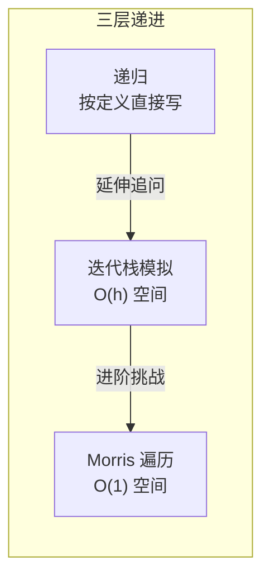

---

title: "二叉树的中序遍历"

difficulty: 简单

category: 二叉树

tags:

  - leetcode

  - 二叉树

created: "2026-07-21"

---

# 94. 二叉树的中序遍历（Binary Tree Inorder Traversal）

> 难度：简单 | 主题：二叉树、DFS、栈、递归

## 题目

给定二叉树的根节点 root，返回它的中序遍历（左 → 根 → 右）。

**示例**

```text

输入：root = [1,null,2,3]

输出：[1,3,2]

```

---

## 思路
### 先讲个故事：读一本嵌套章节的书

想象你在读一本**每章都有"前置阅读"和"后续阅读"**的书：

- 要读第 1 章：必须先读完它的"前置章节"（左子树）

- 读完第 1 章正文后：再读它的"后续章节"（右子树）

这不就是中序遍历吗？——**左 → 根 → 右**。

---

### 三层递进：从直觉到最优



**第 1 层：递归（最直观）**

中序遍历的定义就是"左→根→右"，照写：

```python

def inorder(root):

    if not root: return

    inorder(root.left)   # 先左

    print(root.val)      # 再根

    inorder(root.right)  # 后右

```

递归隐式使用了系统调用栈，每个节点恰好访问一次，O(n)。

**第 2 层：迭代栈模拟（常考）**

延伸提问："不用递归能实现吗？"

→ 手动模拟递归栈，核心思想：**左到底 → 弹栈访问 → 转右子树**

```text

while 有节点没处理:

    while 当前节点非空:

        入栈 ← 当前节点

        向左走

    弹栈 → 访问

    向右走

```

模拟一下：

```text

    ①         栈 = []

   ↙ ↘        curr = ①

  ②   ③

 ↙ ↘

④   ⑤

④→②→⑤→①→③

  步骤         栈状态              输出

  1向左到底    [①, ②, ④]           —

  2弹栈访问    [①, ②]           → ④

  3④无右子树   [①, ②]           —

  4弹栈访问    [①]              → ②

  5转到⑤      [①, ⑤]           —

  6向左到底    [①, ⑤]           —

  7弹栈访问    [①]              → ⑤

  8弹栈访问    []               → ①

  9转到③      [③]              —

  10弹栈访问   []               → ③

```

**第 3 层：Morris 遍历（O(1) 空间，了解即可）**

利用线索二叉树（threaded binary tree）——把空闲的右指针临时指向中序后继节点。遍历完恢复原结构。

```text

curr = root

while curr:

    if curr.left 为空:

        访问 curr

        curr = curr.right        # 转向后继（可能是线索指针）

    else:

        找 curr 的前驱节点（左子树的最右节点）

        如果前驱的 right 为空：

            前驱.right = curr    # 建立线索（指向中序后继）

            curr = curr.left     # 继续向左深入

        如果前驱的 right == curr（已被线索化）：

            前驱.right = None    # 恢复原结构

            访问 curr            # 中序访问

            curr = curr.right    # 转向右子树

```

不要求手写，但能说出原理体现深度。

---

## 代码（迭代版，推荐）

```python

def inorderTraversal(self, root):

    result = []              # 存储遍历结果

    stack = []               # 手动模拟递归栈

    curr = root              # 当前指针

    while curr or stack:     # 还有节点没走完或栈里还有待访问节点

        while curr:          # 左到底：沿左子树一路压栈

            stack.append(curr)

            curr = curr.left

        curr = stack.pop()           # 弹栈：取出最左的未访问节点

        result.append(curr.val)      # 中序访问：处理根节点

        curr = curr.right            # 转向右子树，下轮循环会走它的左到底

    return result

```

**口诀**：「左到底，弹栈访，转右边。」

---

## 复杂度

| 方法 | 时间 | 空间 |
|------|------|------|
| 递归 | O(n) | O(h)（系统栈） |
| **迭代** | **O(n)** | **O(h)** |
| Morris | O(n) | O(1) |

h 是树高：平衡树 O(log n)，退化链 O(n)。

---

## 实战考量
### 频率分析

> **出现在**：几乎每场二叉树的**热身题**。20% 常会从遍历开始。迭代版是高频追问，**不会写迭代版容易被减分**。

### 延伸思考

**Q：递归和迭代的时间复杂度一样吗？**

A：都是 O(n)，每个节点访问一次。空间上递归用系统栈 O(h)，迭代用手动栈 O(h)，没有本质区别。Morris 才是真正的 O(1) 空间。

**Q：前序和后序的迭代怎么写？**

A：

- **前序**（根→左→右）：入栈右→左，出栈访问。或者 `while curr:` 时先访问再入栈左子树。

- **后序**（左→右→根）：较复杂，用标记法或双栈法。标记法：记录每个节点的访问状态（第一次入栈等待，第二次再弹栈访问）。

**Q：Morris 遍历的原理是什么？**

A：利用左子树最右节点的空右指针，指向当前节点（中序后继）。遍历到该节点时通过线索找到后继，然后恢复原结构。核心是"借指针，用还还"。

**Q：中序遍历对 BST 有什么用？**

A：BST 的中序遍历是严格递增序列。98验证二叉搜索树 可以用中序遍历来验证。

### 易错点

- `while curr or stack`：不是 `while stack`。因为 root 为空时 stack 也是空的，但 curr 为空还需要弹栈

- 迭代版是**先左到底再弹栈**，不是**先弹栈再左走**

- 递归版不要忘记 `if not root: return`

---

## 生活类比

> **中序 → 按顺序读嵌套章节**

>

> 你有一本书，每章都有前置阅读和后续阅读。

> 中序遍历就是：把前置阅读全部读完 → 读当前章 → 读后续章节。

>

> 迭代法就是：在书桌上放一摞书（栈），先一直往前翻前置章节，

> 翻到不能再前了，回头看最后一本，读完正文，再翻它的后续章节。

---

## 相关题目

| 题目 | 关系 |
|------|------|
| 144二叉树的前序遍历 | 前序/中序/后序三兄弟 |
| 145二叉树的后序遍历 | 前序/中序/后序三兄弟 |
| 102二叉树的层序遍历 | BFS 遍历 |
| 98验证二叉搜索树 | 中序在 BST 上的应用 |
| 105从前序与中序遍历序列构造二叉树 | 经典二叉树重建问题 |

---

→ 返回题单：[[LeetCode学习路线图#五、二叉树]]

## 速记卡（面试闪卡）

**Q1：一句话讲清「94. 二叉树的中序遍历（Binary Tree Inorder Traversal）」到底是什么？**

A：按左→根→右顺序，把二叉树的节点走一遍。

**Q2：思路：递归到迭代栈到 Morris —— 怎么理解？**

A：像读一本每章都有前置阅读的书：中序遍历（Inorder Traversal）就是先读完左子树这章、再读当前章、后读右子树。系统调用栈（Call Stack）就是书桌上的那摞书，递归（Recursion）帮你自动翻。

**Q3：代码：迭代栈模拟 —— 怎么理解？**

A：不想靠系统栈？自己用栈（Stack）手动模拟：左到底压栈，弹栈访问，再转右子树——口诀「左到底，弹栈访，转右边」。

**Q4：复杂度：三种写法对比 —— 怎么理解？**

A：递归和迭代时间复杂度（Time Complexity）都是 O(n)，空间靠栈 O(h)；Morris 遍历（Morris Traversal）借指针把空间压到 O(1)，堪称抠门大师。

**Q5：生活类比：翻书找章 —— 怎么理解？**

A：迭代法就是桌上放一摞书（Stack），一路往前翻前置章节，翻不动了回头看最后一本读正文，再翻后续——中序遍历（Inorder Traversal）的具象版。

**Q6：核心速记主线有哪些？**

- 顺序左→根→右别乱

- 迭代栈：左到底弹栈访

- Morris 空间压到 O(1)

- 不会迭代容易被减分

**口诀**

A：中序左根右成行，

迭代弹栈转向旁。

Morris 借针空间降，

翻书遍遍记心房。

## 相关链接

- [[笔记/Leetcode笔记/05_二叉树/144二叉树的前序遍历|二叉树的前序遍历]]

- [[笔记/Leetcode笔记/05_二叉树/145二叉树的后序遍历|二叉树的后序遍历]]

- [[笔记/Leetcode笔记/05_二叉树/102二叉树的层序遍历|二叉树的层序遍历]]

- [[笔记/Leetcode笔记/05_二叉树/103二叉树的锯齿形层序遍历|二叉树的锯齿形层序遍历]]

- [[笔记/Leetcode笔记/05_二叉树/105从前序与中序遍历序列构造二叉树|从前序与中序遍历序列构造二叉树]]

