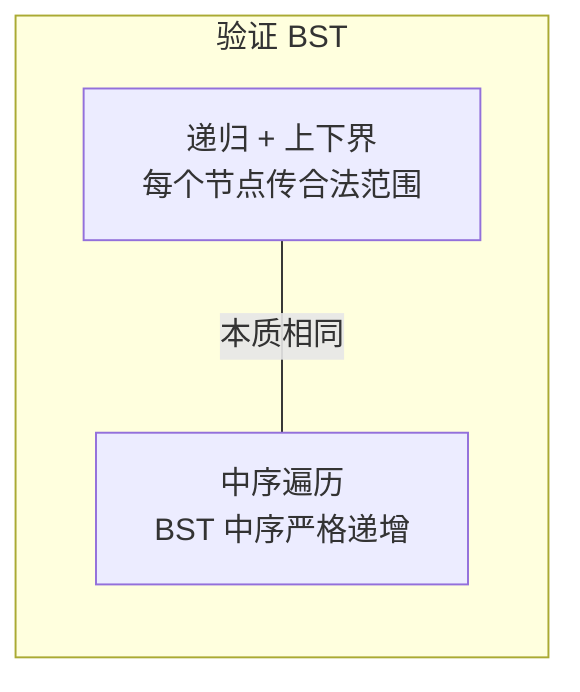

# 98. 验证二叉搜索树（Validate Binary Search Tree）

> 难度：中等 | 主题：二叉树、DFS、中序遍历

## 题目

给你二叉树的根节点 root，判断它是否是一个有效的二叉搜索树（BST）。

**BST 定义：**
- 左子树 **所有** 节点值 < 根节点值
- 右子树 **所有** 节点值 > 根节点值
- 左右子树也是 BST

**示例**
```text
输入：root = [2,1,3]
输出：true

反例：[5,4,6,null,null,3,7] → false
     5
    / \
   4   6
      / \
     3   7
3 在 5 的右子树中，但 3 < 5，违反了 BST 定义
```

---

## 思路

### 先讲个故事：档案室的编号规则

想象一个档案室，文件柜的编号规则是：
- 左柜所有文件编号 < 当前柜编号
- 右柜所有文件编号 > 当前柜编号
- 子柜也要遵守同样的规则

你要检查这个档案室是否符合规则。

**直觉陷阱**：大部分人只检查"左孩子 < 根 < 右孩子"——这不够！
因为 3 可以是 6 的左孩子（3 < 6 ✅），但它在 5 的右子树中（3 < 5 ❌）。

正确做法：**给每个节点一个合法的数值范围**。

---

### 两种解法：上下界 vs 中序



**解法 1：递归 + 上下界（推荐）**

每个节点都有一个合法的取值范围 `(lower, upper)`：
- 根节点：`(-∞, +∞)`，任何值都行
- 左子树节点：`(lower, root.val)`——上界压缩为根值，因为左子树所有节点 < 根
- 右子树节点：`(root.val, upper)`——下界压缩为根值，因为右子树所有节点 > 根

```text
               5  (-∞, +∞)
              / \
    (-∞,5)  4   6  (5, +∞)
               / \
        (5,6) 3   7  (6, +∞)
              ❌ 3 < 5 → false
```

向子节点传递范围时，范围不断收窄——像一个"漏斗"。

**解法 2：中序遍历**

BST 的核心性质：**中序遍历结果严格递增**。

```text
中序：左 → 根 → 右
BST： 小 → 中 → 大
```

遍历时维护上一个节点值 `prev`，每访问一个节点就检查 `当前值 > prev`。一旦发现 ≤ prev，就不是 BST，提前终止。

---

## 代码

```python
# 方法 1：递归 + 上下界（推荐，最直观）
def isValidBST(self, root):
    def helper(node, lower=float('-inf'), upper=float('inf')):
        # lower: 当前节点值的下界（开区间）
        # upper: 当前节点值的上界（开区间）
        if not node:
            return True                     # 空节点不违反规则

        if node.val <= lower or node.val >= upper:
            return False                    # 值超出合法范围

        if not helper(node.left, lower, node.val):
            return False                    # 左子树：上界压缩为当前值
        if not helper(node.right, node.val, upper):
            return False                    # 右子树：下界压缩为当前值

        return True

    return helper(root)

# 方法 2：中序遍历（利用 BST 中序递增性质）
def isValidBST(self, root):
    self.prev = None                        # 记录中序前驱值

    def inorder(node):
        if not node:
            return True

        if not inorder(node.left):          # 中序：先左
            return False

        # 中序：访问根，检查严格递增
        if self.prev is not None and node.val <= self.prev:
            return False
        self.prev = node.val                # 更新前驱

        return inorder(node.right)          # 中序：后右

    return inorder(root)
```

**两种方法怎么选？**

- **上下界法**：思维更接近 BST 定义，推荐优先写
- **中序法**：写起来更短，但需要理解 BST 中序递增的性质

---

## 复杂度

| 指标 | 值 | 解释 |
|------|----|------|
| 时间 | O(n) | 每个节点访问一次 |
| 空间 | O(h) | 递归栈深度，最坏 O(n)（斜树） |

---

## 实战考量

### 频率分析

> **出现在**：二叉树**最常考题之一**，约 50% 轮次会出现。
> 字节/美团/阿里 重点掌握点——**70% 的候选人会犯"只比较左右孩子"的错误**。

### 延伸思考

**Q：为什么只比较左右孩子不够？**
A：反例 `[5,4,6,null,null,3,7]` — 每个节点都满足"左孩子 < 根 < 右孩子"（4<5✅, 3<6✅, 6<7✅），但 3 在 5 的右子树中却小于 5，整体不是 BST。

**Q：上下界为什么用开区间？**
A：BST 定义是"左子树所有节点**小于**根"，不是"小于等于"。开区间 `(lower, upper)` 精确对应"严格小于/大于"。如果用闭区间，`val <= lower` 写为 `val < lower` 也可以，但开区间的概念更贴近定义。

**Q：如果树中有重复值，算 BST 吗？**
A：经典定义下不算。本题要求严格递增（`<=` 返回 False）。如果题目允许重复值在左子树，那左子树的边界就是 `<=` 了。

**Q：中序遍历能提前终止吗？**
A：可以。一旦发现 `node.val <= self.prev`，立即返回 False，不用遍历完整棵树。这叫"短路"。

**Q：中序遍历怎么处理 prev 初始值？**
A：`prev = None`，第一个中序节点没有前驱，跳过比较。中序第一个值是最左节点，它可以是任何值。

### 易错点

- 上下界法：参数是 `lower` 和 `upper`，左子树传 `(lower, root.val)`，右子树传 `(root.val, upper)`——容易写反
- 开区间条件：`val <= lower or val >= upper`，不是 `<` 和 `>`
- 中序法：`prev` 用 `self.prev` 而不是局部变量——递归中需要跨调用层访问
- `float('inf')` 而不是 `sys.maxsize`——节点值可能比 int 最大还大（虽然题目不会，但习惯用 inf 更安全）

---

## 生活类比

> **上下界法 → 档案柜编号检查**
>
> 想象你在检查档案室编号规则：
> 走到 5 号柜，你说："左柜的号不能超过 5，右柜的号不能低于 5。"
> 走到 6 号柜（5 的右柜），你补充："左柜的号要在 5~6 之间，右柜的号要高于 6。"
> 走到 3 号柜（6 的左柜），你发现 3 < 5 → 违反规则！
>
> 每一次向下传递范围都在收窄，就像在坐标轴上不断缩小合法区间。

---

## 相关题目

| 题目 | 关系 |
|------|------|
| 235二叉搜索树的最近公共祖先 | 利用 BST 有序性定位 LCA |
| 230二叉搜索树中第K小的元素 | BST 中序有序的应用 |
| 108将有序数组转换为二叉搜索树 | 从有序序列构造 BST |
| 94二叉树的中序遍历 | 中序法的基础 |

---

→ 返回题单：[[LeetCode学习清单#五、二叉树]]
