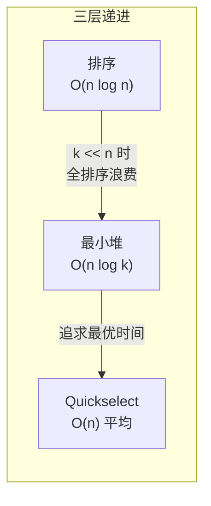

---

title: "数组中的第K个最大元素"

difficulty: 中等

category: 堆

tags:

  - leetcode

  - 堆

created: "2026-07-21"

---

# 215. 数组中的第K个最大元素（Kth Largest Element in an Array）

> 难度：中等 | 主题：堆、快速选择、分治

## 题目

给定整数数组 nums 和整数 k，返回数组中第 k 个最大的元素。注意要找的是排序后的第 k 个最大元素，不是第 k 个不同的元素。

**示例**

```text

输入：nums = [3,2,1,5,6,4], k = 2

输出：5

```

---

## 思路
### 先讲个故事：成绩单上的第 K 名

期末考试后，老师让你找出全班第 K 高的分数。你会怎么做？

最直接的想法：把全班的分数从高到低排个序，取第 K 个。但更聪明的方式是——只关心分数最高的 K 个人，用一个"小本子"记下他们，其他人不用管。

**第 K 大 = 升序排序后倒数第 K 个 = 索引 n-k 的元素。**

### 引导式推导：三层递进



**第 1 层：排序**

`sort()` 后取 `nums[n-k]`。简单，但不是最优。

**第 2 层：最小堆（推荐）**

维护一个大小为 k 的小顶堆，遍历数组：

- 堆没满 → 直接入堆

- 堆满了且当前元素 > 堆顶 → 弹出堆顶，入堆当前元素

堆里始终存着"当前遇到的最大的 k 个数"，堆顶是这 k 个里的最小值——就是第 k 大。

```text

nums = [3,2,1,5,6,4], k = 2

堆操作:

① 3 入堆 → [3]

② 2 入堆 → [2,3]（堆大小=k ✓）

③ 1 < 堆顶 2 → 跳过

④ 5 > 堆顶 2 → pop(2), push(5) → [3,5]

⑤ 6 > 堆顶 3 → pop(3), push(6) → [5,6]

⑥ 4 < 堆顶 5 → 跳过

结果：堆顶=5 ✓

```

**第 3 层：Quickselect（最优时间）**

基于快排的 partition，每次选一个 pivot，根据其位置决定递归哪一侧——只递归包含目标的那一半。

```text

找第 2 大（n-k=4）:

[3,2,1,5,6,4] → pivot=4 → [3,2,1,|4|,5,6]

  pivot 在索引 3 < 目标 4，递归右边

[5,6] → pivot=6 → [5,|6|]

  pivot 在索引 5 > 目标 4，递归左边

[5] → 只剩索引 4 → 返回 5 ✓

```

---

## 代码

```python

import heapq

# 方法1：最小堆（稳妥写法）

def findKthLargest(self, nums, k):

    min_heap = []

    for num in nums:

        heapq.heappush(min_heap, num)

        if len(min_heap) > k:

            heapq.heappop(min_heap)

    return min_heap[0]

# 快速选择（Quickselect）

def findKthLargest(self, nums, k):

    return self.quickselect(nums, 0, len(nums) - 1, len(nums) - k)

def quickselect(self, nums, left, right, k):

    if left == right:

        return nums[left]

    pivot_idx = self.partition(nums, left, right)

    if pivot_idx == k:

        return nums[pivot_idx]

    elif pivot_idx > k:

        return self.quickselect(nums, left, pivot_idx - 1, k)

    else:

        return self.quickselect(nums, pivot_idx + 1, right, k)

def partition(self, nums, left, right):

    pivot = nums[right]

    i = left

    for j in range(left, right):

        if nums[j] <= pivot:

            nums[i], nums[j] = nums[j], nums[i]

            i += 1

    nums[i], nums[right] = nums[right], nums[i]

    return i

```

## 复杂度

| 指标 | 值 | 解释 |

|------|----|------|

| 最小堆时间 | O(n log k) | 每个元素入堆出堆一次 |

| 最小堆空间 | O(k) | 堆大小不超过 k |

| Quickselect | O(n) 平均，O(n²) 最坏 | 只递归一半，概率保证 |

---

## 实战考量
### 频率分析

> **出现在**：常见核心题，字节/阿里/美团等几乎必考。两种写法都要会——**先写堆再提 Quickselect** 会显著加分。约 50% 常会从这道题延伸讨论大数据场景。

### 延伸思考

**Q：Quickselect 最坏为什么是 O(n²)？怎么优化？**

A：每次 pivot 选到最大/最小，退化为单边递归。优化：随机选 pivot 或三数取中法。

**Q：如果 K 很大（接近 n），哪种方法更好？**

A：堆变成 O(n log n)，Quickselect 仍是 O(n)，Quickselect 更优。

**Q：如果数据流不断进来，找动态第 K 大呢？**

A：维护大小为 K 的最小堆，新数据比堆顶大就替换。这就是 295/703 题的思路。

**Q：如果找第 K 小呢？**

A：维护大小为 K 的最大堆，或 Quickselect 找索引 k-1。

**Q：最小堆里存的是什么？**

A：存的是"最大的 k 个数"，堆顶是这 k 个里的最小值——即第 k 大。

### 易错点

- 最小堆堆顶是第 k 大，**不是最大堆**

- Quickselect 的 k 是升序索引 `n-k`，不是第 k 大

- 堆超过 k 时要 pop，不要忘记

---

## 生活类比

> **第 K 大 → 用一个小本本记下最大的 K 个人**

>

> 你不需要知道全班每个人的分数——只需要一个能记下 K 个人的小本子，每当发现一个新分数比本子上最低的高，就把最低的划掉，写上新的。

>

> Quickselect 更聪明：像一个面试官，每次拿一份简历当基准（pivot），说"比这个好的站右边，比这个差的站左边"，然后只去人多的那边继续找。

---

## 相关题目

| 题目 | 关系 |

|------|------|

| [[347前K个高频元素]] | 堆 + 哈希表，Top K 模式 |

| 912排序数组（手撕快排） | Quickselect 基于 partition |

| 295数据流的中位数 | 双堆设计 |

---

→ 返回题单：[[LeetCode学习路线图#六、堆]]

## 速记卡（面试闪卡）

**Q1：一句话讲清「215. 数组中的第K个最大元素（Kth Largest Element in an Array）」到底是什么？**

A：在数组中找出排序后第 k 个最大的元素。

**Q2：思路 —— 怎么理解？**

A：像老师找全班第 k 高的分：最笨是排个序取第 k 个；聪明是只记最大的 k 人。推荐 Min-heap（最小堆）存最大 k 个，堆顶即第 k 大。

**Q3：代码 —— 怎么理解？**

A：最小堆法：遍历数组，堆未满就入，满了且当前>堆顶就弹顶入新；堆顶即答案。Quickselect 用 partition 只递归含目标那半。

**Q4：复杂度 —— 怎么理解？**

A：最小堆时间 O(n log k)、空间 O(k)；Quickselect 平均 O(n)、最坏 O(n²)（pivot 总选到极值）。

**Q5：实战考量 —— 怎么理解？**

A：字节/阿里/美团近必考，先写堆再提 Quickselect 加分。易错：堆顶是第 k 大不是最大；Quickselect 的 k 是升序索引 n-k。

**Q6：核心速记主线有哪些？**

- 最小堆存最大 k 个，堆顶即第 k 大

- 堆满且当前>堆顶才替换，保持 O(k) 大小

- 最小堆 O(n log k)，Quickselect 平均 O(n)

- 易错：用最小堆非最大堆，k 取 n-k 索引

**口诀**

A：第k大怎么找

小顶堆里瞄

最大k个存

堆顶就是宝

## 相关链接

- [[笔记/Leetcode笔记/06_堆/347前K个高频元素|前K个高频元素]]

- [[笔记/Leetcode笔记/06_堆/295数据流的中位数|数据流的中位数]]

- [[笔记/Leetcode笔记/06_堆/00-解题模板|堆 解题模板]]

- [[笔记/Leetcode笔记/01_数组与哈希/26删除有序数组中的重复项|删除有序数组中的重复项]]

- [[笔记/Leetcode笔记/01_数组与哈希/41缺失的第一个正数|缺失的第一个正数]]

