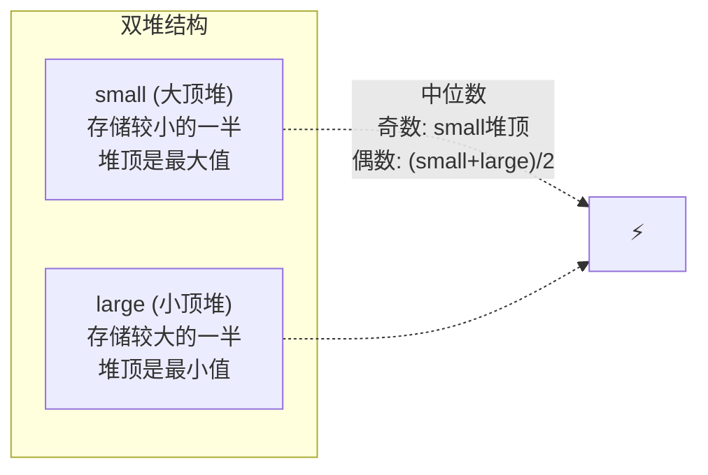

---

title: "数据流的中位数"

difficulty: 困难

category: 堆

tags:

  - leetcode

  - 堆

created: "2026-07-21"

---

# 295. 数据流的中位数（Find Median from Data Stream）

> 难度：困难 | 主题：堆、数据结构设计

## 题目

中位数是有序整数列表中的中间值。如果列表的大小是偶数，则中位数是两个中间值的平均值。设计一个数据结构，支持添加整数和返回当前所有元素的中位数。

**示例**

```text

输入：add(1), add(2), find(), add(3), find()

输出：[null,null,1.5,null,2]

```

---

## 思路
### 先讲个故事：舞台两侧的观众

想象一个舞台，观众按身高站成两列——左边一列从矮到高，最右边的最高；右边一列从高到矮，最左边的最矮。两列的人数尽量相等。

**中位数就在这两列的中间分界线上**。如果总人数是奇数，中位数就是人数多的那列的最中间那个人。

这就是双堆法的本质——用两个堆把数据分成两半。

### 引导式推导：为什么是两个堆？

如果数据是静态的，排序取中位数就行。但数据是**动态流入**的——每次加一个数都要能快速拿到中位数。

**两个堆的分工：**

- **大顶堆 `small`**：存较小的一半，堆顶是这半边的**最大值**（中间偏左）

- **小顶堆 `large`**：存较大的一半，堆顶是这半边的**最小值**（中间偏右）

**约束**：

1. `small` 的所有数 ≤ `large` 的所有数

2. `|len(small) - len(large)| ≤ 1`，且 `small` 不比 `large` 少

```text

奇数个时中位数 = small 堆顶

偶数个时中位数 = (small 堆顶 + large 堆顶) / 2

```

### 数据流演示

```text

add(1): small=[1], large=[]        → 中位数 = 1

add(2): small=[1], large=[2]       → 中位数 = (1+2)/2 = 1.5

add(3): small=[2,1], large=[3]     → 中位数 = 2

add(4): small=[2,1], large=[3,4]   → 中位数 = (2+3)/2 = 2.5

```



### Python 的大顶堆模拟

Python 的 `heapq` 只有小顶堆。大顶堆用**存负数**来模拟——存 `-num`，取的时候 `-heap[0]`。

```text

实际值: [1, 3, 5]

存负数: [-1, -3, -5] → 堆顶是 -5（最小的负数）

取反: -(-5) = 5（实际的最大值）✓

```

---

## 代码

```python

import heapq

class MedianFinder:

    def __init__(self):

        self.small = []    # 大顶堆（存负数模拟）

        self.large = []    # 小顶堆

    def addNum(self, num: int) -> None:

        heapq.heappush(self.small, -num)

        val = -heapq.heappop(self.small)

        heapq.heappush(self.large, val)

        if len(self.large) > len(self.small):

            val = heapq.heappop(self.large)

            heapq.heappush(self.small, -val)

    def findMedian(self) -> float:

        if len(self.small) > len(self.large):

            return -self.small[0]

        return (-self.small[0] + self.large[0]) / 2.0

```

## 复杂度

| 指标 | 值 | 解释 |

|------|----|------|

| addNum | O(log n) | 最多 3 次堆操作 |

| findMedian | O(1) | 直接取堆顶 |

| 空间 | O(n) | 所有数据存在两个堆里 |

---

## 实战考量
### 频率分析

> **出现在**：经典设计题，常见。约 35% 的中高级常会考到察"用两个堆维护动态中位数"的思维。这道题的难点不在于代码量，而在于**想到用两个堆**。

### 延伸思考

**Q：为什么不用一个堆？**

A：一个堆只能知道最大或最小，无法直接拿到中间值。两个堆各管一半，各取所需。

**Q：Python 怎么实现大顶堆？**

A：没有原生大顶堆。存负数模拟：存 `-num`，取时 `-heap[0]`。

**Q：addNum 的固定流程是什么？**

A：先放 small → 移堆顶到 large → 检查大小平衡，确保 `len(small) ≥ len(large)`。

**Q：如果数据范围固定（比如 0~100），有没有更快的方法？**

A：计数排序 + 双指针维护中位数，add 可以 O(1)。

**Q：滑动窗口的中位数怎么做？**

A：双堆 + 延迟删除（lazy deletion），或有序集合（TreeSet）。

**Q：为什么保持 `len(small) ≥ len(large)`？**

A：这样奇数个时中位数一定在 small 堆顶，逻辑统一。

### 易错点

- Python 大顶堆用负数模拟，取堆顶时要取反

- `addNum` 后一定要平衡堆大小

- 偶数时中位数是两个堆顶的平均值，要用浮点数除法 `/ 2.0`

---

## 生活类比

> **双堆求中位数 → 舞台两侧的观众**

>

> 左边的人（small 堆）中最高的是左半边的天花板；右边的人（large 堆）中最矮的是右半边的地板。中位数就在天花板和地板之间。

>

> 一句话总结：**把数据劈成两半，各管各的堆顶，中位数就在分界线上。**

---

## 相关题目

| 题目 | 关系 |

|------|------|

| 215数组中的第K个最大元素 | 单堆维护 Top K |

| [[347前K个高频元素]] | 堆 + 哈希表 |

---

→ 返回题单：[[LeetCode学习路线图#六、堆]]

## 速记卡（面试闪卡）

**Q1：一句话讲清「295. 数据流的中位数（Find Median from Data Stream）」到底是什么？**

A：用两个堆维护动态数据流的中位数，add O(log n)、find O(1)。

**Q2：思路 —— 怎么理解？**

A：像舞台两侧观众——左列（大顶堆 small）存较小一半、堆顶是左半最大；右列（小顶堆 large）存较大一半、堆顶是右半最小。两列人数差≤1，中位数就在分界线上。

**Q3：代码 —— 怎么理解？**

A：addNum 先压 small（负数模拟大顶堆），弹顶转压 large，若 large 比 small 长就弹回 small，保持 len(small)≥len(large)；findMedian 奇数返 -small[0]，偶数返两堆顶平均。

**Q4：复杂度 —— 怎么理解？**

A：addNum O(log n) 最多 3 次堆操作；findMedian O(1) 直接取堆顶；空间 O(n) 全部数据存在两个堆里。

**Q5：实战考量 —— 怎么理解？**

A：经典设计题，难点在"想到用两个堆"；Python 无原生大顶堆用存负数模拟；保持 len(small)≥len(large) 让奇数中位数恒在 small 顶；滑动窗口中位数用双堆+延迟删除。

**Q6：核心速记主线有哪些？**

- 双堆：small 大顶堆（较小半）、large 小顶堆（较大半），各取堆顶得中位

- addNum 先入 small 再平衡，保 len(small)≥len(large)

- Python 大顶堆存负数模拟，取时取反

- add O(log n) find O(1)，空间 O(n)

**口诀**

A：数据流中求中位，双堆劈成两半边

small 大顶 large 小，堆顶交界即中线

负数模拟大顶堆，平衡保 small 不短

add 对数 find 一，想到双堆就过关

## 相关链接

- [[笔记/Leetcode笔记/06_堆/215数组中的第K个最大元素|数组中的第K个最大元素]]

- [[笔记/Leetcode笔记/06_堆/347前K个高频元素|前K个高频元素]]

- [[笔记/Leetcode笔记/06_堆/00-解题模板|堆 解题模板]]

- [[笔记/Leetcode笔记/08_二分查找/4寻找两个正序数组的中位数|寻找两个正序数组的中位数]]

- [[笔记/Leetcode笔记/14_数学与位运算/231-2的幂|2的幂]]

