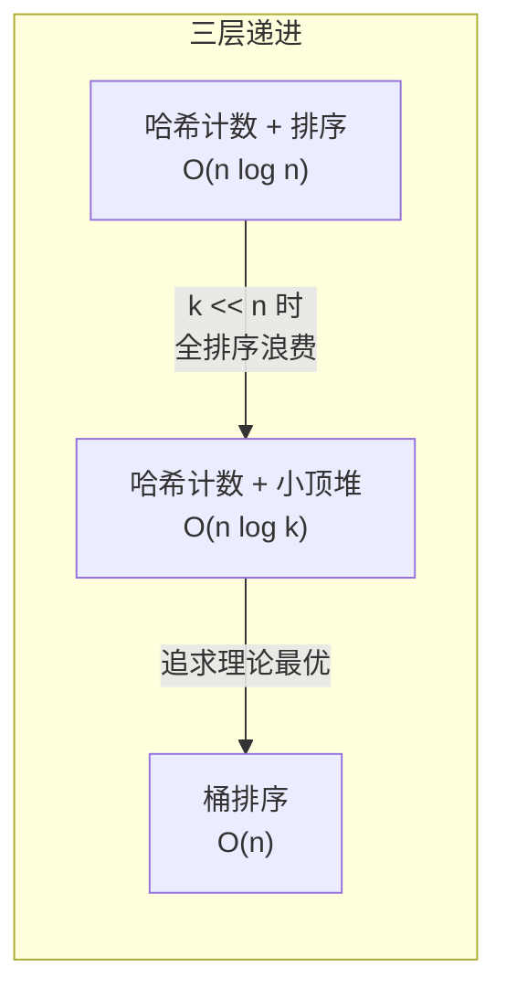

---

title: "前K个高频元素"

difficulty: 中等

category: 堆

tags:

  - leetcode

  - 堆

created: "2026-07-21"

---

# 347. 前 K 个高频元素（Top K Frequent Elements）

> 难度：中等 | 主题：堆、哈希表、桶排序

## 题目

给你一个整数数组 nums 和一个整数 k，返回其中出现频率前 k 高的元素。顺序任意。

**示例**

```text

输入：nums = [1,1,1,2,2,3], k = 2

输出：[1,2]

```

---

## 思路
### 先讲个故事：班级里的热门话题

老师在班里做了一个话题投票，每个同学可以在纸条上写自己感兴趣的话题编号。现在老师想知道——全班最受欢迎的 K 个话题是哪些？

首先，你需要把每张纸条归类统计（数一数每个编号出现多少次）。然后，从这些统计结果中找出票数最高的 K 个。

**前 K 高频 = 先数数（哈希表统计）→ 再排序（堆/桶筛选）。**

### 引导式推导：三层递进



**第 1 层：哈希计数 + 排序**

`Counter(nums)` 统计频率，然后按频率降序排序取前 k 个。

**第 2 层：哈希计数 + 小顶堆（推荐）**

统计频率后，维护大小为 k 的小顶堆，按频率比较。遍历频率表，当堆未满或当前频率 > 堆顶频率时入堆。

```text

nums = [1,1,1,2,2,3], k = 2

① Counter → {1:3, 2:2, 3:1}

② 小顶堆操作:

  (3, 1) 入堆 → [(3,1)]

  (2, 2) 入堆 → [(2,2), (3,1)]（堆大小=k ✓）

  (1, 3) 频率 1 < 堆顶频率 2 → 跳过

③ 结果: [1, 2] ✓

```

**第 3 层：桶排序（理论最优）**

统计频率后，利用"频率上限不超过 n"这个特点，用数组 `bucket[freq]` 存对应频率的元素。从高到低遍历桶取 k 个。

```text

Counter → {1:3, 2:2, 3:1}

buckets[3] = [1]

buckets[2] = [2]

buckets[1] = [3]

从高到低取: bucket[3] → [1], bucket[2] → [2] ✓

```

---

## 代码

```python

import heapq

from collections import Counter

# 方法1：最小堆（推荐）

def topKFrequent(self, nums, k):

    count = Counter(nums)

    min_heap = []

    for num, freq in count.items():

        heapq.heappush(min_heap, (freq, num))

        if len(min_heap) > k:

            heapq.heappop(min_heap)

    return [num for freq, num in min_heap]

# 方法2：桶排序

def topKFrequent(self, nums, k):

    count = Counter(nums)

    n = len(nums)

    freq_buckets = [[] for _ in range(n + 1)]

    for num, freq in count.items():

        freq_buckets[freq].append(num)

    result = []

    for freq in range(n, 0, -1):

        for num in freq_buckets[freq]:

            result.append(num)

            if len(result) == k:

                return result

    return result

```

## 复杂度

| 指标 | 堆解法 | 桶排序 |

|------|--------|--------|

| 时间 | O(n log k) | O(n) |

| 空间 | O(n) | O(n) |

---

## 实战考量
### 频率分析

> **出现在**：Top K 模式题，常见。"哈希表统计 + 堆筛选"是**大数据场景的经典组合**。约 40% 常会从这道题延伸讨论"如果数据大到内存放不下怎么办"。

### 延伸思考

**Q：如果 n 很大，内存放不下 Counter 怎么办？**

A：数据流场景用 Reservoir Sampling（蓄水池抽样），或外排序。

**Q：要求返回的 k 个元素按频率降序排列呢？**

A：最小堆结果需要再排 O(k log k)；桶排序天然从高往低取。

**Q：时间复杂度的瓶颈在哪里？**

A：Counter O(n) 是线性，堆 O(n log k)。如果 k << n，堆很快。

**Q：Counter 的时间复杂度？**

A：O(n)，遍历一次数组统计频率。

**Q：桶排序利用了哪个特性？**

A：频率上限不超过 n（数组中每个元素最多出现 n 次），所以桶的大小是 n+1，可控。

### 易错点

- `heapq` 是最小堆，存频率最小的在堆顶，超过 k 就弹出

- 不要写成最大堆的逻辑（存负频率）

- `Counter` 是 Python 内置神器，用它很 Pythonic

- 多个元素频率相同时，返回顺序任意

---

## 生活类比

> **前 K 高频 → 先统计每个话题被说了多少次，再找出最热门的 K 个**

>

> 就像你在论坛上找热门帖子——先看每个帖子的点赞数，然后找一个能记录 K 个最高点赞的"小本子"，新帖子比本子上最低的高就替换。

>

> 桶排序更激进：直接准备 n 个篮子（0 赞 ~ n 赞），把帖子扔进对应篮子里，从高赞篮子往下拿。

---

## 相关题目

| 题目 | 关系 |

|------|------|

| 215数组中的第K个最大元素 | 纯堆选第 K 大 |

| 295数据流的中位数 | 双堆设计 |

---

→ 返回题单：[[LeetCode学习路线图#六、堆]]

## 速记卡（面试闪卡）

**Q1：一句话讲清「347. 前 K 个高频元素（Top K Frequent Elements）」到底是什么？**

A：返回数组中出现频率最高的前 k 个元素，顺序任意（Top K，前 K 大）。

**Q2：思路 —— 怎么理解？**

A：像论坛找热门帖：先数每个话题票数（哈希），再筛出最高 K 个（Hash Map，哈希表）。

**Q3：代码 —— 怎么理解？**

A：小顶堆存 (freq,num) 维持 k 个；或桶排序按频率入篮（Min-Heap，最小堆）。

**Q4：复杂度 —— 怎么理解？**

A：堆解法 O(n log k)、桶排序 O(n)，空间均 O(n)（Bucket Sort，桶排序）。

**Q5：实战考量 —— 怎么理解？**

A：Top K 经典，大数据可蓄水池抽样；k<<n 时堆很快（Frequency Counting，频率统计）。

**Q6：核心速记主线有哪些？**

- 先哈希计数频率，再筛前 k

- 小顶堆 O(n log k) 推荐

- 桶排序 O(n) 利用频率上限≤n

- 多个元素同频时返回顺序任意

**口诀**

A：前 K 高频怎么捞

哈希计数先记牢

小顶堆里留 k 个

桶排更快一遍扫

## 相关链接

- [[笔记/Leetcode笔记/06_堆/215数组中的第K个最大元素|数组中的第K个最大元素]]

- [[笔记/Leetcode笔记/06_堆/295数据流的中位数|数据流的中位数]]

- [[笔记/Leetcode笔记/06_堆/00-解题模板|堆 解题模板]]

- [[笔记/Leetcode笔记/01_数组与哈希/169多数元素|多数元素]]

- [[笔记/Leetcode笔记/08_二分查找/378有序矩阵中第K小的元素|有序矩阵中第K小的元素]]

