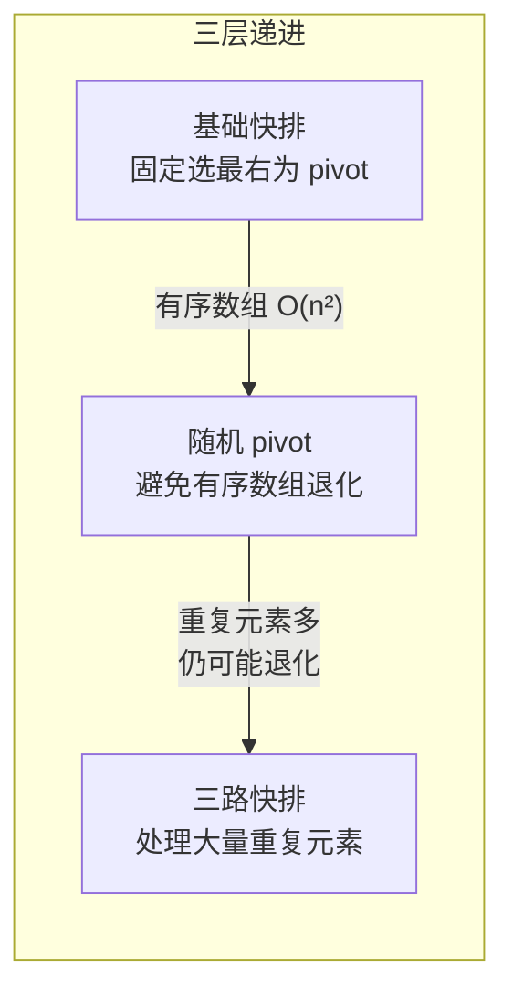
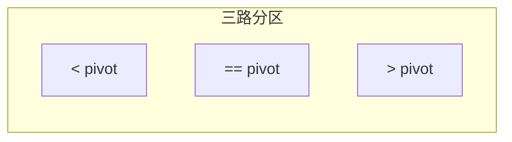

# 912. 排序数组（手撕快排 / Sort an Array）

> 难度：中等 | 主题：排序、分治、快速排序

## 题目

给你一个整数数组 nums，请你将该数组升序排列。

**示例**

```text
输入：nums = [5,2,3,1]
输出：[1,2,3,5]
```

---

## 思路

### 先讲个故事：混乱的扑克牌

你有没有整理过一副散乱的扑克牌？最自然的方式是——随手抽一张当基准，比它小的放左边，比它大的放右边，然后对左右两堆重复同样的操作。这就是快排。

**快排 = 选一个人当队长（pivot），矮的站左边，高的站右边，左右两队各自再选队长。**

### 引导式推导：从选队长到分治

**第 1 步（选 pivot 并分区）**：以 `[5,2,3,1]` 为例，选最后一个元素 `1` 为 pivot。

```text
[5,2,3,1] → 比 1 小的放左边 → [1,5,2,3]
            pivot 到了索引 0
```

**第 2 步（递归左边）**：左边 `[]` 空了，右边 `[5,2,3]` 选 pivot = 3。

```text
[5,2,3] → 比 3 小的放左边 → [2,3,5]
          pivot 到了索引 1
```

**第 3 步（递归右边）**：左边 `[2]` 一个元素，右边 `[5]` 一个元素，完成。

**分区的关键**：用两个指针 i 和 j。j 遍历，i 指向「<= pivot 区域」的边界。遇到 <= pivot 的就跟 i 交换，i 右移。

### 三层递进：从基础到最优



**基础快排**：选最后一个元素为 pivot，把数组分成两部分。平均 O(n log n)，最坏 O(n²)——当数组已经有序时，每次 pivot 都是最大/最小，递归退化成链表。

**随机 pivot**：在 `[left, right]` 中随机选一个位置和 right 交换。概率上极大降低了最坏情况。

**三路快排**：数组分成三部分——小于 pivot、等于 pivot、大于 pivot。等于 pivot 的不再参与递归。元素大量重复时从 O(n²) 回到 O(n log n)。



---

## 代码

```python
import random

# 标准快排（随机 pivot，推荐）
def sortArray(self, nums):
    self.quicksort(nums, 0, len(nums) - 1)
    return nums

def quicksort(self, nums, left, right):
    if left >= right:
        return
    pivot_idx = self.partition(nums, left, right)
    self.quicksort(nums, left, pivot_idx - 1)
    self.quicksort(nums, pivot_idx + 1, right)

def partition(self, nums, left, right):
    rand_idx = random.randint(left, right)
    nums[rand_idx], nums[right] = nums[right], nums[rand_idx]
    pivot = nums[right]
    i = left
    for j in range(left, right):
        if nums[j] <= pivot:
            nums[i], nums[j] = nums[j], nums[i]
            i += 1
    nums[i], nums[right] = nums[right], nums[i]
    return i

# 三路快排（大量重复元素）
def sortArray(self, nums):
    self.quicksort3way(nums, 0, len(nums) - 1)
    return nums

def quicksort3way(self, nums, left, right):
    if left >= right:
        return
    rand_idx = random.randint(left, right)
    nums[rand_idx], nums[left] = nums[left], nums[rand_idx]
    pivot = nums[left]
    lt, gt, i = left, right, left + 1
    while i <= gt:
        if nums[i] < pivot:
            nums[i], nums[lt] = nums[lt], nums[i]
            lt += 1; i += 1
        elif nums[i] > pivot:
            nums[i], nums[gt] = nums[gt], nums[i]
            gt -= 1
        else:
            i += 1
    self.quicksort3way(nums, left, lt - 1)
    self.quicksort3way(nums, gt + 1, right)
```

## 复杂度

| 指标 | 值 | 解释 |
|------|----|------|
| 时间（平均） | O(n log n) | 随机 pivot 期望深度 log n |
| 时间（最坏） | O(n²) | pivot 总选到最大/最小，但随机化后概率极低 |
| 空间 | O(log n) | 递归栈深度 |
| 稳定性 | 不稳定 | 跨位置交换会打破相对顺序 |

---

## 实战考量

### 频率分析

> **出现在**：手撕算法 Top 3 必考题。字节/阿里/美团一面几乎必写。约 60% 常会从这里开始考察分治思维。

### 延伸思考

**Q：快排最坏情况是什么？怎么优化？**
A：有序数组 + 固定选最右为 pivot → 退化成 O(n²)。优化：随机选 pivot 或三数取中。

**Q：快排稳定吗？能改成稳定的吗？**
A：不稳定，因为交换是跨越式的。想改稳定需要额外空间做类似归并的操作——那不如直接用归并排序。

**Q：三路快排什么时候用？**
A：数组有大量重复元素时。标准快排会把等于 pivot 的元素全分到一边，导致 partition 严重不平衡。三路快排把相等的放中间，只递归两边。

**Q：Python 的 `sort()` 是什么排序？**
A：Timsort，归并 + 插入的混合排序，稳定。

**Q：partition 返回的 pivot 位置要参与递归吗？**
A：不参与。pivot 已经在其最终位置，递归 `[left, pivot-1]` 和 `[pivot+1, right]`。

### 易错点

- `partition` 最后交换的是 `nums[i]` 和 `nums[right]`，不是 `nums[i+1]`
- 随机 pivot 后要和 `right` 交换，否则分区逻辑不对
- 三路快排的循环条件是 `i <= gt`（不是 `i < gt`），因为 gt 会左移
- 递归区间不要包含 pivot

---

## 生活类比

> **快排 → 选队长分两队的扑克牌整理法**
>
> 如果你要在混乱的数组中找位置，快排的做法是：随机抓一个当队长，矮的站左边，高的站右边，然后两边各找一个副队长重复这个过程。
>
> 用四个字概括：**分而治之**。和归并排序的区别在于——快排是先分（partition）再治（递归），归并是先治（递归）再合（merge）。

---

## 相关题目

| 题目 | 关系 |
|------|------|
| [[手撕归并排序]] | 同为 O(n log n) 排序，稳定版 |
| [[手撕堆排序]] | O(1) 空间排序 |
| 215数组中的第K个最大元素 | Quickselect 基于 partition |

---

→ 返回题单：[[LeetCode学习清单#七、排序]]

## 速记卡（面试闪卡）

**Q1：一句话讲清「912. 排序数组（手撕快排 / Sort an Array）」到底是什么？**
A：给你一个整数数组 nums，请你将该数组升序排列。
**示例**
---

**Q2：题目 —— 怎么理解？**
A：给你一个整数数组 nums，请你将该数组升序排列。
**示例**
---

**Q3：思路 —— 怎么理解？**
A：你有没有整理过一副散乱的扑克牌？最自然的方式是——随手抽一张当基准，比它小的放左边，比它大的放右边，然后对左右两堆重复同样的操作。这就是快排。
**快排 = 选一个人当队长（pivot），矮的站左边，高的站右边，左右两队各自再选队长。**
**第 1 步（选 pivot 并分区）**：以  为例，选最后一个元素  为 pivot。
**第 2 步（递归左边）**：左边  空了，右边  选 pivot = 3。

**Q4：复杂度 —— 怎么理解？**
A：| 指标 | 值 | 解释 |
|------|----|------|
| 时间（平均） | O(n log n) | 随机 pivot 期望深度 log n |
| 时间（最坏） | O(n²) | pivot 总选到最大/最小，但随机化后概率极低 |
| 空间 | O(log n) | 递归栈深度 |
| 稳定性 | 不稳定 | 跨位置交换会打破相对顺序 |
---

**Q5：核心速记主线有哪些？**
A：抓住这几根：题目、思路、代码、复杂度、实战考量、生活类比。

