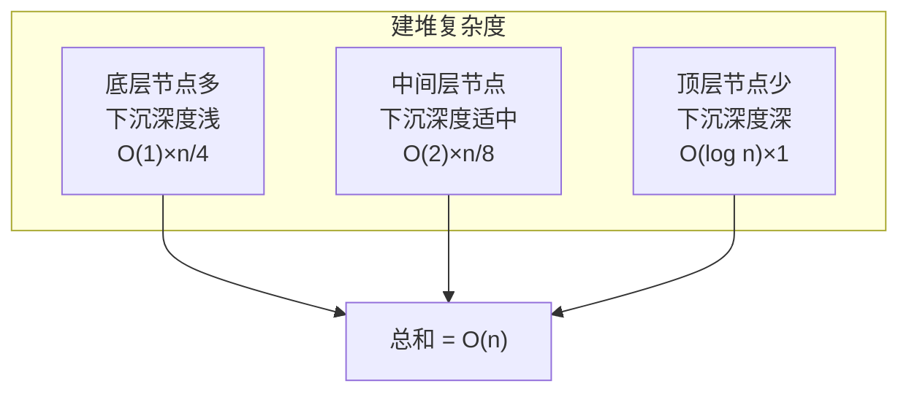

# 手撕堆排序（Heap Sort）

> 难度：中等 | 主题：排序、堆、完全二叉树

## 题目

实现堆排序算法。利用完全二叉树结构（堆）进行排序，分为建堆和排序两个阶段，要求对输入数组进行原地排序。

**示例**

```text
输入：nums = [4,10,3,5,1]
输出：[1,3,4,5,10]
```

---

## 思路

### 先讲个故事：学生会主席选举

假设你要从一群学生中按身高从矮到高排队。你可以这样做：先让大家站成一棵"树"——每次最高的那个人站到树根，然后把他拉出来放到队伍末尾，剩下的重新选最高的。反复操作，队伍就排好了。

**堆排序 = 先建一个"最高的人永远在树根"的结构（最大堆），然后每次把树根移到末尾，重新调整。**

### 引导式推导：从数组到二叉树

**完全二叉树的数组表示**：节点 i 的左孩子是 `2*i+1`，右孩子是 `2*i+2`，父节点是 `(i-1)//2`。

```text
数组: [4, 10, 3, 5, 1]
树形:
      4
    /   \
   10    3
  /  \
 5    1
```

**建堆（从下往上做下沉）**：

从最后一个非叶子节点 `(n//2 - 1)` 开始，往前遍历到根节点，对每个节点做"下沉"——把当前节点和它的两个孩子比较，最大的换上来，然后继续下沉换下去的那个位置。

```text
建堆过程（最大堆）:
[4,10,3,5,1] → 从索引 1（值为 10）开始
  10 > 4，交换 → [10,4,3,5,1]
  索引 0（值为 10），交换 4 和 5 → [10,5,3,4,1]
  → 堆顶是最大值 10 ✓
```

**排序**：把堆顶（最大值）和末尾交换，堆大小减 1，对新堆顶做下沉。

```text
排序过程:
[10,5,3,4,1] → 交换 10 和 1 → [1,5,3,4,10]，堆大小=4，下沉 1
[5,1,3,4,10] → 交换 5 和 4 → [4,1,3,5,10]，堆大小=3，下沉 4
... → [3,1,4,5,10] → [1,3,4,5,10] ✓
```

### 为什么建堆是 O(n) 而不是 O(n log n)？

直觉上，n/2 个节点各下沉一次，每次 O(log n)，好像是 O(n log n)。但精确分析发现：底层节点多但下沉深度浅（叶子节点不下沉），顶层节点少但下沉深度深。累加数学期望是 O(n)。



---

## 代码

```python
def sortArray(self, nums):
    n = len(nums)
    for i in range(n // 2 - 1, -1, -1):
        self.heapify(nums, n, i)
    for i in range(n - 1, 0, -1):
        nums[0], nums[i] = nums[i], nums[0]
        self.heapify(nums, i, 0)
    return nums

def heapify(self, nums, heap_size, root):
    largest = root
    left = 2 * root + 1
    right = 2 * root + 2
    if left < heap_size and nums[left] > nums[largest]:
        largest = left
    if right < heap_size and nums[right] > nums[largest]:
        largest = right
    if largest != root:
        nums[root], nums[largest] = nums[largest], nums[root]
        self.heapify(nums, heap_size, largest)
```

## 复杂度

| 指标 | 值 | 解释 |
|------|----|------|
| 时间 | O(n log n) | 建堆 O(n)，n-1 次下沉各 O(log n) |
| 空间 | O(1) | 原地排序 |
| 稳定性 | 不稳定 | 交换可能跨越相同元素 |

---

## 实战考量

### 频率分析

> **出现在**：常考题，考察对堆数据结构的底层理解。约 30% 的场景会问到堆排序。常通过堆排序来测试你"是否真的理解堆"，而不是只背下了 heapq 的 API。

### 延伸思考

**Q：建堆为什么是 O(n) 不是 O(n log n)？**
A：大部分节点下沉深度很浅。底层节点多但几乎不下沉，顶层节点少但下沉深。精确计算是 O(n)。

**Q：堆排序和快排/归并比有什么优劣？**
A：堆排序空间 O(1) 最优，但不稳定且常数因子大，实际速度通常不如快排。归并稳定但需要 O(n) 空间。

**Q：如果只需要前 K 大元素，用堆排序还是最小堆？**
A：最小堆 O(n log k) 更优，不需要全部排序。

**Q：下沉（sift down）和上滤（percolate up）有什么区别？**
A：下沉是节点往下找正确位置（用于建堆和删除堆顶），上滤是节点往上找正确位置（用于插入）。

**Q：`heapify` 为什么从 `n//2 - 1` 开始？**
A：最后一个非叶子节点才有孩子需要下沉。叶子节点不需要下沉。

### 易错点

- 建堆从 `n//2 - 1` 开始，不是从 0 开始
- 排序阶段 `heap_size` 不断减小，已排序部分不参与
- `heapify` 递归条件是 `largest != root`，不是 `left` 或 `right` 存在
- 完全二叉树的索引关系：`2*i+1` 和 `2*i+2`，不要写成 `2*i` 和 `2*i+1`

---

## 生活类比

> **堆排序 → 每次抓最高的那个放到队伍末尾**
>
> 就像你有一群身高各异的人，先搭一个"金字塔"让最高的人站在塔尖。然后把塔尖拉出来放到终点，让剩下的人重新竞争塔尖。
>
> 一句话总结：**用完全二叉树维护"当前最大"，每次取最大放末尾。**

---

## 相关题目

| 题目 | 关系 |
|------|------|
| 912排序数组（手撕快排） | 快排版 |
| 215数组中的第K个最大元素 | 堆的应用 |
| 295数据流的中位数 | 双堆设计 |

---

→ 返回题单：[[LeetCode学习清单#七、排序]]
