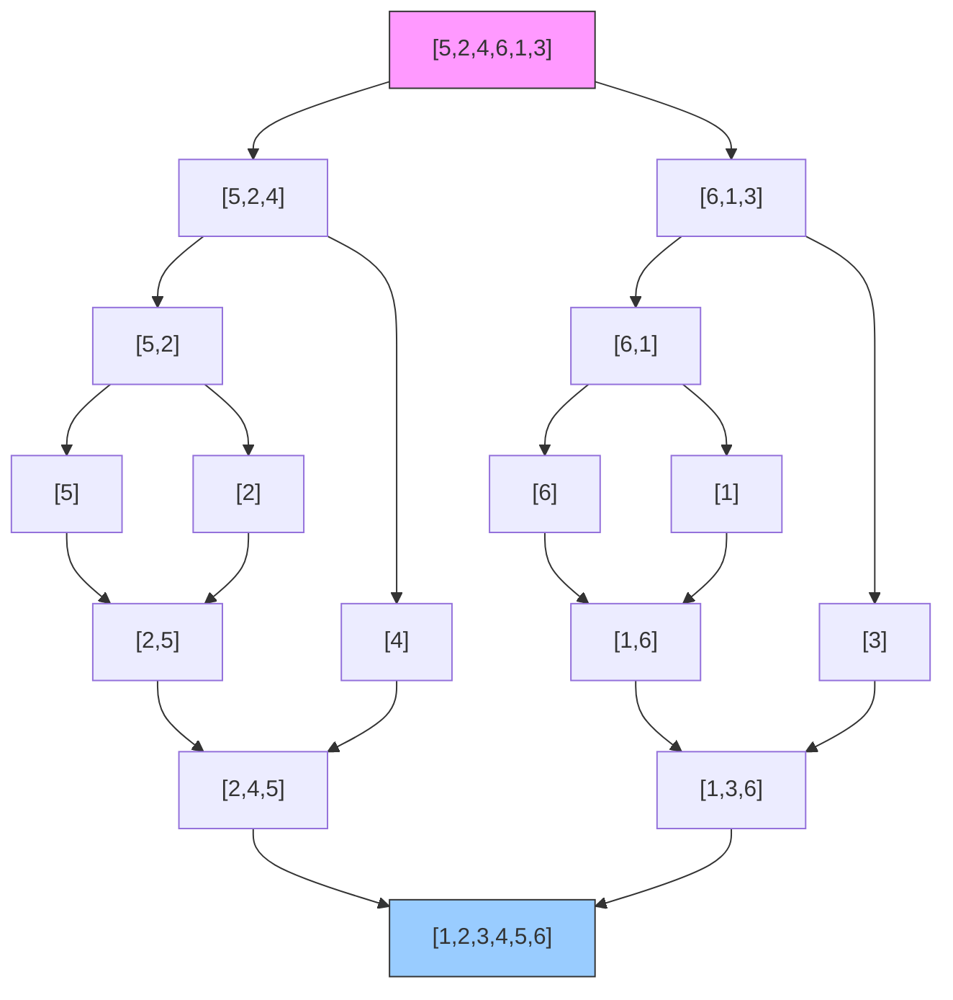

# 手撕归并排序（Merge Sort）

> 难度：中等 | 主题：排序、分治、递归

## 题目

实现归并排序算法，对输入数组进行排序。

**示例**

```text
输入：nums = [5,2,4,6,1,3]
输出：[1,2,3,4,5,6]
```

---

## 思路

### 先讲个故事：两张排好的牌堆

假设你面前有两堆已经排好序的扑克牌（一个升序），你要把它们合并成一堆，怎么做？

很简单：每次比较两堆最上面的牌，小的拿出来放到新堆。这就是归并排序的"合"。

**归并排序 = 先把牌撕成单张（分），再把单张两两合并成有序小堆（治），最后合成完整一副（合）。**

### 引导式推导：分三步走

**第 1 步（分）**：把数组从中间切成两半。`[5,2,4,6,1,3]` → `[5,2,4]` 和 `[6,1,3]`

**第 2 步（治）**：递归排序两半。`[5,2,4]` → 再分 → ... → `[2,4,5]`，`[6,1,3]` → ... → `[1,3,6]`

**第 3 步（合）**：合并两个有序数组。

```text
合并 [2,4,5] 和 [1,3,6]：
  ① 比较 2 和 1 → 取 1
  ② 比较 2 和 3 → 取 2
  ③ 比较 4 和 3 → 取 3
  ④ 比较 4 和 6 → 取 4
  ⑤ 比较 5 和 6 → 取 5
  ⑥ 还剩 6 → 取 6
  结果：[1,2,3,4,5,6]
```

**合并两个有序数组的时间是 O(n)**，这个操作和 21合并两个有序链表 本质相同。

**核心洞察**：递归深度 O(log n)，每层合并的总工作量 O(n)，所以总时间 O(n log n)。



### 为什么归并排序是稳定的？

合并时，当左右两边的元素相等，我们**先放左边的**（`nums[i] <= nums[j]`）。这就保证了相同元素的相对顺序不变。

### 归并 vs 快排

| | 归并 | 快排 |
|---|---|---|
| 顺序 | 先治（递归）后合 | 先分（partition）后治 |
| 稳定 | 稳定 | 不稳定 |
| 空间 | O(n) | O(log n) |
| 最适合 | 链表排序（不需额外空间，改指针即可） | 数组原地排序 |

---

## 代码

```python
def sortArray(self, nums):
    self.merge_sort(nums, 0, len(nums) - 1)
    return nums

def merge_sort(self, nums, left, right):
    if left >= right:
        return
    mid = left + (right - left) // 2
    self.merge_sort(nums, left, mid)
    self.merge_sort(nums, mid + 1, right)
    self.merge(nums, left, mid, right)

def merge(self, nums, left, mid, right):
    temp = []
    i, j = left, mid + 1
    while i <= mid and j <= right:
        if nums[i] <= nums[j]:
            temp.append(nums[i])
            i += 1
        else:
            temp.append(nums[j])
            j += 1
    while i <= mid:
        temp.append(nums[i])
        i += 1
    while j <= right:
        temp.append(nums[j])
        j += 1
    for k in range(len(temp)):
        nums[left + k] = temp[k]
```

## 复杂度

| 指标 | 值 | 解释 |
|------|----|------|
| 时间 | O(n log n) | 递归深度 log n，每层合并 O(n) |
| 空间 | O(n) | 临时数组最大 O(n)，递归栈 O(log n) |
| 稳定性 | 稳定 | 合并时 `<=` 保证左边先放 |

---

## 实战考量

### 频率分析

> **出现在**：常考题，尤其考察分治思维。约 40% 的算法常会从归并或快排开始。常见的问题是"归并和快排的区别"来考察你对排序算法的理解深度。

### 延伸思考

**Q：归并和快排的区别？**
A：归并是先递归后合并（先治后合），快排是先分区后递归（先分后治）。归并稳定但空间 O(n)，快排不稳定但空间 O(log n)。

**Q：归并的空间能优化到 O(1) 吗？**
A：可以，用自底向上的迭代归并（步长翻倍），但代码复杂且常数大，实际很少用。

**Q：链表排序用归并还是快排？**
A：归并。链表合并不需要额外空间（改指针即可），而快排的 partition 对链表很不友好（需要随机访问）。

**Q：逆序对问题怎么解？**
A：归并排序合并时，如果 `nums[i] > nums[j]`，说明 `nums[i...mid]` 都和 `nums[j]` 构成逆序对，计数 `mid - i + 1`。

**Q：为什么 `mid = left + (right - left) // 2`？**
A：防止 `left + right` 溢出。虽然 Python 没这问题，但要写标准写法。

### 易错点

- `mid` 是左半的最后一个索引，右半从 `mid + 1` 开始
- 临时数组要写回原数组，不是每次都新建
- 合并时条件判断用 `<=` 而不是 `<`（否则不稳定）

---

## 生活类比

> **归并排序 → 班级分成两组，各自排序，再合并**
>
> 班长说："全班按身高排成一列。第一排同学排左边一半，第二排排右边一半，各自排好。然后两队各出一个人，矮的站前面，依次比较。"
>
> 归并的精髓就是 **分工协作**：把大问题分成独立的小问题，各自的答案再组合成总答案。

---

## 相关题目

| 题目 | 关系 |
|------|------|
| 912排序数组（手撕快排） | 快排版，空间更优 |
| 148排序链表 | 链表版归并排序 |

---

→ 返回题单：[[LeetCode学习清单#七、排序]]
