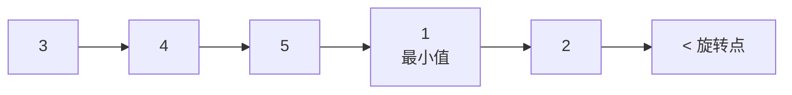

# 153. 寻找旋转排序数组中的最小值

> 难度：中等 | 主题：旋转数组二分——跟最右边比

## 题目

已知一个长度为 n 的数组预先按照升序排列，在某个未知的点上进行了旋转。请找出旋转数组中的最小元素。要求 O(log n) 时间复杂度。

**示例**
```text
输入：nums = [3,4,5,1,2]
输出：1
```

---

## 思路

### 先讲个故事：被打乱的日历

你有 12 个月的日历按顺序贴成一排。有人从中间撕开，把后半叠到了前半上面。现在你看到的可能是 [7,8,9,10,11,12,1,2,3,4,5,6]。你要快速找到**1 月在哪**。

因为日历本身有序，只是被切了一刀。你会看中间月份：如果中间是 9 月，它比右边的 3 月大，说明切口在后半部分，最小值在右边。

---

### 引导式推导：旋转数组的形状

升序数组旋转后，形状就像一个大写字母 **"√"**：



**核心性质**：`nums[mid]` 跟 `nums[right]` 比，而非跟 `nums[left]` 比。

| 条件 | 含义 | 操作 |
|------|------|------|
| `nums[mid] < nums[right]` | mid 在低谷侧 | `right = mid`（mid 可能是最小值） |
| `nums[mid] > nums[right]` | mid 在高峰侧 | `left = mid + 1` |

**为什么跟 right 比而不是跟 left？** 如果数组没旋转（完全升序），`nums[mid] > nums[left]` 恒成立，会误判最小值在右边。

**为什么 `nums[mid] < nums[right]` 时是 `right = mid` 而不是 `mid - 1`？** 因为 mid 可能就是最小值，不能跳过。比如 [2,1] 时 mid=0, `nums[0] > nums[1]`，最小值在右边。

---

## 代码

```python
class Solution:
    def findMin(self, nums: list[int]) -> int:
        left, right = 0, len(nums) - 1
        while left < right:
            mid = (right - left) // 2 + left
            if nums[mid] < nums[right]:
                right = mid
            else:
                left = mid + 1
        return nums[left]
```

**循环条件为什么是 `left < right` 而不是 `<=`？** 还剩一个元素时它就是最小值，不需要再分。这与 704 不同。

---

## 复杂度

| 指标 | 值 | 解释 |
|------|----|------|
| 时间 | O(log n) | 标准二分 |
| 空间 | O(1) | 两个指针 |

---

## 实战考量

### 频率分析

> **出现在**：旋转数组二分的必修课。字节/美团/阿里常考，与 33 题组成旋转数组系列。

### 延伸思考

**Q：为什么跟 `right` 比而不是跟 `left` 比？**
A：跟 left 比在无旋转数组（完全升序）上会崩：`nums[mid] > nums[left]` 恒成立，导致误判最小值在右边，一路向右搜索直到撞到右边界返回错误答案。

**Q：为什么 `nums[mid] < nums[right]` 时 `right = mid` 而不是 `mid - 1`？**
A：mid 可能就是最小值（如 [4,5,1,2,3] 中 mid=2 时值为 1），不能跳过。

**Q：如果数组有重复元素呢？（154 题）**
A：当 `nums[mid] == nums[right]` 时无法判断，只能 `right -= 1`，最坏退化为 O(n)。

### 易错点

- 跟 right 比，不是跟 left
- `right = mid` 不能 `-1`
- 循环条件 `left < right`（不是 `<=`）

---

## 生活类比

> **找旋转点 → 找断开的圆环**
>
> 一根铁环上均匀标了数字，从某处断开后拉直。数字从断点处重新排列：[4,5,6,1,2,3]。要找 1（最小值）就像找断点——断开处前后一定是最大的挨着最小的。

---

## 相关题目

| 题目 | 关系 |
|------|------|
| [[33搜索旋转排序数组]] | 旋转数组进阶（搜索 target 值） |
| 704二分查找 | 二分基础 |

---

→ 返回题单：[[LeetCode学习清单#八、二分查找]]
