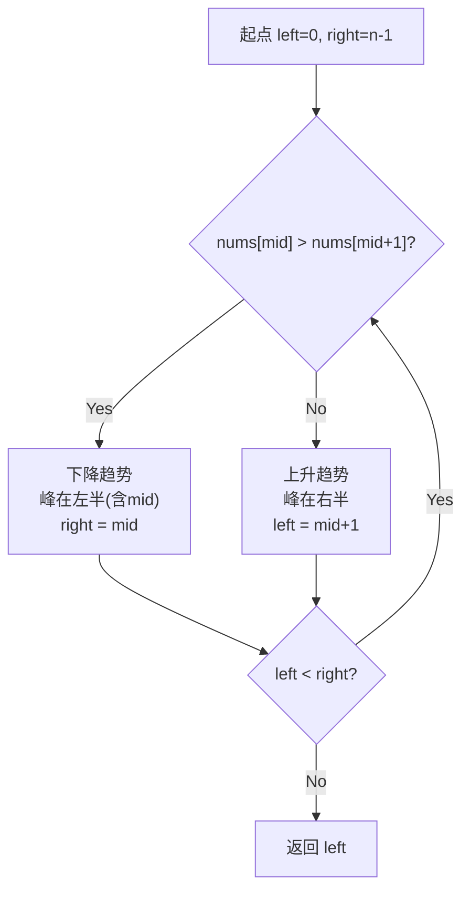

# 162. 寻找峰值（Find Peak Element）

> 难度：中等 | 主题：二分查找、数组

## 题目

峰值元素是指其值严格大于左右相邻值的元素。给你一个整数数组 nums，找到峰值元素并返回其索引。数组可能包含多个峰值，返回任何一个即可。要求 O(log n) 时间复杂度。

**示例**
```text
输入：nums = [1,2,3,1]
输出：2
解释：3 是峰值元素
```

---

## 思路

### 先讲个故事：登山找山顶

你正在爬一座山，山势起伏不定。你不知道山顶在哪，但你有一个判断力：**往高的方向走一定能找到山顶**。

当你站在某个位置，如果右边比你高，你就往右走；如果左边比你高，你就往左走。因为数组两端视为 -∞，所以你一定会走到某个"两边都比你低"的位置——那就是山顶。

---

### 引导式推导：为什么二分能找峰值？

**核心洞察**：利用「向高处走必达峰」的性质做二分。比较 `nums[mid]` 和 `nums[mid+1]`：



- 如果 `nums[mid] > nums[mid+1]`，左边（含 mid）可能有峰，`right = mid`
- 如果 `nums[mid] < nums[mid+1]`，右边（含 mid+1）一定有峰，`left = mid + 1`

不需要找全局最大，只要找到一个峰即可。

**为什么一定能找到？** 因为 nums[-1] = nums[n] = -∞，所以上升必有下降，下降本身就是峰值。

| 解法 | 时间 | 空间 |
|------|------|------|
| **二分查找（推荐）** | O(log n) | O(1) |
| 线性扫描 | O(n) | O(1) |

---

## 代码

```python
def findPeakElement(self, nums):
    left, right = 0, len(nums) - 1
    
    while left < right:
        mid = left + (right - left) // 2
        
        if nums[mid] > nums[mid + 1]:
            right = mid
        else:
            left = mid + 1
    
    return left
```

---

## 复杂度

| 指标 | 值 | 解释 |
|------|----|------|
| 时间 | O(log n) | 二分查找 |
| 空间 | O(1) | 只用两个指针 |

---

## 实战考量

### 频率分析

> **出现在**：二分变形题经典。考察「二分不一定要有序，只要具备某种单调/排除性质就能用」。字节/美团常考。

### 延伸思考

**Q：如果有多个峰值，怎么找最大的那个？**
A：必须遍历或二分加比较，不能简单二分。本题只要求返回任意一个。

**Q：如果数组里有平台（相邻相等）呢？**
A：本题保证相邻不等，如果有相等需要额外处理。

**Q：二维矩阵找峰值呢？**
A：先二分一维找到列方向最大，再在该列找行方向最大，递归。

### 易错点

- 比较 `nums[mid+1]` 不是 `nums[mid-1]`
- 循环条件 `left < right`
- 本题不找全局最大，只要一个峰

---

## 生活类比

> **找峰值 → 顺着坡往上爬**
>
> 就像你在大雾中登山，看不见全貌，但你能感觉到脚下是上坡还是下坡。只要一直往高的方向走，雾散时你一定站在某个山头上——可能不是最高的，但一定是个峰。

---

## 相关题目

| 题目 | 关系 |
|------|------|
| 153寻找旋转数组最小值 | 二分找旋转点 |
| 704二分查找 | 二分基础 |

---

→ 返回题单：[[LeetCode学习清单#八、二分查找]]
