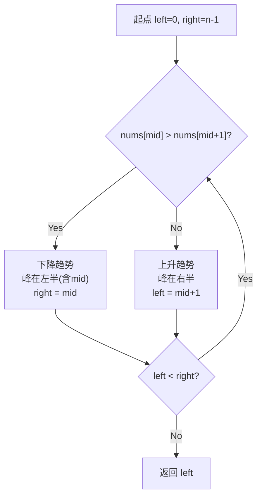

---

title: "寻找峰值"

difficulty: 中等

category: 二分查找

tags:

  - leetcode

  - 二分查找

created: "2026-07-21"

---

# 162. 寻找峰值（Find Peak Element）

> 难度：中等 | 主题：二分查找、数组

## 题目

峰值元素是指其值严格大于左右相邻值的元素。给你一个整数数组 nums，找到峰值元素并返回其索引。数组可能包含多个峰值，返回任何一个即可。要求 O(log n) 时间复杂度。

**示例**

```text

输入：nums = [1,2,3,1]

输出：2

解释：3 是峰值元素

```

---

## 思路
### 先讲个故事：登山找山顶

你正在爬一座山，山势起伏不定。你不知道山顶在哪，但你有一个判断力：**往高的方向走一定能找到山顶**。

当你站在某个位置，如果右边比你高，你就往右走；如果左边比你高，你就往左走。因为数组两端视为 -∞，所以你一定会走到某个"两边都比你低"的位置——那就是山顶。

---

### 引导式推导：为什么二分能找峰值？

**核心洞察**：利用「向高处走必达峰」的性质做二分。比较 `nums[mid]` 和 `nums[mid+1]`：



- 如果 `nums[mid] > nums[mid+1]`，左边（含 mid）可能有峰，`right = mid`

- 如果 `nums[mid] < nums[mid+1]`，右边（含 mid+1）一定有峰，`left = mid + 1`

不需要找全局最大，只要找到一个峰即可。

**为什么一定能找到？** 因为 nums[-1] = nums[n] = -∞，所以上升必有下降，下降本身就是峰值。

| 解法 | 时间 | 空间 |

|------|------|------|

| **二分查找（推荐）** | O(log n) | O(1) |

| 线性扫描 | O(n) | O(1) |

---

## 代码

```python

def findPeakElement(self, nums):

    left, right = 0, len(nums) - 1

    while left < right:

        mid = left + (right - left) // 2

        if nums[mid] > nums[mid + 1]:

            right = mid

        else:

            left = mid + 1

    return left

```

---

## 复杂度

| 指标 | 值 | 解释 |

|------|----|------|

| 时间 | O(log n) | 二分查找 |

| 空间 | O(1) | 只用两个指针 |

---

## 实战考量
### 频率分析

> **出现在**：二分变形题经典。考察「二分不一定要有序，只要具备某种单调/排除性质就能用」。字节/美团常考。

### 延伸思考

**Q：如果有多个峰值，怎么找最大的那个？**

A：必须遍历或二分加比较，不能简单二分。本题只要求返回任意一个。

**Q：如果数组里有平台（相邻相等）呢？**

A：本题保证相邻不等，如果有相等需要额外处理。

**Q：二维矩阵找峰值呢？**

A：先二分一维找到列方向最大，再在该列找行方向最大，递归。

### 易错点

- 比较 `nums[mid+1]` 不是 `nums[mid-1]`

- 循环条件 `left < right`

- 本题不找全局最大，只要一个峰

---

## 生活类比

> **找峰值 → 顺着坡往上爬**

>

> 就像你在大雾中登山，看不见全貌，但你能感觉到脚下是上坡还是下坡。只要一直往高的方向走，雾散时你一定站在某个山头上——可能不是最高的，但一定是个峰。

---

## 相关题目

| 题目 | 关系 |

|------|------|

| 153寻找旋转数组最小值 | 二分找旋转点 |

| 704二分查找 | 二分基础 |

---

→ 返回题单：[[LeetCode学习路线图#八、二分查找]]

## 速记卡（面试闪卡）

**Q1：一句话讲清「162. 寻找峰值（Find Peak Element）」到底是什么？**

A：在数组里找一个比左右邻居都大的元素（峰值），要求 O(log n) 时间。

**Q2：题目怎么理解？ —— 怎么理解？**

A：雾中登山，看不清全貌但能感到脚下是上坡还是下坡，一直往高的方向走，雾散时必站上某个山头。这就是找峰值元素（Peak Element，严格大于左右相邻值的元素）。

**Q3：为什么二分能找峰？ —— 怎么理解？**

A：比较 mid 和 mid+1：上坡（mid<mid+1）就往右走，下坡（mid>mid+1）峰在左半。像跟着坡度走，不用有序也能排除一半。这是基于单调排除性质的二分（binary search on monotonic property）。

**Q4：为什么一定找得到？ —— 怎么理解？**

A：数组两头当作负无穷（-∞），上升必有下降，而下降点本身就是峰。所以不管从哪起走，终会收敛到一个峰，不一定最高但一定合法。这是边界即负无穷（boundary as -∞）的保证。

**Q5：复杂度和实战怎么理解？ —— 怎么理解？**

A：字节/美团常考，立意是"二分不一定要有序，只要有某种排除性质就能用"。时间 O(log n)，空间 O(1)（两个指针）。

**Q6：核心速记主线有哪些？**

- 题目：找任意一个严格大于左右邻居的峰值

- 核心：对比 mid 与 mid+1，上坡右移、下坡左移

- 关键：两端视为 -∞，必能收敛到一个峰

- 实战：字节/美团常考，考"二分不要求有序"

**口诀**

A：寻找峰值像登山，

上坡往右下坡还；

两端当作负无穷，

必有一峰在手边。

## 相关链接

- [[笔记/Leetcode笔记/08_二分查找/378有序矩阵中第K小的元素|有序矩阵中第K小的元素]]

- [[笔记/Leetcode笔记/08_二分查找/4寻找两个正序数组的中位数|寻找两个正序数组的中位数]]

- [[笔记/Leetcode笔记/08_二分查找/153寻找旋转数组最小值|寻找旋转数组最小值]]

- [[笔记/Leetcode笔记/08_二分查找/35搜索插入位置|搜索插入位置]]

- [[笔记/Leetcode笔记/08_二分查找/240搜索二维矩阵II|搜索二维矩阵II]]

