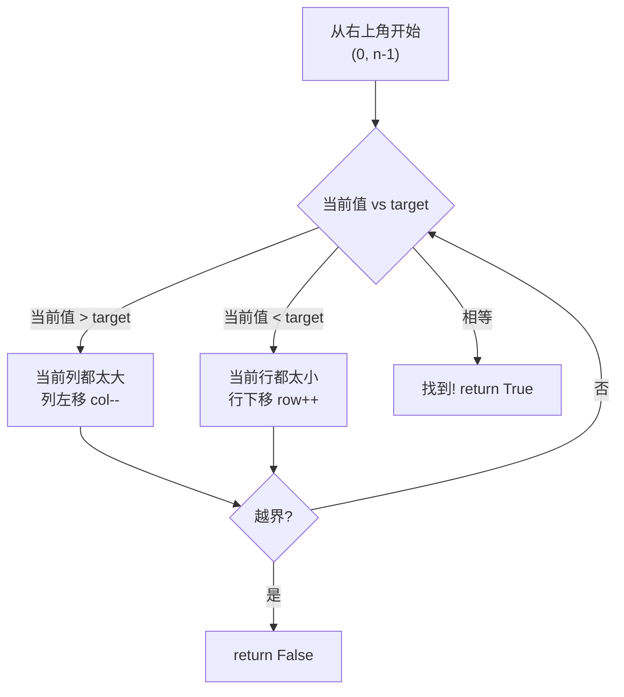

# 240. 搜索二维矩阵 II（Search a 2D Matrix II）

> 难度：中等 | 主题：二分查找、矩阵、双指针

## 题目

编写一个高效的算法来搜索 m x n 矩阵 matrix 中的一个目标值 target。该矩阵具有以下特性：每行的元素从左到右升序排列；每列的元素从上到下升序排列。

**示例**
```python
输入：matrix = [[1,4,7,11,15],[2,5,8,12,19],[3,6,9,16,22],[10,13,14,17,24],[18,21,23,26,30]], target = 5
输出：true
```

---

## 思路

### 先讲个故事：在十字路口找路

你站在一个十字路口，北边的路越走越热（数字变大），东边的路越走越冷（数字变小）。你要找一个温度 15°C 的地方。

你站在右上角——这里是你北边最热、东边最冷的地方。如果当前位置比 15 热，说明这条路往北只会更热，你往东走；如果比 15 冷，说明这条路往东只会更冷，你往北走。每一步都排除一行或一列。

---

### 引导式推导：Z 字形搜索

从**右上角**开始搜索。右上角是当前行的最大、当前列的最小。



每次比较都能排除一行或一列，最多走 m+n 步。

| 解法 | 时间 | 空间 |
|------|------|------|
| **右上角双指针（推荐）** | O(m+n) | O(1) |
| 逐行二分 | O(m log n) | O(1) |

---

## 代码

```python
def searchMatrix(self, matrix, target):
    if not matrix or not matrix[0]:
        return False
    
    m, n = len(matrix), len(matrix[0])
    row, col = 0, n - 1
    
    while row < m and col >= 0:
        current = matrix[row][col]
        
        if current == target:
            return True
        elif current > target:
            col -= 1
        else:
            row += 1
    
    return False
```

---

## 复杂度

| 指标 | 值 | 解释 |
|------|----|------|
| 时间 | O(m+n) | 每次排除一行或一列 |
| 空间 | O(1) | 只用两个指针 |

---

## 实战考量

### 频率分析

> **出现在**：矩阵搜索经典题。考察对二维有序结构的搜索策略，不能只会一维二分。字节/美团常考。

### 延伸思考

**Q：为什么从左下角开始也可以？**
A：左下角是当前列最大、当前行最小，同理可推。

**Q：如果矩阵极大（10^5 x 10^5），m+n 和 m*log(n) 哪个好？**
A：10^5 + 10^5 = 2*10^5，10^5 * log(10^5) ≈ 1.7*10^6，双指针更优。

**Q：如果要求统计出现次数呢？**
A：找到后向左右扩展，或用二分找上下界。

### 易错点

- 起始位置必须是右上角或左下角
- 循环条件是 `row < m and col >= 0`
- 从左上角开始不行：右和下都变大，无法确定方向

---

## 生活类比

> **Z 字形搜索 → 在十字路口找路**
>
> 你站在一个路口，北边越走越热，东边越走越冷。你要找某个温度——每一步都能排除一条路。方向感就是你的二分法：热了往东，冷了往北，迟早走到。

---

## 相关题目

| 题目 | 关系 |
|------|------|
| 74搜索二维矩阵 | 矩阵可拉平成一维有序 |
| 378有序矩阵中第K小的元素 | 有序矩阵第 K 小 |

---

→ 返回题单：[[LeetCode学习清单#八、二分查找]]

## 速记卡（面试闪卡）

**Q1：一句话讲清「240. 搜索二维矩阵 II（Search a 2D Matrix II）」到底是什么？**
A：编写一个高效的算法来搜索 m x n 矩阵 matrix 中的一个目标值 target。该矩阵具有以下特性：每行的元素从左到右升序排列；每列的元素从上到下升序排列。
**示例**
---

**Q2：题目 —— 怎么理解？**
A：编写一个高效的算法来搜索 m x n 矩阵 matrix 中的一个目标值 target。该矩阵具有以下特性：每行的元素从左到右升序排列；每列的元素从上到下升序排列。
**示例**
---

**Q3：思路 —— 怎么理解？**
A：你站在一个十字路口，北边的路越走越热（数字变大），东边的路越走越冷（数字变小）。你要找一个温度 15°C 的地方。
你站在右上角——这里是你北边最热、东边最冷的地方。如果当前位置比 15 热，说明这条路往北只会更热，你往东走；如果比 15 冷，说明这条路往东只会更冷，你往北走。每一步都排除一行或一列。
---
从**右上角**开始搜索。右上角是当前行的最大、当前列的最小。
每次比较都能排除一行或一列，最多走 m+n 步。

**Q4：代码 —— 怎么理解？**
A：---

**Q5：复杂度 —— 怎么理解？**
A：| 指标 | 值 | 解释 |
|------|----|------|
| 时间 | O(m+n) | 每次排除一行或一列 |
| 空间 | O(1) | 只用两个指针 |
---

**Q6：核心速记主线有哪些？**
A：抓住这几根：题目、思路、代码、复杂度、实战考量、生活类比。

