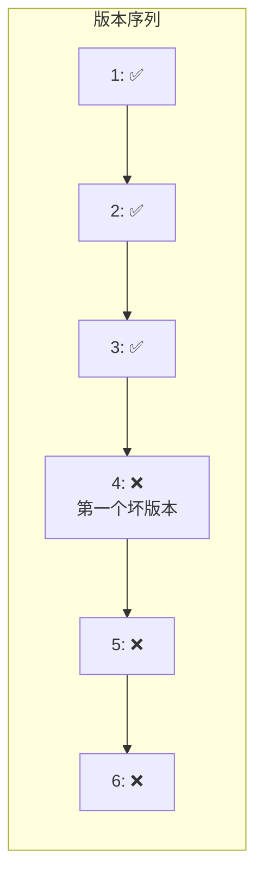
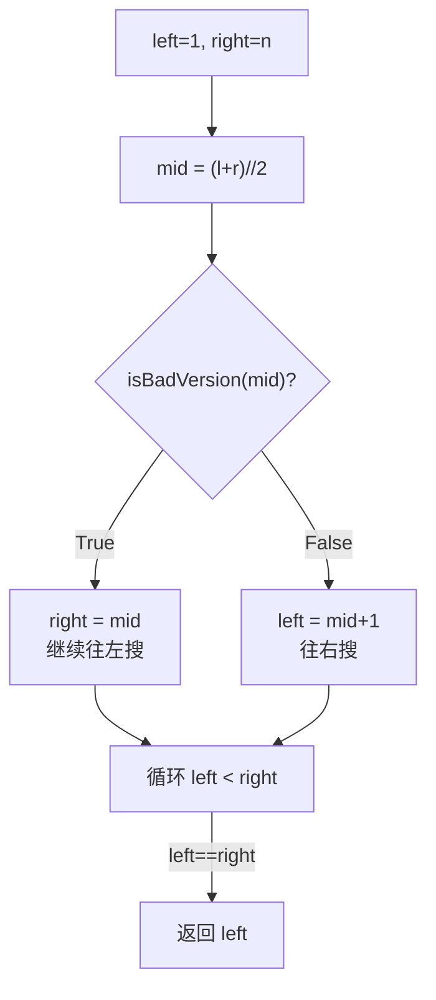

---

title: "第一个错误的版本"

difficulty: 简单

category: 二分查找

tags:

  - leetcode

  - 二分查找

created: "2026-07-21"

---

# 278. 第一个错误的版本

> 难度：简单 | 主题：二分查找——找左边界

## 题目

你是产品经理，目前正在带领一个团队开发新的产品。不幸的是，你的产品的最新版本没有通过质量检测。由于每个版本都是基于之前的版本开发的，所以错误的版本之后的所有版本都是错的。假设你有 n 个版本 [1, 2, ..., n]，你想找出导致之后所有版本出错的第一个错误的版本。要求尽可能少的调用 API。

**示例**

```text

输入：n = 5, bad = 4

输出：4

解释：调用 isBadVersion(4) → true，第一个错误版本是 4

```

---

## 思路
### 先讲个故事：第一颗坏掉的鸡蛋

你有 100 个鸡蛋一排摆着，从某个位置开始鸡蛋全是坏的。你要找到**第一颗坏鸡蛋**。

你不会从第一颗开始逐个检查——太慢。你会跳着检查：如果第 50 颗是好的，好的鸡蛋后面不会突然变坏，所以坏鸡蛋一定在 51~100；如果第 50 颗是坏的，它可能是第一颗，也可能前面还有坏的，所以继续在 1~49 里找。

这就是"找第一个满足条件的元素"的标准二分。

---

### 引导式推导：从线性到二分

**线性扫描**：调用 `isBadVersion(1)`、`isBadVersion(2)`... 直到遇到第一个 true。最坏 O(n)。

**二分优化**：题目核心性质——**单调性**。一旦某个版本是坏的，它之后的所有版本都是坏的。这形成一个分界线：前段全 true、后段全 false。



问题转化为：在 [1, n] 中找第一个 `isBadVersion(mid) == True` 的位置。

**与 704 的区别**：

- 704 找 `==`，找到了直接返回

- 278 找 `True`，找到了还要往左搜（因为要找第一个）

---

### 二分模板：找左边界



**为什么 `isBadVersion(mid)` 为 True 时是 `right = mid` 而不是 `mid - 1`？** 因为 mid 可能就是第一个坏版本，不能跳过。这和 35 题一样的道理。

---

## 代码

```python

def firstBadVersion(self, n):

    left, right = 1, n

    while left < right:

        mid = left + (right - left) // 2

        if isBadVersion(mid):

            right = mid

        else:

            left = mid + 1

    return left

```

**循环条件为什么是 `left < right` 而不是 `<=`？** 题目保证一定存在坏版本，所以 left == right 时就是答案，不需要再循环。

---

## 复杂度

| 指标 | 值 | 解释 |
|------|----|------|
| 时间 | O(log n) | 二分版本号 |
| 空间 | O(1) | 两个指针 |

---

## 实战考量
### 频率分析

> **出现在**：常考二分变体，考察能否识别单调性以及"找边界"而不是"找值"。

### 延伸思考

**Q：如果找最后一个正确版本呢？**

A：条件反转。找最后一个 `isBadVersion(mid) == False` 的位置：如果 `isBadVersion(mid)` 为 False 则 `left = mid`，否则 `right = mid - 1`。最后返回 `right`。

**Q：如果有多个不连续的坏版本呢？**

A：本题依赖"坏版本之后全坏"的单调性。如果不连续，不能二分，只能线性扫描。

**Q：左闭右开写法怎么写？**

A：`left, right = 1, n+1`，`while left < right`，条件 true 时 `right = mid`，false 时 `left = mid + 1`，返回 `left`。

### 易错点

- `right = mid` 不是 `mid - 1`（mid 可能是答案）

- 循环条件用 `left < right` 不是 `<=`

- 与 704 的区别：704 找 == 命中即返回，278 找第一个 True 命中不返回

---

## 生活类比

> **找第一个坏版本 → 查污染源**

>

> 河流上游有工厂排污。你在下游检测到污染，但不知道哪个工厂是源头。你不会逐个工厂测——你从中间工厂测，如果它下游有污染，源头就在上游；如果它下游没污染，源头就在下游。

---

## 相关题目

| 题目 | 关系 |
|------|------|
| 704二分查找 | 基础二分模板 |
| [[34查找元素第一个和最后一个位置]] | 找左右边界 |

---

→ 返回题单：[[LeetCode学习路线图#八、二分查找]]

## 速记卡（面试闪卡）

**Q1：一句话讲清「278. 第一个错误的版本」到底是什么？**

A：在「坏版本之后全坏」的单调序列里，用二分找第一个坏版本——左边界二分模板，O(log n)。

**Q2：题目本质 —— 怎么理解？**

A：想象 100 个鸡蛋一排摆着，从某处开始全是坏的，要找第一颗坏蛋。你不会从头查——跳到中间，好则坏蛋在右侧、坏则可能在左侧。这就是「找第一个满足条件的元素」，英语叫 First Bad Version / Lower Bound。

**Q3：思路：单调性 → 二分 —— 怎么理解？**

A：题目核心性质是单调性：一旦某版本坏，它之后全坏，形成「前段好、后段坏」分界线。问题转化为在 [1,n] 找第一个 isBadVersion==True 的位置。和 704 不同：704 找值命中即返回，278 命中还要往左搜。

**Q4：代码：找左边界 —— 怎么理解？**

A：循环条件用 left<right 而非 <=，因为题目保证有答案，相等即停。mid 命中时 right=mid（不能 mid-1，mid 可能就是答案），未命中 left=mid+1。像用二分锁死「污染源」位置。

**Q5：复杂度与变体 —— 怎么理解？**

A：时间 O(log n)（二分版本号），空间 O(1)（两个指针）。变体：找最后一个好版本条件反转；若坏版本不连续（失去单调性）则不能二分，只能线性扫描。

**Q6：核心速记主线有哪些？**

- 单调性：坏版本之后全坏，前好后坏一条分界线

- 左边界二分：命中 right=mid，未命中 left=mid+1

- 循环用 left<right，结束 left==right 即答案

- 时间 O(log n)、空间 O(1)

**口诀**

A：二分查坏版本

左边界要锁定

命中 right 等于 mid

O(log n) 真轻松

## 相关链接

- [[笔记/Leetcode笔记/08_二分查找/34查找元素第一个和最后一个位置|查找元素第一个和最后一个位置]]

- [[笔记/Leetcode笔记/08_二分查找/378有序矩阵中第K小的元素|有序矩阵中第K小的元素]]

- [[笔记/Leetcode笔记/08_二分查找/35搜索插入位置|搜索插入位置]]

- [[笔记/Leetcode笔记/08_二分查找/4寻找两个正序数组的中位数|寻找两个正序数组的中位数]]

- [[笔记/Leetcode笔记/08_二分查找/704二分查找|二分查找]]

