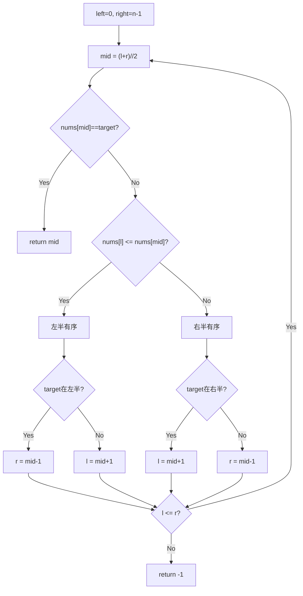

---

title: "搜索旋转排序数组"

difficulty: 中等

category: 二分查找

tags:

  - leetcode

  - 二分查找

created: "2026-07-21"

---

# 33. 搜索旋转排序数组

> 难度：中等 | 主题：旋转数组二分——先找有序半，再判断 target 在里面吗

## 题目

整数数组 nums 按升序排列，数组中的值互不相同。在传递给函数之前，nums 在预先未知的某个下标 k（0 <= k < nums.length）上进行了旋转。给你旋转后的数组 nums 和一个整数 target，如果 nums 中存在这个目标值 target，则返回它的下标，否则返回 -1。要求 O(log n) 时间复杂度。

**示例**

```text

输入：nums = [4,5,6,7,0,1,2], target = 0

输出：4

```

---

## 思路
### 先讲个故事：在被撕碎的书页里找字

你有一本字典，被人从中间撕开后把后半部分叠到了前面。现在你看到的页码是 [7,8,9,10,1,2,3,4]。你要找"第 3 页"在哪。

你会发现：撕开后**至少有一半还是有序的**。如果中间页码比左边大，说明左半是连续的；否则右半是连续的。只要知道哪半有序，就能判断 target 在不在那半里。

---

### 引导式推导：一次二分判断哪半有序

旋转数组任意取中点，**至少一半有序**。先判断哪半有序，再判断 target 是否在有序半内，从而决定搜索方向。



| 条件 | 含义 |
|------|------|
| `nums[l] <= nums[mid]` | 左半有序 |
| `nums[l] > nums[mid]` | 右半有序 |
| 解法 | 时间 | 空间 |
|------|------|------|
| **二分** | O(log n) | O(1) |

---

## 代码

```python

class Solution:

    def search(self, nums: list[int], target: int) -> int:

        l, r = 0, len(nums) - 1

        while l <= r:

            mid = (l + r) // 2

            if nums[mid] == target:

                return mid

            if nums[l] <= nums[mid]:

                if nums[l] <= target < nums[mid]:

                    r = mid - 1

                else:

                    l = mid + 1

            else:

                if nums[mid] < target <= nums[r]:

                    l = mid + 1

                else:

                    r = mid - 1

        return -1

```

---

## 复杂度

| 指标 | 值 | 解释 |
|------|----|------|
| 时间 | O(log n) | 二分查找 |
| 空间 | O(1) | 几个指针变量 |

---

## 实战考量
### 频率分析

> **出现在**：二分进阶高频题。考察能否在「部分有序」数组中用二分。重点掌握，核心是「每次二分至少有一半有序」这个洞察。与 153 题组成旋转数组系列。

### 延伸思考

**Q：如果数组有重复元素呢？（81 题）**

A：当 `nums[l] == nums[mid] == nums[r]` 时无法判断哪边有序，只能 `l += 1; r -= 1` 缩小区间，最坏退化为 O(n)。

**Q：为什么 `nums[l] <= nums[mid]` 用 `<=` 而不是 `<`？**

A：区间只剩两个元素时 `l == mid`，左半只有 mid 自己，天然有序。

**Q：旋转数组找最小值怎么二分？（153 题）**

A：跟 `nums[right]` 比，`nums[mid] < nums[right]` 时 `right = mid`（mid 可能是答案）。

### 易错点

- `nums[l] <= nums[mid]` 的等号不能丢

- 区间判断 mid 侧用 `<`（mid 已排除），边界侧用 `<=`

- 循环条件 `l <= r`（不是 `<`）

---

## 生活类比

> **搜索旋转数组 → 在被撕碎的书页里找字**

>

> 字典被撕开后重叠，你翻到某一页发现页码是 9。你立刻知道：9 比前面的 4 大，说明左半（4~9）没被撕过，是连续的。你要找的"第 3 页"不在 4~9 里，那就去右半找。每次翻一页都能排除一半。

---

## 相关题目

| 题目 | 关系 |
|------|------|
| 153寻找旋转数组最小值 | 旋转数组基础（找最小值） |
| 704二分查找 | 二分基础（标准有序数组） |

---

→ 返回题单：[[LeetCode学习路线图#八、二分查找]]

## 速记卡（面试闪卡）

**Q1：一句话讲清「33. 搜索旋转排序数组」到底是什么？**

A：旋转后的有序数组里二分查找，每次二分至少有一半有序，据此判方向。

**Q2：一、题目与旋转数组 —— 怎么理解？**

A：像被撕碎叠错的字典，要找某页在哪但要求 O(log n)。数组升序后在某点旋转，返回 target 下标或 -1（Rotated Sorted Array）。

**Q3：二、先判有序半思路 —— 怎么理解？**

A：像翻到一页发现页码 9 比前页大，说明左半没被撕过。中点必有一半有序，先判哪半有序再定 target 在不在（Find Sorted Half）。

**Q4：三、二分收缩方向 —— 怎么理解？**

A：像确认左半有序后，看 target 落不落在这段区间决定缩左还是缩右。用 <= 判左半、区间判断 mid 侧用 <（Binary Shrink）。

**Q5：四、复杂度与易错点 —— 怎么理解？**

A：像每次排除一半，时间 O(log n) 空间 O(1)。易错在 nums[l]<=nums[mid] 等号不能丢、循环 l<=r（Time/Space Complexity）。

**Q6：核心速记主线有哪些？**

- 旋转数组每次二分至少有一半有序

- 先判 nums[l]<=nums[mid] 哪半有序

- 据 target 是否在有序半决定收缩方向

- 时间 O(log n) 空间 O(1)，等号别丢

**口诀**

A：旋转也二分，

半边总有序；

先判哪边顺，

方向就清晰。

## 相关链接

- [[笔记/Leetcode笔记/08_二分查找/4寻找两个正序数组的中位数|寻找两个正序数组的中位数]]

- [[笔记/Leetcode笔记/08_二分查找/35搜索插入位置|搜索插入位置]]

- [[笔记/Leetcode笔记/08_二分查找/153寻找旋转数组最小值|寻找旋转数组最小值]]

- [[笔记/Leetcode笔记/08_二分查找/378有序矩阵中第K小的元素|有序矩阵中第K小的元素]]

- [[笔记/Leetcode笔记/08_二分查找/240搜索二维矩阵II|搜索二维矩阵II]]

