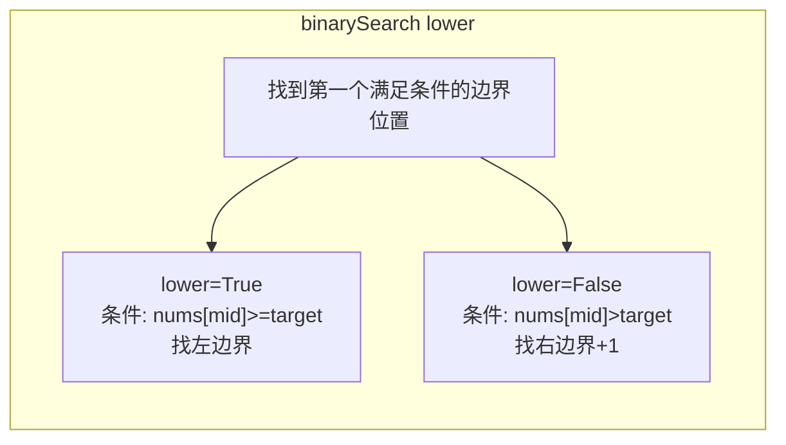

---

title: "查找元素第一个和最后一个位置"

difficulty: 中等

category: 二分查找

tags:

  - leetcode

  - 二分查找

created: "2026-07-21"

---

# 34. 查找元素的第一个和最后一个位置

> 难度：中等 | 主题：边界二分——两次 35

## 题目

给你一个按照非递减顺序排列的整数数组 nums，和一个目标值 target。请找出给定目标值在数组中的开始位置和结束位置。如果数组中不存在目标值 target，返回 [-1, -1]。要求 O(log n) 时间复杂度。

**示例**

```text

输入：nums = [5,7,7,8,8,10], target = 8

输出：[3,4]

```

---

## 思路
### 先讲个故事：点名册上的重名

老师点名："叫 8 号的同学站起来。"你发现班上有两个 8 号——第一个 8 号和最后一个 8 号。要快速找到这两个位置，你会怎么做？

你不会一个个数——点名册是按学号排序的，二分查找能快速定位。但你需要的不是"有没有 8 号"，而是**第一个 8 号和最后一个 8 号**。

---

### 引导式推导：拆分问题

**关键洞察：一个二分不够，那就做两次。**


**第一次二分**：找第一个 ≥ target 的位置（35 题模板）→ `leftIdx`

**第二次二分**：找第一个 > target 的位置 → `rightIdx`

如果 target 存在：

- 左边界 = `leftIdx`

- 右边界 = `rightIdx - 1`

如果 target 不存在，`leftIdx` 和 `rightIdx` 会交叉或越界。

**为什么不用一次二分找到 target 后向两边扩散？** 如果整个数组都是 target 值（比如 [8,8,8,8,8]），向两边扩散是 O(n)，不符合题目要求的 O(log n)。

---

### 统一二分函数



用一个 `binarySearch(lower)` 函数封装两种模式：

- `lower=True`：条件用 `>=`，返回第一个 ≥ target 的位置

- `lower=False`：条件用 `>`，返回第一个 > target 的位置

---

## 代码

```python

class Solution:

    def searchRange(self, nums: list[int], target: int) -> list[int]:

        def binarySearch(lower: bool) -> int:

            left, right = 0, len(nums) - 1

            ans = len(nums)

            while left <= right:

                mid = (right - left) // 2 + left

                if nums[mid] > target or (lower and nums[mid] >= target):

                    right = mid - 1

                    ans = mid

                else:

                    left = mid + 1

            return ans

        leftIdx = binarySearch(True)

        rightIdx = binarySearch(False) - 1

        if (leftIdx <= rightIdx and rightIdx < len(nums)

                and nums[leftIdx] == target and nums[rightIdx] == target):

            return [leftIdx, rightIdx]

        return [-1, -1]

```

**`ans` 为什么初始化为 `len(nums)` 而不是 `-1`？** 当 target 大于所有元素时，`leftIdx` 返回 `len(nums)`，`rightIdx` 返回 `len(nums)-1`，校验 `leftIdx <= rightIdx` 自然失败。

---

## 复杂度

| 指标 | 值 | 解释 |

|------|----|------|

| 时间 | O(log n) | 两次二分 |

| 空间 | O(1) | 几个指针变量 |

---

## 实战考量
### 频率分析

> **出现在**：字节/美团/阿里高频题。二分边界查找的核心模板，是 704→35→34 的进阶路径终点。

### 延伸思考

**Q：为什么用两次二分而不是一次二分找到 target 后向两边扩散？**

A：最坏情况整个数组都是 target，扩散是 O(n)。两次二分始终 O(log n)。

**Q：`binarySearch(False)` 后为什么要 `-1`？**

A：`binarySearch(False)` 找第一个 > target 的位置，右边界是最后一个等于 target 的位置，等于"第一个大于的索引减 1"。

**Q：为什么找到边界后还要校验 `nums[leftIdx] == target`？**

A：二分只保证找到边界位置，不保证 target 一定存在。比如 nums=[1,3], target=2，leftIdx 返回 1（3 的位置），但 3 ≠ 2。

### 易错点

- `ans = len(nums)` 不是 `-1`

- 事后必须校验 target 是否存在

- `rightIdx` 要 `-1`

---

## 生活类比

> **两次二分 → 找一个人的朋友圈首发和末条**

>

> 翻朋友圈的时间线，要找"2024 年发的第一条朋友圈"和"最后一条"。不会一条条翻——先二分找第一条 2024 年的（左边界），再二分找第一条 2025 年的（右边界+1），最后一条就是前一天。

---

## 相关题目

| 题目 | 关系 |

|------|------|

| [[35搜索插入位置]] | 基础：一次边界二分 |

| 153寻找旋转数组最小值 | 旋转数组二分 |

| 704二分查找 | 二分基础模板 |

---

→ 返回题单：[[LeetCode学习路线图#八、二分查找]]

## 速记卡（面试闪卡）

**Q1：一句话讲清「34. 查找元素的第一个和最后一个位置」到底是什么？**

A：在有序数组里找 target 的首尾下标，要求 O(log n)；靠两次边界二分分别定位左边界和右边界。

**Q2：题目：点名册上的重名（boundary binary search） —— 怎么理解？**

A：有序数组里 target 可能重复出现（如 [5,7,7,8,8,10] 找 8 → [3,4]）。要的不是「有没有 8」，而是第一个 8 和最后一个 8 的位置。就像点名册按学号排好，要快速找到两个重名 8 号各站哪。

**Q3：思路：一次不够就做两次（two-pass 二分） —— 怎么理解？**

A：一次二分找到 target 后向两边扩散不行——全数组都是 target 时退化为 O(n)，违反 O(log n)。改做两次：第一次找「第一个 ≥ target」（左边界 leftIdx），第二次找「第一个 > target」（rightIdx），右边界 = rightIdx-1。两次始终 O(log n)。

**Q4：代码：binarySearch(lower) 封装（O(log n)） —— 怎么理解？**

A：一个 binarySearch(lower) 封装两种：lower=True 条件 ≥ 找左边界，lower=False 条件 > 找右边界+1。ans 初始化为 len(nums)（非 -1）：target 比所有都大时 leftIdx 返回 n、校验自然失败。最后必须校验 nums[leftIdx]==target，防 target 根本不存在。

**Q5：复杂度与实战（O(log n)，高频模板） —— 怎么理解？**

A：时间 O(log n) 两次二分；空间 O(1)。实战：字节/美团/阿里高频，是 704→35→34 边界二分进阶终点。易错：ans 初值用 len(nums) 不是 -1；rightIdx 要 -1；事后必须校验 target 存在（如 nums=[1,3], target=2 会误返回）。

**Q6：核心速记主线有哪些？**

- 题目：有序数组找 target 首尾下标，O(log n)

- 思路：两次二分，左边界=首≥target，右边界=首>target-1

- 代码：binarySearch(lower) 封装，ans 初值 len(nums)

- 复杂度：时间 O(log n)，空间 O(1)

- 易错：校验 target 存在；rightIdx-1；别用扩散法

**口诀**

A：数组查首尾要周，

两次二分边界求；

左为首发右为收，

对数时间不犯愁。

## 相关链接

- [[笔记/Leetcode笔记/08_二分查找/378有序矩阵中第K小的元素|有序矩阵中第K小的元素]]

- [[笔记/Leetcode笔记/08_二分查找/35搜索插入位置|搜索插入位置]]

- [[笔记/Leetcode笔记/08_二分查找/278第一个错误的版本|第一个错误的版本]]

- [[笔记/Leetcode笔记/08_二分查找/4寻找两个正序数组的中位数|寻找两个正序数组的中位数]]

- [[笔记/Leetcode笔记/08_二分查找/240搜索二维矩阵II|搜索二维矩阵II]]

