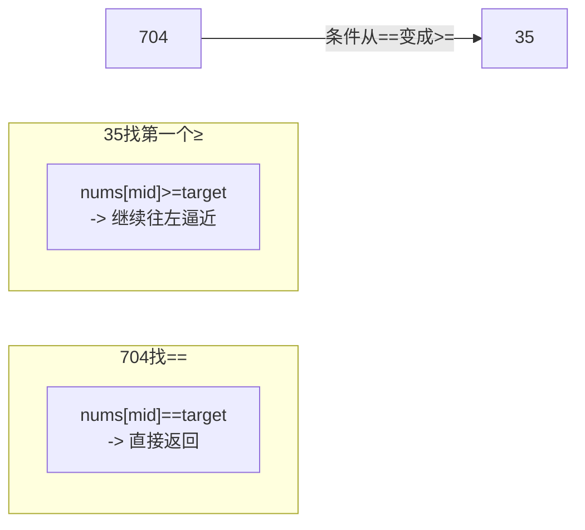

---

title: "搜索插入位置"

difficulty: 简单

category: 二分查找

tags:

  - leetcode

  - 二分查找

created: "2026-07-21"

---

# 35. 搜索插入位置

> 难度：简单 | 主题：二分变体——找第一个 ≥ target 的位置

## 题目

给定一个排序数组和一个目标值，在数组中找到目标值，并返回其索引。如果目标值不存在于数组中，返回它将会被按顺序插入的位置。请使用时间复杂度为 O(log n) 的算法。

**示例**

```text

输入：nums = [1,3,5,6], target = 5

输出：2

输入：nums = [1,3,5,6], target = 2

输出：1

```

---

## 思路
### 先讲个故事：图书馆插书

你在图书馆整理书架，书脊上的编号从小到大排列。管理员递给你一本编号 7 的书，让你插到正确位置。

你不会从第一本看到最后一本——你会先看中间，判断 7 应该在左半还是右半。和标准二分唯一的区别是：**如果书架上已经有 7，你可能会插在它前面**。所以你找的是"第一个 >= 7 的位置"。

---

### 引导式推导：从 704 到 35

704 题的目标是**找等于 target 的位置**，找到了就返回。



**35 题的目标是找第一个 ≥ target 的位置**：

- 如果 target 存在，这个位置就是 target 的索引

- 如果 target 不存在，这个位置就是应该插入的位置

**循环不变量**：退出时 left 指向第一个 ≥ target 的位置，right 指向最后一个 < target 的位置。

**边界情况**：如果 target 比所有元素都大，left 最终等于 len(nums)，即插入到末尾。

---

## 代码

```python

class Solution:

    def searchInsert(self, nums: list[int], target: int) -> int:

        left, right = 0, len(nums) - 1

        while left <= right:

            mid = (right - left) // 2 + left

            if nums[mid] >= target:

                right = mid - 1

            else:

                left = mid + 1

        return left

```

**为什么 `nums[mid] >= target` 时不是直接返回而是继续往左搜？** 因为要找"第一个"≥ target，即使找到了也要往左逼近，确保最靠前。

---

## 复杂度

| 指标 | 值 | 解释 |

|------|----|------|

| 时间 | O(log n) | 标准二分 |

| 空间 | O(1) | 几个指针变量 |

---

## 实战考量
### 频率分析

> **出现在**：704 和 34 之间的桥梁题，会作为"二分边界查找"的入门。约 40% 的二面会从这道题切入，看你能否延伸到 34 题。

### 延伸思考

**Q：704 和 35 的核心区别是什么？**

A：704 找 `==`，命中即返回；35 找 `>=`，命中后继续往左逼近。

**Q：为什么 `right = mid - 1` 而不是 `mid`？**

A：mid 已经检查过（满足 `nums[mid] >= target`），可以安全排除。

**Q：如果 target 比所有元素都大，返回什么？**

A：left 最终等于 len(nums)，即插入到数组末尾。

**Q：循环不变量怎么理解？**

A：退出时 left 指向第一个 ≥ target 的位置。right 停在最后一个 < target 的位置。right 左侧全是 < target，left 右侧全是 ≥ target。

### 易错点

- `right = mid - 1` 而非 `mid`（已检查过 mid）

- 返回 `left` 而非 `mid`

- 空数组时 left = 0

---

## 生活类比

> **找第一个 ≥ target → 插入排序的直觉**

>

> 玩扑克牌理牌时，你拿到一张新牌不会插在任意位置——你会找到第一张比它大的牌，插在那张前面。插入位置就是"第一个 ≥ 新牌"的位置。

---

## 相关题目

| 题目 | 关系 |

|------|------|

| 704二分查找 | 基础版（找 ==） |

| [[34查找元素第一个和最后一个位置]] | 进阶：两次边界二分 |

---

→ 返回题单：[[LeetCode学习路线图#八、二分查找]]

## 速记卡（面试闪卡）

**Q1：一句话讲清「35. 搜索插入位置」到底是什么？**

A：排序数组找 target，不存在就返回应插入位——本质二分找第一个 ≥ target 的下标。

**Q2：一、题目：查无则插 —— 怎么理解？**

A：像在编号书架插书：给排序数组与 target，找到返回索引，找不到返回该插入的位置，要求 O(log n)（Search Insert Position）。

**Q3：二、思路：找第一个 ≥ target —— 怎么理解？**

A：像理扑克牌：拿到新牌找第一张比它大的插前面（Insertion）。和标准二分区别是条件从 == 变 >=，命中后继续往左逼近找最靠前（Lower bound）。

**Q4：三、代码：left 即答案 —— 怎么理解？**

A：像两端夹逼：while 里 nums[mid]>=target 就 right=mid-1 往左收，否则 left=mid+1；退出时 left 就是第一个 ≥ target 的位置（Binary search）。返回 left 不返回 mid。

**Q5：四、复杂度与实战：边界入门 —— 怎么理解？**

A：时间 O(log n)、空间 O(1)。704 与 34 间的桥梁题，约 40% 二面切入，看你能否延伸到 34 题两次边界二分（Boundary binary search）。

**Q6：核心速记主线有哪些？**

- 本质：二分找第一个 ≥ target 的位置（lower bound）

- 与 704 区别：704 找 == 命中即返；35 找 >= 命中还往左逼

- 代码：nums[mid]>=target 时 right=mid-1，返回 left

- 边界：target 比所有大都返回 len(nums)；空数组返回 0

- 实战：二分边界查找入门，延伸到 34 题

**口诀**

A：搜索插入走二分，

首个大等定为门；

命中向左逼到顶，

落点就是左指针。

## 相关链接

- [[笔记/Leetcode笔记/08_二分查找/240搜索二维矩阵II|搜索二维矩阵II]]

- [[笔记/Leetcode笔记/08_二分查找/74搜索二维矩阵|搜索二维矩阵]]

- [[笔记/Leetcode笔记/08_二分查找/378有序矩阵中第K小的元素|有序矩阵中第K小的元素]]

- [[笔记/Leetcode笔记/08_二分查找/4寻找两个正序数组的中位数|寻找两个正序数组的中位数]]

- [[笔记/Leetcode笔记/08_二分查找/704二分查找|二分查找]]

