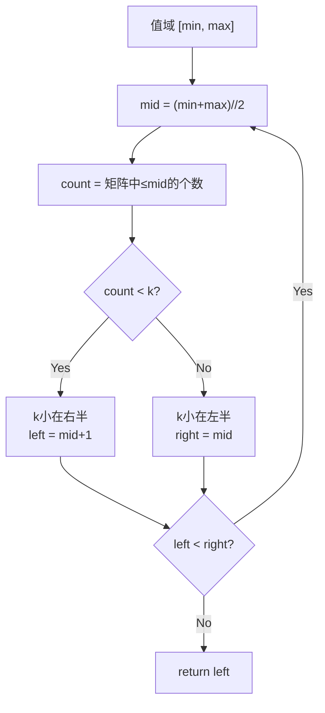

---

title: "有序矩阵中第K小的元素"

difficulty: 中等

category: 二分查找

tags:

  - leetcode

  - 二分查找

created: "2026-07-21"

---

# 378. 有序矩阵中第 K 小的元素（Kth Smallest Element in a Sorted Matrix）

> 难度：中等 | 主题：二分查找、矩阵、堆

## 题目

给你一个 n x n 矩阵 matrix，其中每行和每列元素均按升序排序，找到矩阵中第 k 小的元素。请注意，它是排序后的第 k 小元素，而不是第 k 个不同的元素。

**示例**

```python

输入：matrix = [[1,5,9],[10,11,13],[12,13,15]], k = 8

输出：13

```

---

## 思路
### 先讲个故事：考试排名

班上有 n×n 个同学的分数，每行每列都递增。老师要宣布"第 k 名是谁"。你不会把所有分数排序——那太慢。你会用二分法：猜一个分数线，数有多少人低于这个线，如果不够 k 人就提高分数线，够了就降低。

---

### 引导式推导：值域二分

**核心思路**：不在索引上二分，而在**值域**上二分。猜一个数 mid，统计矩阵中 ≤ mid 的元素个数 count：



`count_less_equal` 统计矩阵中 ≤ mid 的元素个数（利用每行有序，从右上角走）。

| 解法 | 时间 | 空间 | 特点 |

|------|------|------|------|

| **二分答案（推荐）** | O(n log V) | O(1) | 空间优，常用 |

| 最小堆 | O(k log n) | O(n) | k 较小时更快 |

---

## 代码

```python

def kthSmallest(self, matrix, k):

    n = len(matrix)

    left, right = matrix[0][0], matrix[n-1][n-1]

    while left < right:

        mid = left + (right - left) // 2

        count = self.count_less_equal(matrix, n, mid)

        if count < k:

            left = mid + 1

        else:

            right = mid

    return left

def count_less_equal(self, matrix, n, target):

    row, col = 0, n - 1

    count = 0

    while row < n and col >= 0:

        if matrix[row][col] <= target:

            count += col + 1

            row += 1

        else:

            col -= 1

    return count

```

---

## 复杂度

| 指标 | 值 | 解释 |

|------|----|------|

| 时间 | O(n log V) | V 是值域大小；count_less_equal 是 O(n) |

| 空间 | O(1) | 几个指针变量 |

---

## 实战考量
### 频率分析

> **出现在**：二分进阶题。考察「值域二分 + 统计函数」的组合，是二维有序结构的重要技巧。字节/阿里常考。

### 延伸思考

**Q：值域很大时二分还优吗？**

A：值域二分复杂度与值域范围有关，如果值域极大且稀疏，堆法可能更优。

**Q：如果矩阵是 n x m 且 m != n 呢？**

A：统计函数还是 O(n+m)，值域二分依然适用。

**Q：如果要求第 K 大呢？**

A：转成第 (n² - k + 1) 小，或值域二分改统计 >= target。

### 易错点

- `count_less_equal` 从右上角开始

- 二分是值域二分不是索引二分

- `count < k` 时 `left = mid + 1`，否则 `right = mid`

---

## 生活类比

> **值域二分 → 猜体重比赛**

>

> 运动会上 n×n 个同学比体重，每行每列都递增。主持人宣布"第 k 轻的人体重是多少"。你不会把所有人排队——你猜一个体重，数多少人比他轻。轻的人不够 k 个就提高标准，够了就降低，最后猜到的体重就是答案。

---

## 相关题目

| 题目 | 关系 |

|------|------|

| 240搜索二维矩阵II | 矩阵搜索基础 |

| 215数组中的第K个最大元素 | 一维数组第 K 大 |

| [[4寻找两个正序数组的中位数]] | 两个有序数组第 K 小 |

---

→ 返回题单：[[LeetCode学习路线图#八、二分查找]]

## 速记卡（面试闪卡）

**Q1：一句话讲清「378. 有序矩阵中第 K 小的元素（Kth Smallest Element in a Sorted Matrix）」到底是什么？**

A：在每行每列都升序的方阵里找第 k 小元素，靠值域二分加计数函数。

**Q2：题目：考试第 k 名（kth smallest in sorted matrix） —— 怎么理解？**

A：班里有 n×n 个分数、每行每列都递增，老师要宣布"第 k 名"。难点是矩阵只是行列有序、整体未排，不能简单取中间——得用二分在值域上找分数线。

**Q3：思路：值域二分（binary search on value range） —— 怎么理解？**

A：不在索引二分，而在值域 [min,max] 二分。猜 mid，用 count_less_equal 从右上角走，统计 ≤mid 的个数；count<k 就抬高左界，否则压低右界。像猜体重：数不够就加码，够了就收。

**Q4：代码：右上角计数（count less equal） —— 怎么理解？**

A：`count_less_equal` 从 row=0、col=n-1 出发：当前 ≤target 就 count+=col+1 并下移，否则左移。O(n) 完成计数。外层 while left<right 二分，返回 left。

**Q5：复杂度与实战（O(n log V) time） —— 怎么理解？**

A：时间 O(n log V)（V 值域，计数 O(n)），空间 O(1)。字节阿里二分进阶常考；k 较小时最小堆 O(k log n) 更快，稀疏大值域优选堆。

**Q6：核心速记主线有哪些？**

- 题目：行列升序矩阵中找第 k 小

- 思路：值域二分，猜 mid 统计 ≤mid 个数

- 代码：count_less_equal 从右上角走，O(n)

- 复杂度：时间 O(n log V)、空间 O(1)

- 实战：k 小时用最小堆更优

**口诀**

A：矩阵有序行列排，

值域二分巧安排；

右上起步数几块，

第 k 小者自然来。

## 相关链接

- [[笔记/Leetcode笔记/08_二分查找/240搜索二维矩阵II|搜索二维矩阵II]]

- [[笔记/Leetcode笔记/08_二分查找/35搜索插入位置|搜索插入位置]]

- [[笔记/Leetcode笔记/08_二分查找/74搜索二维矩阵|搜索二维矩阵]]

- [[笔记/Leetcode笔记/08_二分查找/4寻找两个正序数组的中位数|寻找两个正序数组的中位数]]

- [[笔记/Leetcode笔记/08_二分查找/34查找元素第一个和最后一个位置|查找元素第一个和最后一个位置]]

