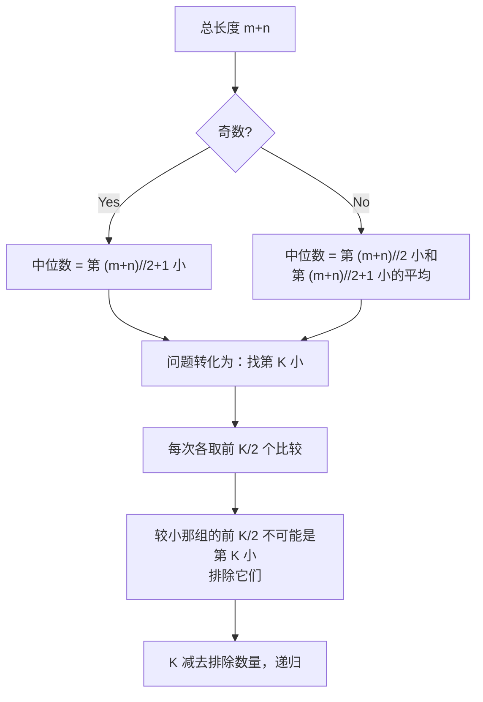

# 4. 寻找两个正序数组的中位数（Median of Two Sorted Arrays）

> 难度：困难 | 主题：二分查找、数组、分治

## 题目

给定两个大小分别为 m 和 n 的正序（从小到大）数组 nums1 和 nums2。请找出并返回这两个正序数组的中位数。要求算法的时间复杂度为 O(log (m+n))。

**示例**
```text
输入：nums1 = [1,3], nums2 = [2]
输出：2.00000
解释：合并数组 [1,2,3]，中位数是 2
```

---

## 思路

### 先讲个故事：两摞牌找中位数

你面前有两摞已经排好序的牌。要找合并后的中位数。你不会真的合并——那太慢。你从两摞牌顶各取一半比较，较小那一半不可能包含中位数，直接扔掉。然后缩小范围继续比。

---

### 引导式推导：找第 K 小

核心思路：中位数的本质是找第 K 小的元素。



找第 K 小的方法：每次从两个数组各取前 K/2 个元素比较，排除较小那组的前 K/2 个（它们不可能是第 K 小），然后 K 减去排除的数量，递归。

| 解法 | 时间 | 空间 |
|------|------|------|
| **二分找第 K 小（推荐）** | O(log(m+n)) | O(log(m+n)) |
| 划分数组 | O(log(min(m,n))) | O(1) |

---

## 代码

```python
def findMedianSortedArrays(self, nums1, nums2):
    total = len(nums1) + len(nums2)
    
    if total % 2 == 1:
        return self.findKth(nums1, nums2, total // 2 + 1)
    else:
        left = self.findKth(nums1, nums2, total // 2)
        right = self.findKth(nums1, nums2, total // 2 + 1)
        return (left + right) / 2.0

def findKth(self, nums1, nums2, k):
    if len(nums1) > len(nums2):
        return self.findKth(nums2, nums1, k)
    
    if not nums1:
        return nums2[k - 1]
    
    if k == 1:
        return min(nums1[0], nums2[0])
    
    i = min(k // 2, len(nums1))
    j = min(k // 2, len(nums2))
    
    if nums1[i - 1] < nums2[j - 1]:
        return self.findKth(nums1[i:], nums2, k - i)
    else:
        return self.findKth(nums1, nums2[j:], k - j)
```

---

## 复杂度

| 指标 | 值 | 解释 |
|------|----|------|
| 时间 | O(log(m+n)) | 每次排除 K/2 个元素 |
| 空间 | O(log(m+n)) | 递归栈深度 |

---

## 实战考量

### 频率分析

> **出现在**：困难经典题。顶级公司常考，考察对二分/分治的深刻理解。字节/Google 高频。

### 延伸思考

**Q：为什么能保证排除的元素一定不是第 K 小？**
A：假设 `nums1[i-1] < nums2[j-1]`，`nums1` 前 i 个都 ≤ `nums1[i-1]` < `nums2[j-1]` ≤ `nums2` 后 j 个，所以 `nums1` 前 i 个最多是第 i 小，不可能是第 k 小（i <= k/2 < k）。

**Q：迭代版怎么写？**
A：用 while k > 1 循环，每次排除一半。

**Q：划分数组的做法了解吗？**
A：在较短数组中二分一个分割点，使得左右两部分元素个数平衡且左半最大值 <= 右半最小值。

### 易错点

- 始终让 nums1 更短
- `i = min(k//2, len(nums1))`
- 索引是 `i-1` 不是 `i`

---

## 生活类比

> **两摞牌找中位数 → 淘汰赛**
>
> 两组选手已经按实力排好序。要找合并后的第 k 强。你让两组各派前 k/2 名比武——输的那一组全员淘汰，因为他们的实力最多排到第 k/2 名，不可能是第 k 强。然后 k 缩小，继续比。

---

## 相关题目

| 题目 | 关系 |
|------|------|
| 378有序矩阵中第K小的元素 | 二维有序矩阵第 K 小 |
| 215数组中的第K个最大元素 | 一维数组第 K 大 |

---

→ 返回题单：[[LeetCode学习清单#八、二分查找]]
