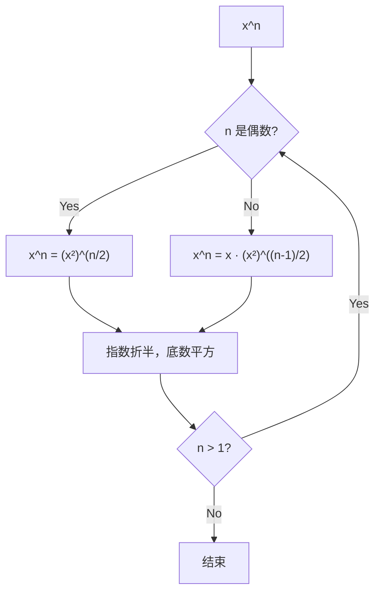

---

title: "Pow(x,n)"

difficulty: 中等

category: 二分查找

tags:

  - leetcode

  - 二分查找

created: "2026-07-21"

---

# 50. Pow(x, n)（Pow(x, n)）

> 难度：中等 | 主题：二分查找、递归、快速幂、数学

## 题目

实现 pow(x, n)，即计算 x 的整数 n 次幂函数。

**示例**

```text

输入：x = 2.00000, n = 10

输出：1024.00000

```

---

## 思路
### 先讲个故事：折纸的力量

你要折一张纸，问"对折 10 次有多厚？"。你不会一层层加——你知道每次对折厚度翻倍。x^10 = (x^5)^2，算一次 x^5 再自乘就行。而 x^5 = x * (x^2)^2，又可以拆。每次把指数折半，只需要 log n 次乘法。

---

### 引导式推导：指数的二进制分解

核心洞察：利用指数的二进制分解。比如 `x^13 = x^(1101₂) = x^8 * x^4 * x^1`。每次把指数折半：



二进制视角：n 的每一位为 1 时，把对应的 x^(2^k) 乘入结果。

| 解法 | 时间 | 空间 |

|------|------|------|

| **快速幂迭代（推荐）** | O(log n) | O(1) |

| 快速幂递归 | O(log n) | O(log n) |

| 暴力 | O(n) | O(1) |

---

## 代码

```python

def myPow(self, x, n):

    if n < 0:

        x = 1 / x

        n = -n

    result = 1.0

    current_product = x

    while n > 0:

        if n & 1:

            result *= current_product

        current_product *= current_product

        n >>= 1

    return result

```

---

## 复杂度

| 指标 | 值 | 解释 |

|------|----|------|

| 时间 | O(log n) | 每次指数折半 |

| 空间 | O(1) | 迭代版只用几个变量 |

---

## 实战考量
### 频率分析

> **出现在**：基础算法题，快速幂是常客。考察对二进制和分治的理解。字节/美团常考。

### 延伸思考

**Q：时间复杂度为什么是 O(log n)？**

A：每次指数至少折半，最多 log n 次。

**Q：如果要求大数取模呢？**

A：每次乘法后取模，`result = (result * current_product) % mod`。

**Q：矩阵快速幂了解吗？**

A：用于加速递推，如斐波那契数列 O(log n)。

### 易错点

- 负指数要先处理

- `n = -2^31` 在 C++/Java 中要转 long

- 迭代时 `current_product` 每次自乘

---

## 生活类比

> **快速幂 → 指数的折叠**

>

> 就像折纸：折 1 次是 2 层，折 2 次是 4 层，折 10 次是 1024 层。你不需要一层层数——每次翻倍就行。快速幂的本质就是"每次翻倍"，只不过这里的"翻倍"是指数折半、底数平方。

---

## 相关题目

| 题目 | 关系 |

|------|------|

| [[69x的平方根]] | 二分/牛顿法 |

---

→ 返回题单：[[LeetCode学习路线图#八、二分查找]]

## 速记卡（面试闪卡）

**Q1：一句话讲清「50. Pow(x, n)（Pow(x, n)）」到底是什么？**

A：计算 x 的 n 次幂，用快速幂把指数折半、底数平方，做到对数级时间。

**Q2：题目理解 —— 幂运算的痛点？ —— 怎么理解？**

A：像问对折十次多厚：一层层乘太慢。题目要你算 x^n，n 可能很大甚至还为负。英文：Power Function。

**Q3：核心思路 —— 指数怎么折半？ —— 怎么理解？**

A：像折纸每次翻倍：x^13 = x^8·x^4·x^1，二进制哪位是 1 就把对应 x^(2^k) 乘进去。英文：Binary Exponentiation。

**Q4：代码实现 —— 循环怎么写？ —— 怎么理解？**

A：像边折边收：n 末位为 1 就把当前积乘进结果，current 每次自乘，n 右移一位，直到 n 归零。英文：Iterative Fast Pow。

**Q5：复杂度与实战 —— 负指数与溢出？ —— 怎么理解？**

A：像先翻面：n<0 先取倒数再算；C++/Java 要转 long 防 -2^31 溢出；大数取模每次乘后取。英文：Modular Exponentiation。

**Q6：核心速记主线有哪些？**

- 快速幂：指数二进制分解，n 的每位 1 对应乘入 x^(2^k)

- 迭代版：n&1 决定乘入，current 自乘，n>>=1

- 时间 O(log n)、空间 O(1)

- 负指数先 1/x 再算；n=-2^31 要转 long

- 大数取模：每次乘法后 result = result*current % mod

**口诀**

A：快速幂法指数折，

底数平方对数迭；

末位为一是积入，

负指翻面莫越界。

## 相关链接

- [[笔记/Leetcode笔记/08_二分查找/35搜索插入位置|搜索插入位置]]

- [[笔记/Leetcode笔记/08_二分查找/378有序矩阵中第K小的元素|有序矩阵中第K小的元素]]

- [[笔记/Leetcode笔记/08_二分查找/4寻找两个正序数组的中位数|寻找两个正序数组的中位数]]

- [[笔记/Leetcode笔记/08_二分查找/240搜索二维矩阵II|搜索二维矩阵II]]

- [[笔记/Leetcode笔记/08_二分查找/74搜索二维矩阵|搜索二维矩阵]]

