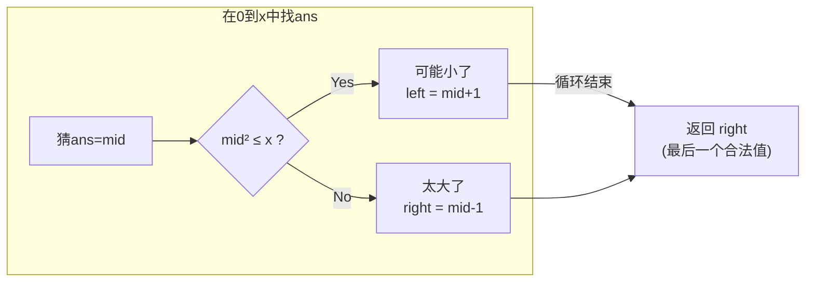
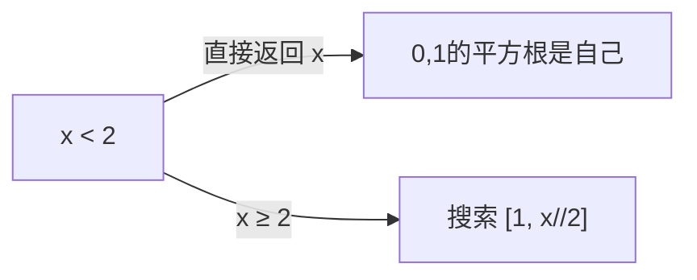

# 69. x 的平方根

> 难度：简单 | 主题：二分查找——单调性判断

## 题目

给你一个非负整数 x，计算并返回 x 的算术平方根。由于返回类型是整数，结果只保留整数部分，小数部分将被舍去。不允许使用任何内置指数函数和算符。

**示例**
```text
输入：x = 8
输出：2
解释：8 的算术平方根是 2.82842...，返回整数部分 2
```

---

## 思路

### 先讲个故事：猜平方根

朋友说："我想了一个数，它的平方不超过 100，你猜这个数最大是多少？"

你不会从 1 试到 10——你会猜 5，5² = 25 < 100；猜 8，8² = 64 < 100；猜 10，10² = 100，刚好。这就是二分查找平方根——在 [0, x] 中找最大的 m 使得 m² ≤ x。

---

### 引导式推导：从定义到二分

**问题转化**：求 sqrt(x) 的整数部分，等价于在 [0, x] 中找**最后一个**满足 `mid * mid ≤ x` 的数。

**单调性**：如果 `mid * mid ≤ x`，那么 mid 可能是答案，但更大的也可能满足，所以继续往右搜。



**退出时为什么返回 right 不是 left？** 循环退出时 left = right + 1。left² 一定 > x，right² 一定 ≤ x。right 就是最后一个合法答案。

---

### 可以优化搜索范围

x ≥ 4 时 sqrt(x) ≤ x // 2。所以搜索范围可以缩小到 [1, x // 2]，减少一半。



---

## 代码

```python
def mySqrt(self, x):
    if x < 2:
        return x

    left, right = 1, x // 2
    while left <= right:
        mid = left + (right - left) // 2
        if mid == x // mid:
            return mid
        elif mid < x // mid:
            left = mid + 1
        else:
            right = mid - 1

    return right
```

**为什么用 `mid == x // mid` 代替 `mid * mid == x`？** 防止大数溢出。虽然 Python 不会溢出，但实践中写这个习惯在 C++/Java 实践中加分。

---

## 复杂度

| 指标 | 值 | 解释 |
|------|----|------|
| 时间 | O(log x) | 二分范围 x |
| 空间 | O(1) | 几个变量 |

---

## 实战考量

### 频率分析

> **出现在**：一面二分基础题，考察对二分边界的理解以及溢出处理意识。

### 延伸思考

**Q：为什么返回 right 不是 left？**
A：退出时 left = right + 1。left² 一定 > x，right² 一定 ≤ x。right 是最后一个满足条件的值。

**Q：用牛顿迭代法怎么写？**
A：`r = (r + x / r) / 2`，迭代到 r² 与 x 的差小于精度。收敛速度比二分快。

**Q：如果要求精确到小数点后 k 位呢？**
A：把范围放大 10^(2k) 倍，最后再缩小回去。或用牛顿法浮点迭代。

### 易错点

- 用除法防溢出
- `x < 2` 的特殊处理
- 返回 `right` 不是 `left`

---

## 生活类比

> **找平方根 → 找正方形边长**
>
> 你知道一个正方形的面积是 10，想知道边长。你不会一个个平方算——二分猜边长：猜 3，面积 9 < 10；猜 4，面积 16 > 10。所以边长在 3~4 之间，整数部分是 3。

---

## 相关题目

| 题目 | 关系 |
|------|------|
| [[50Pow(x,n)]] | 快速幂 |
| 704二分查找 | 二分基础 |

---

→ 返回题单：[[LeetCode学习清单#八、二分查找]]
