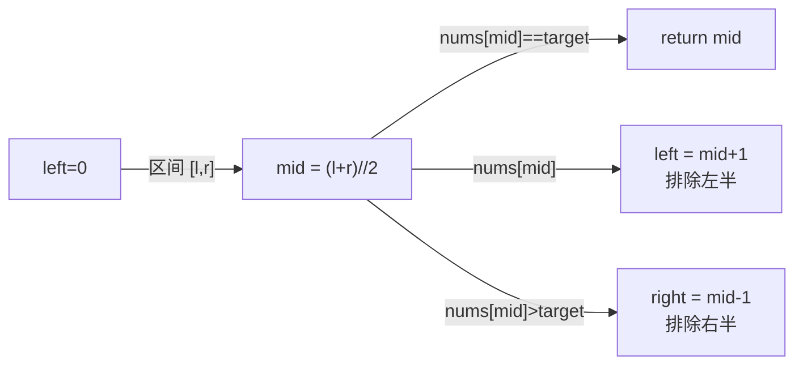

---

title: "二分查找"

difficulty: 简单

category: 二分查找

tags:

  - leetcode

  - 二分查找

created: "2026-07-21"

---

# 704. 二分查找

> 难度：简单 | 主题：标准二分模板

## 题目

给定一个 n 个元素有序的（升序）整型数组 nums 和一个目标值 target，写一个函数搜索 nums 中的 target，如果目标值存在返回下标，否则返回 -1。

**示例**

```text

输入：nums = [-1,0,3,5,9,12], target = 9

输出：4

```

---

## 思路
### 先讲个故事：猜数字游戏

小时候玩过猜数字游戏吗？A 心里想一个 1~100 的数，B 猜，A 说"大了"或"小了"。最聪明的猜法不是 1, 2, 3... 一个个试——而是**每次都猜中间**。第一次猜 50，如果大了就猜 25，范围每次缩小一半。这就是二分查找。

---

### 引导式推导：从 O(n) 到 O(log n)

**线性查找的思路**：从 index 0 开始，一个一个比。最坏情况要找 n 次。

**二分查找的思路**：数组已经排好序了，为什么不利用这个信息？

拿到中间元素 nums[mid]：

- 如果它正好是 target → 找到了

- 如果它比 target 大 → target 在左半边

- 如果它比 target 小 → target 在右半边

每次排除一半的数据。100 万条数据最多 20 次就能找到。

**为什么二分查找只能用在有序数组？** 因为我们需要"中间元素比 target 大 → 左半不可能有 target"这个推论。如果数组无序，这个推论不成立。

---

### 边界处理：闭区间模板

二分查找的边界写法不止一种，最推荐的是**闭区间模板**：



闭区间要点：

- `right = len(nums) - 1`（最后一个元素的索引）

- `while left <= right`（等号时还有元素要检查）

- 收缩时 `mid ± 1`（mid 已检查，必须踢出区间）

---

## 代码

```python

class Solution:

    def search(self, nums: list[int], target: int) -> int:

        left, right = 0, len(nums) - 1

        while left <= right:

            mid = (right - left) // 2 + left    # 防溢出计算中点

            if nums[mid] == target:

                return mid

            elif nums[mid] > target:

                right = mid - 1

            else:

                left = mid + 1

        return -1

```

**为什么 `mid = (right - left) // 2 + left` 比 `(left + right) // 2` 好？** 防止 left + right 整数溢出。Python 不会溢出，但这是习惯，C++/Java 会。

---

## 复杂度

| 指标 | 值 | 解释 |

|------|----|------|

| 时间 | O(log n) | 每次排除一半数据 |

| 空间 | O(1) | 只用几个指针变量 |

---

## 实战考量
### 频率分析

> **出现在**：几乎所有公司的，二分查找是算法的"ABC"。30% 的直接考模板，70% 考变体（35/34/153 等）。

### 延伸思考

**Q：为什么用 `left <= right` 而不是 `left < right`？**

A：闭区间 [left, right] 当 left == right 时还有一个元素要检查。开区间 [left, right) 才用 `<`。

**Q：为什么收缩时是 `mid + 1` 和 `mid - 1`？**

A：mid 已经检查过了，必须踢出区间，否则如果 `left = right = mid` 时 `nums[mid] != target`，会死循环。

**Q：左闭右开怎么写？**

A：`right = len(nums)`, `while left < right`, 收缩时 `right = mid`（不 -1，因为右边界是开区间）。但只记一种闭区间模板就够了。

**Q：二分查找有什么局限性？**

A：只能用在有序数据结构上，且要求随机访问（数组可以，链表不行）。

### 易错点

- `while` 条件写错（闭区间用 `<=`，开区间用 `<`）

- 收缩时忘记 `±1` 导致死循环

- 返回 `-1` 表示未找到

---

## 生活类比

> **二分查找 → 有序才有二分**

>

> 就像查字典：你不会从第一页翻到最后一页找"中"字。

> 你会先翻到中间，看"中"在前面还是后面。

> 字典之所以能这么查，是因为它**有序**。无序的书你只能一页一页翻。

---

## 相关题目

| 题目 | 关系 |

|------|------|

| [[35搜索插入位置]] | 基础→边界扩展（找 ≥ target 位置） |

| [[34查找元素第一个和最后一个位置]] | 进阶：两次边界二分 |

---

→ 返回题单：[[LeetCode学习路线图#八、二分查找]]

## 速记卡（面试闪卡）

**Q1：一句话讲清「704. 二分查找」到底是什么？**

A：《二分查找》在有序数组上每次折半定位 target，时间从 O(n) 降到 O(log n)。

**Q2：题目 —— 怎么理解？**

A：像查字典找字：给升序数组和 target，找到返回下标否则 -1；题目（Problem）考你有序上的折半搜索。

**Q3：思路 —— 怎么理解？**

A：像猜数字游戏：每次猜中间，大了往左小了往右，范围减半；二分查找（Binary Search）靠有序才能排除半边。

**Q4：代码 —— 怎么理解？**

A：闭区间模板：right=len-1，while left<=right，mid 命中返回、否则收缩 mid±1；代码（Code）防溢出用 (r-l)//2+l。

**Q5：复杂度 —— 怎么理解？**

A：像每次砍一半：时间 O(log n) 折半，空间 O(1) 仅指针；复杂度（Complexity）百万数据最多 20 次命中。

**Q6：核心速记主线有哪些？**

- 题目：有序数组搜 target，命中返回下标

- 思路：每次取中点折半，利用有序性

- 代码：闭区间 left<=right，收缩 mid±1

- 复杂度：时间 O(log n)，空间 O(1)

**口诀**

A：二分查字典，

每次取中间；

有序才可用，

log n 一遍见。

## 相关链接

- [[笔记/Leetcode笔记/08_二分查找/35搜索插入位置|搜索插入位置]]

- [[笔记/Leetcode笔记/08_二分查找/378有序矩阵中第K小的元素|有序矩阵中第K小的元素]]

- [[笔记/Leetcode笔记/08_二分查找/4寻找两个正序数组的中位数|寻找两个正序数组的中位数]]

- [[笔记/Leetcode笔记/08_二分查找/240搜索二维矩阵II|搜索二维矩阵II]]

- [[笔记/Leetcode笔记/08_二分查找/34查找元素第一个和最后一个位置|查找元素第一个和最后一个位置]]

