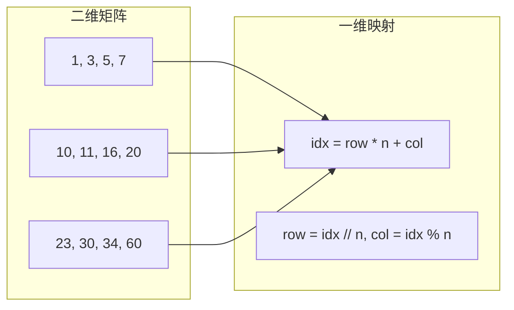

---

title: "搜索二维矩阵"

difficulty: 中等

category: 二分查找

tags:

  - leetcode

  - 二分查找

created: "2026-07-21"

---

# 74. 搜索二维矩阵（Search a 2D Matrix）

> 难度：中等 | 主题：二分查找、矩阵

## 题目

编写一个高效的算法来判断 m x n 矩阵中是否存在一个目标值 target。该矩阵具有以下特性：每行中的整数从左到右按非递减顺序排列；每行的第一个整数大于前一行的最后一个整数。

**示例**

```python

输入：matrix = [[1,3,5,7],[10,11,16,20],[23,30,34,60]], target = 3

输出：true

```

---

## 思路
### 先讲个故事：翻阅电话簿

你拿到一本电话簿，每页的号码都是从左到右递增的，而且下一页的第一个号码比上一页最后一个还大。你要找某个号码，不会一页页翻——你会把整本电话簿"压扁"成一条长纸条，然后在上面做二分查找。

---

### 引导式推导：将二维视为一维

因为每行有序且下一行首 > 本行尾，所以一行行首尾相连就是一维有序数组。



核心洞察：把二维坐标 `(row, col)` 映射成一维索引 `idx = row * n + col`，然后对这个虚拟的一维数组做标准二分查找。

| 解法 | 时间 | 空间 |
|------|------|------|
| **虚拟一维二分（推荐）** | O(log(m*n)) | O(1) |
| 两次二分 | O(log m + log n) | O(1) |

---

## 代码

```python

def searchMatrix(self, matrix, target):

    m, n = len(matrix), len(matrix[0])

    left, right = 0, m * n - 1

    while left <= right:

        mid = left + (right - left) // 2

        row = mid // n

        col = mid % n

        mid_val = matrix[row][col]

        if mid_val == target:

            return True

        elif mid_val < target:

            left = mid + 1

        else:

            right = mid - 1

    return False

```

---

## 复杂度

| 指标 | 值 | 解释 |
|------|----|------|
| 时间 | O(log(m*n)) | 标准二分，元素个数是 m*n |
| 空间 | O(1) | 只用几个变量 |

---

## 实战考量
### 频率分析

> **出现在**：二分变形题，考察对二分查找的灵活应用，不只是数组，还能扩展到矩阵。

### 延伸思考

**Q：如果每行递增但行之间没有规律呢？**

A：变成 240搜索二维矩阵II，不能用一维二分，要用右上角双指针。

**Q：空间复杂度能不能优化？**

A：已经是 O(1)，最优。

### 易错点

- `row = mid // n` 不是 `mid // m`

- 矩阵可能为空要提前判断

- 本题矩阵的「拉平有序」特性是关键

---

## 生活类比

> **搜索二维矩阵 → 翻电话簿**

>

> 电话簿每页的号码递增，下一页的起始号码比上一页末尾还大。你把整本压扁成一条，号码还是递增的——那就用二分。关键是一维映射：`行号 * 每行列数 + 列号`。

---

## 相关题目

| 题目 | 关系 |
|------|------|
| 240搜索二维矩阵II | 行和列分别有序 |
| 378有序矩阵中第K小的元素 | 有序矩阵第 K 小 |

---

→ 返回题单：[[LeetCode学习路线图#八、二分查找]]

## 速记卡（面试闪卡）

**Q1：一句话讲清「74. 搜索二维矩阵（Search a 2D Matrix）」到底是什么？**

A：判断目标值是否在一个行列均有序的矩阵中。

**Q2：思路 —— 怎么理解？**

A：像翻电话簿：每页号码递增、下一页首比上页尾还大，把整本压扁成一条长纸做 Binary Search（二分查找）。关键是二维坐标映射成一维索引。

**Q3：代码 —— 怎么理解？**

A：虚拟一维二分：left=0, right=m*n-1，mid 映射到 row=mid//n, col=mid%n；比较 matrix[row][col] 与 target，标准二分收缩区间。

**Q4：复杂度 —— 怎么理解？**

A：时间 O(log(m*n))（元素共 m*n 个），空间 O(1)（只用几个变量）。已是最优。

**Q5：实战考量 —— 怎么理解？**

A：二分变形题，考察灵活应用。易错：row 用 mid//n 别用 //m；矩阵可能为空要预判；拉平有序特性是关键（否则变 240 题用双指针）。

**Q6：核心速记主线有哪些？**

- 行列有序可拉平成一维有序数组

- 坐标映射：row=idx//n, col=idx%n

- 虚拟一维二分，时间 O(log(m*n))、空间 O(1)

- 易错：row=mid//n，空矩阵要预判

**口诀**

A：矩阵当纸条

压扁二分找

行乘列加列

映射跑不了

## 相关链接

- [[笔记/Leetcode笔记/08_二分查找/240搜索二维矩阵II|搜索二维矩阵II]]

- [[笔记/Leetcode笔记/08_二分查找/35搜索插入位置|搜索插入位置]]

- [[笔记/Leetcode笔记/08_二分查找/378有序矩阵中第K小的元素|有序矩阵中第K小的元素]]

- [[笔记/Leetcode笔记/08_二分查找/4寻找两个正序数组的中位数|寻找两个正序数组的中位数]]

- [[笔记/Leetcode笔记/08_二分查找/153寻找旋转数组最小值|寻找旋转数组最小值]]

