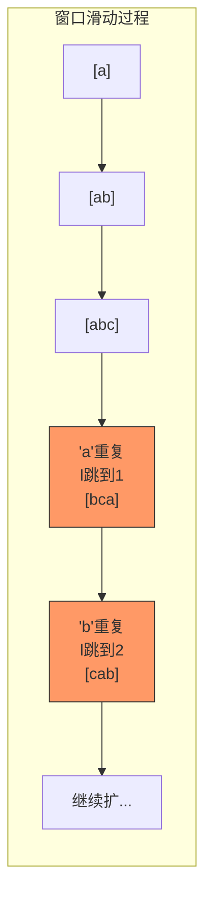

---

title: "无重复字符的最长子串"

difficulty: 中等

category: 滑动窗口

tags:

  - leetcode

  - 滑动窗口

  - sliding-window

created: "2026-07-21"

---

# 3. 无重复字符的最长子串（Longest Substring Without Repeating Characters）

> 难度：中等 | 主题：滑动窗口

## 题目

给定一个字符串 s，请找出其中不含有重复字符的最长子串的长度。

**示例：**

```python

输入：s = "abcabcbb"

输出：3

解释：无重复字符的最长子串是 "abc"，长度 3

```

---

## 思路
### 先讲个故事：找座位

你去图书馆自习，要找一个连续的空座位区。规则是：**相邻座位不能坐同一个人**（不能有重复字符）。

你从左边开始扫，遇到有人坐了（重复字符）就把左边界挪到那个人后面，继续往右找。右边一直往右扩，直到找到最长的一段连续空位。

这就是滑动窗口：**右指针负责扩，左指针负责缩**。

---

### 引导式推导：从暴力到滑动窗口

**暴力法**：枚举所有子串，检查是否有重复 → O(n³)

**滑动窗口 + 哈希表**：窗口右边界 r 不断右移，遇到重复字符时移动左边界 l 到上次出现位置+1。

```text

"abcabcbb"

r=0, 'a' → 窗口 [a], max_len=1

r=1, 'b' → 窗口 [ab], max_len=2

r=2, 'c' → 窗口 [abc], max_len=3

r=3, 'a' → 'a' 在窗口内！移动 l 到上次 'a'+1=1 → 窗口 [bca], max_len=3

r=4, 'b' → 'b' 在窗口内！移动 l 到上次 'b'+1=2 → 窗口 [cab], max_len=3

...

```



**关键洞察**：重复字符出现时，窗口内所有在它之前的字符都要被移除，因为包含它们的前缀不可能产生更优解。

---

## 代码

```python

def lengthOfLongestSubstring(s: str) -> int:

    char_index = {}    # 字符最后出现的位置

    l = max_len = 0    # 左指针 + 全局最长长度

    for r, c in enumerate(s):        # 右指针逐位扩展

        if c in char_index and char_index[c] >= l:

            l = char_index[c] + 1     # 左指针跳到重复字符的下一位

        char_index[c] = r             # 更新字符最后位置

        max_len = max(max_len, r - l + 1)

    return max_len

```

---

## 复杂度

| 指标 | 值 | 解释 |

|------|----|------|

| 时间 | O(n) | 每个字符最多入窗出窗各一次 |

| 空间 | O(k) | k 为字符集大小（ASCII 128 / Unicode），最坏 O(n) |

---

## 实战考量
### 频率分析

> **出现在**：LeetCode 第 116 次高频，几乎必考。滑动窗口入门必会题，考察「不定长滑动窗口」的核心模板——右指针扩展，左指针在条件不满足时收缩。

### 延伸思考

**Q：为什么用 `while` 而不是 `if` 收缩窗口？**

A：可能连续出现多个相同字符，一次收缩不一定够。「abccba」这种场景，`if` 会漏掉。

**Q：如果换成求「至多包含两个不同字符的最长子串」呢？（159 题）**

A：把 `set` 换成 `dict` 计数，收窗口条件改为 `len(window) > 2`。

**Q：如果换成求「至多包含 k 个不同字符的最长子串」呢？（340 题）**

A：同上，条件改为 `len(window) > k`。

**Q：如果用数组代替 set 呢？**

A：已知字符集限定（如 ASCII 128），`last_pos = [-1] * 128` 直接跳左指针到 `last_pos[ch] + 1`，避免 while 循环逐个收缩，但可读性差。

**Q：窗口长度怎么算？**

A：`right - left + 1`。这是滑动窗口的经典公式。

### 易错点

- `while` 不能写成 `if`，可能需连续收缩多次

- 窗口长度 `right - left + 1`

- `set` 的 `remove` 是删除具体字符而非索引

---

## 生活类比

> **无重复最长子串 → 图书馆找座位**

>

> 你从左往右扫，找到一段没人重复坐的连续座位。

> 遇到有人占了你已经占过的位子？把左边界挪到那个人后面，重新开始数。

>

> **滑动窗口就像拉手风琴——右边一直拉，遇到冲突就左边缩一下。**

---

## 相关题目

| 题目 | 关系 |

|------|------|

| 76最小覆盖子串 | 滑动窗口进阶版（找最小覆盖子串） |

| [[438找到字符串中所有字母异位词]] | 固定窗口大小版 |

| [[567字符串的排列]] | 固定窗口判断 |

---

→ 返回题单：[[LeetCode学习路线图#九、滑动窗口]]

## 速记卡（面试闪卡）

**Q1：一句话讲清「3. 无重复字符的最长子串（Longest Substring Without Repeating Characters）」到底是什么？**

A：用滑动窗口在字符串中找不含重复字符的最长子串长度，O(n) 时间。

**Q2：思路 —— 怎么理解？**

A：像图书馆找连续空座位——相邻不能坐同一人（重复字符）。右指针一直扩，遇重复就把左边界跳到上次出现位置+1，拉手风琴般右扩左缩。

**Q3：代码 —— 怎么理解？**

A：char_index 记字符最后位置，右指针 r 逐位扩；若 c 在窗口内（l≤char_index[c]）则 l 跳到 char_index[c]+1；更新位置，max_len=max(max_len, r-l+1)。

**Q4：复杂度 —— 怎么理解？**

A：时间 O(n) 每字符入窗出窗各一次；空间 O(k) k 为字符集大小（ASCII 128/Unicode），最坏 O(n)。

**Q5：实战考量 —— 怎么理解？**

A：高频必考，滑动窗口入门模板；收缩用 while 非 if（可能连续多重复）；窗口长度 r-l+1；延伸 159/340（至多 k 个不同字符）、76（最小覆盖子串）。

**Q6：核心速记主线有哪些？**

- 滑动窗口：右扩左缩，遇重复左跳到上次位置+1

- 用哈希表记字符最后位置，O(n) 时间

- 收缩用 while（可能连续重复），长度 r-l+1

- 高频必考，延伸至多 k 个不同字符/最小覆盖子串

**口诀**

A：无重复最长子串，滑动窗口右扩左

遇重左跳上次位，哈希记末莫相忘

收缩用 while 非 if，长度 r-l 加一算

高频必考模板题，延伸 k 个不同窗

## 相关链接

- [[笔记/Leetcode笔记/09_滑动窗口/209长度最小的子数组|长度最小的子数组]]

- [[笔记/Leetcode笔记/09_滑动窗口/30串联所有单词的子串|串联所有单词的子串]]

- [[笔记/Leetcode笔记/09_滑动窗口/1438绝对差不超过限制的最长子数组|绝对差不超过限制的最长子数组]]

- [[笔记/Leetcode笔记/09_滑动窗口/239滑动窗口最大值|滑动窗口最大值]]

- [[笔记/Leetcode笔记/09_滑动窗口/567字符串的排列|字符串的排列]]

