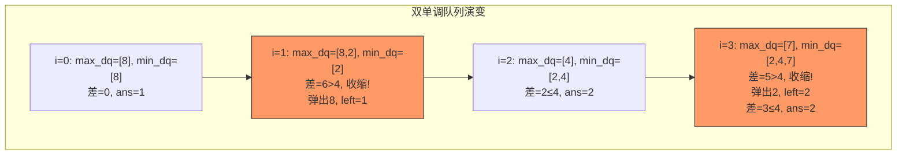

---

title: "绝对差不超过限制的最长子数组"

difficulty: 中等

category: 滑动窗口

tags:

  - leetcode

  - 滑动窗口

  - sliding-window

created: "2026-07-21"

---

# 1438. 绝对差不超过限制的最长子数组

> 难度：中等 | 主题：滑动窗口 + 单调队列

## 题目

给定一个整数数组 nums 和一个整数 limit，返回最长连续子数组的长度，该子数组中任意两个元素之间的绝对差必须小于等于 limit。

**示例：**

```python

输入：nums = [8,2,4,7], limit = 4

输出：2

解释：最长子数组是 [2,4]，最大差距 2 ≤ 4

```

---

## 思路
### 先讲个故事：找温度差最小的连续天气

气象局要找一段连续的天气记录，要求这段记录里最高温和最低温的差不超过 limit。你拿着一个取景框在天气记录上滑动，每滑一步就看框内最高温减最低温——超了就从左边缩，没超就往右边扩。

但问题来了：每次缩或扩之后，怎么快速知道新的最高温和最低温？用两个单调队列——一个管最大值，一个管最小值。

---

### 引导式推导：滑动窗口 + 双单调队列

**暴力直觉**：枚举所有子数组，检查 max - min ≤ limit。O(n²)。

**单调队列优化**：用两个双端队列分别维护窗口内最大值的递减序列和最小值的递增序列。

```text

nums = [8,2,4,7], limit = 4

i=0, num=8:

  max_dq: [8]  (递减)

  min_dq: [8]  (递增)

  max-min = 0 ≤ 4 → 窗口 [8], ans=1

i=1, num=2:

  max_dq: [8,2] → 弹出? 8>2 不弹 → [8,2]

  min_dq: [2] → 弹出 8(8>2) → [2]

  max-min = 8-2 = 6 > 4 → 收缩!

    nums[0]=8 == max_dq[0]=8 → 弹出 → max_dq=[2]

    left=1

  max-min = 2-2 = 0 ≤ 4 → 窗口 [2], ans=1

i=2, num=4:

  max_dq: [4] → 弹出 2(2<4) → [4]

  min_dq: [2,4]

  max-min = 4-2 = 2 ≤ 4 → 窗口 [2,4], ans=2

i=3, num=7:

  max_dq: [7] → 弹出 4(4<7) → [7]

  min_dq: [2,4,7]

  max-min = 7-2 = 5 > 4 → 收缩!

    nums[1]=2 == min_dq[0]=2 → 弹出 → min_dq=[4,7]

    left=2

  max-min = 7-4 = 3 ≤ 4 → 窗口 [4,7], ans=2

```



---

## 代码

```python

from collections import deque

def longestSubarray(nums, limit):

    max_dq = deque()  # 递减队列，队首是窗口最大值

    min_dq = deque()  # 递增队列，队首是窗口最小值

    left = 0

    ans = 0

    for right, num in enumerate(nums):

        # 维护 max 队列（递减）：比当前小的都弹出

        while max_dq and max_dq[-1] < num:

            max_dq.pop()

        max_dq.append(num)

        # 维护 min 队列（递增）：比当前大的都弹出

        while min_dq and min_dq[-1] > num:

            min_dq.pop()

        min_dq.append(num)

        # 收缩窗口：差值超限就缩

        while max_dq[0] - min_dq[0] > limit:

            if max_dq[0] == nums[left]:  # 只有要删除的值是当前最值时出队

                max_dq.popleft()

            if min_dq[0] == nums[left]:

                min_dq.popleft()

            left += 1

        ans = max(ans, right - left + 1)

    return ans

```

---

## 复杂度

| 指标 | 值 | 解释 |
|------|----|------|
| 时间 | O(n) | 每个元素入队出队各一次 |
| 空间 | O(n) | 两个双端队列 |

---

## 实战考量
### 频率分析

> **出现在**：单调队列进阶题，考察双队列维护窗口最值。约 10% 的高难度常会出"双单调队列"变形。

### 延伸思考

**Q：为什么收缩时要检查 `max_dq[0] == nums[left]`？**

A：只有当要删除的值确实是当前最大值时，才需要从 max_dq 中移除。如果它不是最大值，它在队列中间或已经不在队列里了，不需要操作。

**Q：如果 limit=0 呢？**

A：要求所有元素相等。窗口内 max==min，找最长连续相同元素的子数组。

**Q：如果数组有负数呢？**

A：不影响，单调队列只关心相对大小。

**Q：单调队列存值还是存索引？**

A：本题存值即可，因为不需要判断元素是否超出窗口（和 239 题不同）。但存索引也可以，只是收缩时判断条件不同。

### 易错点

- 两个队列要分别维护，不能混用

- 收缩时检查队首是否等于 `nums[left]`（只有要删除的值是当前最值时出队）

- `max_dq[0] - min_dq[0] > limit` 时才收缩

---

## 生活类比

> **绝对差最长子数组 → 找温度差最小的连续天气**

>

> 你拿着一个取景框在天气记录上滑动，要求框内最高温和最低温的差不超过 limit。

> 超了就从左边缩，没超就往右边扩。

> 两个单调队列就是你的"温度计"——一个管最高，一个管最低，随时告诉你差值。

>

> **双单调队列就是"左右护法"——一个帮你盯着最大值，一个帮你盯着最小值。**

---

## 相关题目

| 题目 | 关系 |
|------|------|
| 239滑动窗口最大值 | 单调队列求窗口最值 |
| 03无重复字符的最长子串 | 无重复条件滑动窗口 |

---

→ 返回题单：[[LeetCode学习路线图#九、滑动窗口]]

## 速记卡（面试闪卡）

**Q1：一句话讲清「1438. 绝对差不超过限制的最长子数组」到底是什么？**

A：求最长连续子数组，使其中任意两元素之差不超过 limit（Sliding Window，滑动窗口）。

**Q2：思路 —— 怎么理解？**

A：像取景框滑过温度记录：框内最高减最低≤limit 就扩，否则缩（Monotonic Queue，单调队列）。

**Q3：代码 —— 怎么理解？**

A：两双端队列分别维护窗口最大(递减)与最小(递增)，差超就收缩（Deque，双端队列）。

**Q4：复杂度 —— 怎么理解？**

A：时间 O(n) 元素各入出队一次，空间 O(n) 两个队列（Amortized O(n)，均摊线性）。

**Q5：实战考量 —— 怎么理解？**

A：单调队列进阶题约 10%，考双队列维护窗口最值（Window Extremum，窗口极值）。

**Q6：核心速记主线有哪些？**

- 窗口内 max-min ≤ limit，求最长

- 两个单调队列管最大/最小

- 收缩时只有删除值是当前最值才出队

- limit=0 即求最长相等子数组

**口诀**

A：滑动窗口框温差

最大最小双队列

超限收缩左指针

左右护法保最佳

## 相关链接

- [[笔记/Leetcode笔记/09_滑动窗口/03无重复字符的最长子串|无重复字符的最长子串]]

- [[笔记/Leetcode笔记/09_滑动窗口/209长度最小的子数组|长度最小的子数组]]

- [[笔记/Leetcode笔记/09_滑动窗口/239滑动窗口最大值|滑动窗口最大值]]

- [[笔记/Leetcode笔记/09_滑动窗口/30串联所有单词的子串|串联所有单词的子串]]

- [[笔记/Leetcode笔记/09_滑动窗口/567字符串的排列|字符串的排列]]

