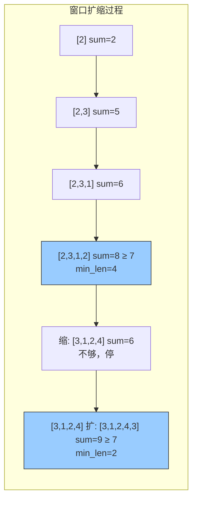

---

title: "长度最小的子数组"

difficulty: 中等

category: 滑动窗口

tags:

  - leetcode

  - 滑动窗口

  - sliding-window

created: "2026-07-21"

---

# 209. 长度最小的子数组（Minimum Size Subarray Sum）

> 难度：中等 | 主题：滑动窗口、前缀和、数组

## 题目

给定一个含有 n 个正整数的数组和一个正整数 target，找出该数组中满足其总和大于等于 target 的长度最小的连续子数组，并返回其长度。如果不存在符合条件的子数组，返回 0。

**示例：**

```python

输入：target = 7, nums = [2,3,1,2,4,3]

输出：2

解释：子数组 [4,3] 长度最小

```

---

## 思路
### 先讲个故事：凑够钱就跑

你去菜市场买菜，手里有个购物清单总价是 target 元。你从第一个摊位开始拿菜，拿到总价够了就停——然后看看能不能从左边扔掉一些便宜的，让总价刚好够但拿的菜最少。

这就是不定长滑动窗口：**右指针负责凑够，左指针负责精简**。

---

### 引导式推导：从暴力到滑动窗口

**暴力法**：枚举所有子数组，计算和 → O(n²)

**滑动窗口 O(n)**：数组所有元素为正，窗口扩大时和单调增，窗口缩小时和单调减。

```text

target=7, nums=[2,3,1,2,4,3]

r=0: sum=2 < 7, 继续扩

r=1: sum=5 < 7, 继续扩

r=2: sum=6 < 7, 继续扩

r=3: sum=8 >= 7 → min_len=4, 尝试缩: sum=6 < 7, 停

r=4: sum=10 >= 7 → min_len=2, 缩: sum=6 < 7, 停

r=5: sum=9 >= 7 → min_len=2, 缩: sum=6 < 7, 停

结果: 2

```



**核心洞察**：`while window_sum >= target` 而不是 `if`，因为收缩左边界后可能仍然 >= target，需要继续收缩。

---

## 代码

```python

def minSubArrayLen(self, target, nums):

    n = len(nums)

    min_len = float('inf')  # 初始化为无穷大，表示还没找到

    window_sum = 0           # 当前窗口内元素和

    left = 0

    for right in range(n):

        window_sum += nums[right]      # 右指针元素加入窗口

        while window_sum >= target:    # 窗口和够了，尝试收缩

            min_len = min(min_len, right - left + 1)  # 更新最小长度

            window_sum -= nums[left]   # 左指针元素移出窗口

            left += 1

    return min_len if min_len != float('inf') else 0  # 没找到返回 0

```

---

## 复杂度

| 指标 | 值 | 解释 |
|------|----|------|
| 时间 | O(n) | 每个元素最多被左右指针各访问一次 |
| 空间 | O(1) | 只用几个变量 |

---

## 实战考量
### 频率分析

> **出现在**：滑动窗口基础题，考察不定长窗口的「扩-缩」节奏。约 20% 的中等难度常会出这种"求最值"的窗口题。

### 延伸思考

**Q：如果数组里有负数呢？**

A：滑动窗口失效，用前缀和 + 哈希表，找 `prefix[j] - prefix[i] >= target`。

**Q：如果要找和恰好等于 target 的最短子数组呢？**

A：用前缀和 + 哈希表存最早出现位置。

**Q：如果要找和 >= target 的最长子数组呢？**

A：正数数组里越长和越大，直接取整个数组；含负数时复杂。

**Q：为什么用 `while` 不是 `if`？**

A：收缩左边界后和可能仍然 >= target，需要继续收缩直到不满足为止。

### 易错点

- `while` 不是 `if`

- `min_len` 初始化为无穷大

- 最后判断是否有解（可能整个数组和都不够）

---

## 生活类比

> **长度最小子数组 → 凑够钱就跑**

>

> 从左边开始拿菜，总价够了就停。然后看看能不能扔掉左边最便宜的几个，拿的菜更少但总价还够。

>

> **滑动窗口就是"贪心地凑，贪心地省"——右指针负责凑够，左指针负责精简。**

---

## 相关题目

| 题目 | 关系 |
|------|------|
| 03无重复字符的最长子串 | 另一类滑动窗口（无重复条件） |
| [[560和为K的子数组]] | 前缀和 + 哈希表做法 |

---

→ 返回题单：[[LeetCode学习路线图#九、滑动窗口]]

## 速记卡（面试闪卡）

**Q1：一句话讲清「209. 长度最小的子数组（Minimum Size Subarray Sum）」到底是什么？**

A：209 题要求找出总和 ≥ target 的最短连续子数组长度，正数数组下用滑动窗口 O(n) 解决。

**Q2：题目 —— 怎么理解？**

A：给你正整数数组和 target，要找元素和 ≥ target 的、长度最小的连续子数组。像菜市场买菜：从第一个摊位拿，总价够了就停，再扔掉左边便宜的让拿的更少。Sliding Window（滑动窗口）右指针凑、左指针精简。

**Q3：思路 —— 怎么理解？**

A：不定长窗口靠 `while window_sum >= target` 收缩（不是 if，因为收缩后可能仍 ≥target）。正数组里窗口扩大和单调增、缩小和单调减，左右指针各扫一遍即 O(n)。

**Q4：代码 —— 怎么理解？**

A：min_len 初始化为无穷大，right 右移累加；一旦和 ≥ target 就更新 min_len 并左移 left 收缩；最后没找到返回 0。只用了几个变量，空间 O(1)。

**Q5：复杂度 —— 怎么理解？**

A：时间 O(n)（每个元素最多被左右指针各访问一次），空间 O(1)。含负数时滑动窗口失效，要改用前缀和 + 哈希表。

**Q6：核心速记主线有哪些？**

- 题意：正数组里找和 ≥ target 的最短连续子数组

- 滑动窗口：右指针扩、左指针缩，核心用 while 而非 if

- 时间 O(n)、空间 O(1)

- 含负数退化，需前缀和 + 哈希表

**口诀**

A：滑动窗口一进一退，

右扩左缩求最短；

while 不是 if 判，

正数数组 O(n) 完。

## 相关链接

- [[笔记/Leetcode笔记/09_滑动窗口/03无重复字符的最长子串|无重复字符的最长子串]]

- [[笔记/Leetcode笔记/09_滑动窗口/30串联所有单词的子串|串联所有单词的子串]]

- [[笔记/Leetcode笔记/09_滑动窗口/239滑动窗口最大值|滑动窗口最大值]]

- [[笔记/Leetcode笔记/09_滑动窗口/1438绝对差不超过限制的最长子数组|绝对差不超过限制的最长子数组]]

- [[笔记/Leetcode笔记/09_滑动窗口/76最小覆盖子串|最小覆盖子串]]

