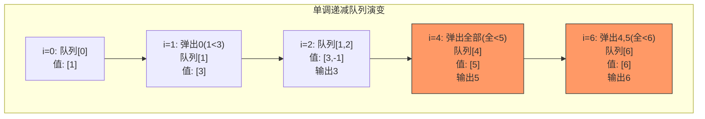

# 239. 滑动窗口最大值（Sliding Window Maximum）

> 难度：困难 | 主题：滑动窗口、单调队列、双端队列

## 题目

给你一个整数数组 nums，有一个大小为 k 的滑动窗口从数组的最左侧移动到数组的最右侧。你只可以看到在滑动窗口内的 k 个数字。滑动窗口每次只向右移动一位。返回滑动窗口中的最大值。

**示例：**
```python
输入：nums = [1,3,-1,-3,5,3,6,7], k = 3
输出：[3,3,5,5,6,7]
```

---

## 思路

### 先讲个故事：谁是擂主

你组织了一场"车轮战"格斗比赛。擂台上最多站 k 个人，但只有一个擂主（最大值）。

新选手上台时：
1. 把所有比他弱的选手全部打下台（队尾移除比当前小的）
2. 他站到队尾排队
3. 擂台时间到了的选手（超出窗口）自动离场
4. 队首那个人就是当前擂主

这就是单调队列：**队首永远是当前窗口的最强者**。

---

### 引导式推导：从暴力到单调队列

**暴力法**：对每个窗口遍历找最大值 → O(n*k)

**单调递减队列**：队列里存元素的索引，保证队列对应的值单调递减。

```text
nums = [1,3,-1,-3,5,3,6,7], k = 3

i=0, num=1: 队列 []
  移除队尾比1小的: 无
  加入1 → 队列 [0]  (值: [1])

i=1, num=3: 
  移除队尾比3小的: 1<3 → 弹出0
  加入3 → 队列 [1]  (值: [3])

i=2, num=-1:
  移除队尾比-1小的: 无（3>-1）
  加入-1 → 队列 [1,2]  (值: [3,-1])
  i=2 ≥ k-1 → 输出 nums[1]=3

i=3, num=-3:
  移除队尾比-3小的: 无（-1>-3）
  加入-3 → 队列 [1,2,3]  (值: [3,-1,-3])
  i=3 ≥ k-1 → 输出 nums[1]=3

i=4, num=5:
  移除队尾比5小的: -3<5 → 弹出3, -1<5 → 弹出2, 3<5 → 弹出1
  加入5 → 队列 [4]  (值: [5])
  检查队头是否超窗口: 4 ≥ 4-3+1=2 ✓
  i=4 ≥ k-1 → 输出 nums[4]=5
...
```



**为什么存下标不存值？** 因为需要判断元素是否超出窗口。

---

## 代码

```python
from collections import deque

def maxSlidingWindow(self, nums, k):
    dq = deque()      # 单调递减双端队列，存索引
    result = []

    for i in range(len(nums)):
        # 1. 移除队尾所有小于当前元素的索引（它们不可能是未来窗口的最大值）
        while dq and nums[dq[-1]] < nums[i]:
            dq.pop()

        # 2. 当前索引入队
        dq.append(i)

        # 3. 移除队头不在窗口内的索引（窗口范围 [i-k+1, i]）
        if dq[0] < i - k + 1:
            dq.popleft()

        # 4. 窗口形成后（i >= k-1），队头就是最大值
        if i >= k - 1:
            result.append(nums[dq[0]])

    return result
```

---

## 复杂度

| 指标 | 值 | 解释 |
|------|----|------|
| 时间 | O(n) | 每个元素最多入队出队各一次 |
| 空间 | O(k) | 双端队列最多存 k 个索引 |

---

## 实战考量

### 频率分析

> **出现在**：经典困难题，非常爱考，考察对单调队列的理解。字节/美团/腾讯高频，约 15% 的高难度常会出单调队列题。

### 延伸思考

**Q：为什么是单调递减而不是递增？**
A：我们要最大值，队头要是最大的，所以大的在前。

**Q：如果求滑动窗口最小值呢？**
A：单调递增队列，逻辑对称。

**Q：用堆怎么做？复杂度如何？**
A：维护大小为 k 的最大堆，每次加入新元素、移除旧元素（延迟删除），O(n log k)。

**Q：单调队列和单调栈的区别？**
A：队列是双端操作（队头队尾），栈是单端；单调队列适合滑动窗口，单调栈适合找下一个更大/更小元素。

**Q：队尾移除条件是 `<` 还是 `<=`？**
A：`<`。相等时旧元素先出窗口，但出窗口前仍可能是最大值。

### 易错点

- 存索引不存值
- `nums[dq[-1]] < nums[i]` 不是 `<=`
- 窗口形成判断 `i >= k-1`

---

## 生活类比

> **滑动窗口最大值 → 格斗车轮战**
>
> 擂台上最多站 k 个人。新选手上台时，所有比他弱的全部打下台。
> 队首那个人就是当前擂主。时间到了的选手自动离场。
>
> **单调队列就是"让强者站前面，弱者随时被淘汰"的排队系统。**

---

## 相关题目

| 题目 | 关系 |
|------|------|
| [[84柱状图中最大的矩形]] | 单调栈应用 |
| 1438绝对差不超过限制的最长子数组 | 双单调队列 |

---

→ 返回题单：[[LeetCode学习清单#九、滑动窗口]]

## 速记卡（面试闪卡）

**Q1：一句话讲清「239. 滑动窗口最大值（Sliding Window Maximum）」到底是什么？**
A：给你一个整数数组 nums，有一个大小为 k 的滑动窗口从数组的最左侧移动到数组的最右侧。你只可以看到在滑动窗口内的 k 个数字。滑动窗口每次只向右移动一位。返回滑动窗口中的最大值。
**示例：**
---

**Q2：题目 —— 怎么理解？**
A：给你一个整数数组 nums，有一个大小为 k 的滑动窗口从数组的最左侧移动到数组的最右侧。你只可以看到在滑动窗口内的 k 个数字。滑动窗口每次只向右移动一位。返回滑动窗口中的最大值。
**示例：**
---

**Q3：思路 —— 怎么理解？**
A：你组织了一场"车轮战"格斗比赛。擂台上最多站 k 个人，但只有一个擂主（最大值）。
新选手上台时：
把所有比他弱的选手全部打下台（队尾移除比当前小的）
他站到队尾排队
擂台时间到了的选手（超出窗口）自动离场
队首那个人就是当前擂主
这就是单调队列：**队首永远是当前窗口的最强者**。
---
**暴力法**：对每个窗口遍历找最大值 → O(n*k)
**单调递减队列**：队列里存元素的索引，保证队列对应的值单调递减。

**Q4：代码 —— 怎么理解？**
A：---

**Q5：复杂度 —— 怎么理解？**
A：| 指标 | 值 | 解释 |
|------|----|------|
| 时间 | O(n) | 每个元素最多入队出队各一次 |
| 空间 | O(k) | 双端队列最多存 k 个索引 |
---

**Q6：核心速记主线有哪些？**
A：抓住这几根：题目、思路、代码、复杂度、实战考量、生活类比。

