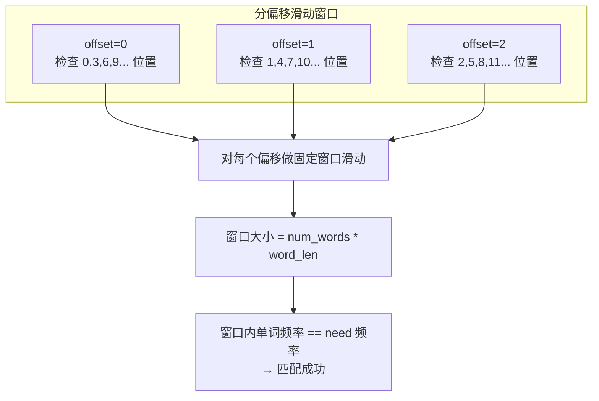

# 30. 串联所有单词的子串（Substring with Concatenation of All Words）

> 难度：困难 | 主题：滑动窗口、哈希表、字符串

## 题目

给定一个字符串 s 和一个字符串数组 words。words 中所有字符串长度相同。s 中的串联子串是指一个包含 words 中所有字符串以任意顺序排列连接起来的子串。返回所有串联子串在 s 中的起始索引。

**示例：**
```python
输入：s = "barfoothefoobarman", words = ["foo","bar"]
输出：[0,9]
```

---

## 思路

### 先讲个故事：拼图找位置

你有一堆拼图碎片（words），每块大小一样（单词长度相同）。你要在一幅大拼图（s）里找到所有能放下这些碎片的位置。

因为碎片可以从任意位置开始放，所以你得尝试所有可能的起始偏移量。每个偏移量下，你用一个"取景框"（滑动窗口）在大拼图上滑动，检查框内碎片是否和你的碎片堆完全匹配。

---

### 引导式推导：分偏移滑动窗口

`words` 中所有单词长度相同（`word_len`），要找 `s` 中恰好由 `words` 所有单词各出现一次拼接成的子串。

**核心洞察**：把问题转化为「固定大小的块滑动窗口」。子串总长度为 `len(words) * word_len`，可以看成由 `word_len` 个字符为一组的块组成。

```text
s = "barfoothefoobarman", words = ["foo","bar"]
word_len = 3, num_words = 2, total_len = 6

offset=0: 按 3 步长滑动
  "bar" → 匹配 bar ✓
  "foo" → 匹配 foo ✓
  → count=2 == len(need) → 记录 left=0

offset=1: 按 3 步长滑动
  "arf" → 不在 need 中，重置
  ...

offset=2: 按 3 步长滑动
  "rfo" → 不在 need 中，重置
  ...
```



**为什么必须对每个偏移分别做？** 因为子串可以从任意字符位置开始，不只是 word_len 的倍数位置。

---

## 代码

```python
from collections import Counter

def findSubstring(self, s, words):
    if not words or not s:
        return []

    word_len = len(words[0])       # 每个单词的长度
    num_words = len(words)         # 单词总数
    total_len = word_len * num_words  # 子串总长度
    n = len(s)

    need = Counter(words)          # 目标单词频率表
    result = []

    for offset in range(word_len): # 对每个起始偏移做滑动窗口
        left = offset              # 窗口左边界
        window = Counter()         # 当前窗口内单词频率表
        count = 0                  # 窗口内已满足的单词种类数

        for right in range(offset, n - word_len + 1, word_len):  # 按单词步长前进
            word = s[right:right + word_len]  # 截取当前单词

            if word not in need:   # 非法单词，整个窗口作废
                window.clear()
                count = 0
                left = right + word_len
                continue

            window[word] += 1
            if window[word] == need[word]:
                count += 1          # 该单词频率刚好达标

            # 保持窗口内的单词总数为 num_words
            while right - left + word_len > total_len:
                left_word = s[left:left + word_len]
                if window[left_word] == need[left_word]:
                    count -= 1      # 移出后不再达标
                window[left_word] -= 1
                if window[left_word] == 0:
                    del window[left_word]
                left += word_len

            if count == len(need):  # 所有单词种类频率都达标
                result.append(left)

    return result
```

---

## 复杂度

| 指标 | 值 | 解释 |
|------|----|------|
| 时间 | O(n * word_len) | 对每个偏移（共 word_len 个）做一次 O(n) 的滑动窗口 |
| 空间 | O(m * word_len) | 哈希表存单词，m 是不同单词数 |

---

## 实战考量

### 频率分析

> **出现在**：滑动窗口困难题，考察对固定块大小窗口的理解，以及多偏移处理。约 10% 的高难度常会出这种"分偏移"变形。

### 延伸思考

**Q：如果 words 里单词长度不同呢？**
A：本题保证相同，不同则问题复杂度大增，需要回溯或 Trie。

**Q：时间复杂度能优化吗？**
A：基本就是 O(n * word_len)，因为必须检查每个偏移。

**Q：如果 s 很长但 words 很少，有优化吗？**
A：可以用 Trie 或 AC 自动机加速单词匹配。

**Q：遇到不在 need 中的单词为什么要重置窗口？**
A：这个单词不能属于任何合法子串，包含它的所有窗口都不可能匹配。

### 易错点

- 多偏移循环不能少
- 遇到非法单词要重置窗口
- 窗口大小按单词数控制，不是字符数
- `right - left + word_len > total_len` 的比较

---

## 生活类比

> **串联所有单词的子串 → 拼图找位置**
>
> 你有一堆拼图碎片，要在大拼图里找到所有能完整放下这些碎片的位置。
> 碎片可以从任意位置开始放，所以你得一行一行、一列一列地试。
>
> **分偏移滑动窗口就是"扫描线"——不放过任何一个可能的起始点。**

---

## 相关题目

| 题目 | 关系 |
|------|------|
| [[438找到字符串中所有字母异位词]] | 固定字符窗口 |
| 76最小覆盖子串 | 不定长窗口 |

---

→ 返回题单：[[LeetCode学习清单#九、滑动窗口]]
