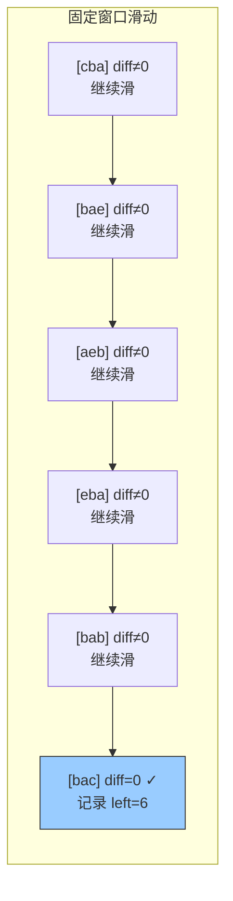

# 438. 找到字符串中所有字母异位词（Find All Anagrams in a String）

> 难度：中等 | 主题：滑动窗口、哈希表、字符串

## 题目

给定两个字符串 s 和 p，找到 s 中所有 p 的异位词的子串，返回这些子串的起始索引。字母异位词指字母相同但排列不同的字符串。

**示例：**
```python
输入：s = "cbaebabacd", p = "abc"
输出：[0,6]
```

---

## 思路

### 先讲个故事：找同款拼图

你手里有一幅拼图的完整清单（p），上面写着每种颜色碎片各需要几块。你在一面大拼图墙（s）上拿一个固定大小的取景框滑动，每滑一步就检查框内碎片颜色是否和清单完全匹配。

匹配上了？记下当前位置。没匹配？继续滑。

这就是固定窗口滑动 + 频次比较。

---

### 引导式推导：从全表比较到差异计数

**固定窗口滑动 + 频次数组**：窗口大小固定为 len(p)，用 26 长度数组统计字符频次，比较窗口内频次与 p 的是否相同。

```text
p = "abc", need = [1,1,1,0,0,...]  (a=1,b=1,c=1)

s = "cbaebabacd"
窗口 "cba" → window = [1,1,1,0,0,...] == need ✓ → 记录 left=0
窗口 "bae" → window = [1,2,0,0,0,...] ≠ need
...
窗口 "bac" → window = [1,1,1,0,0,...] == need ✓ → 记录 left=6
```

**优化：差异计数**

用变量 `diff` 记录窗口和 p 有多少个字符的频率不同。当 `diff == 0` 时就是异位词。避免每次比较 26 个字符。



---

## 代码

```python
from collections import Counter

# 方法1：差异计数（推荐）
def findAnagrams(self, s, p):
    need = [0] * 26                    # 仅小写字母，固定大小数组
    for ch in p:
        need[ord(ch) - ord('a')] += 1  # 统计 p 中每个字符的出现次数

    window = [0] * 26                  # 窗口频率数组

    diff = 0                           # 差异字符种类数
    for i in range(26):
        if need[i] != 0:
            diff += 1                  # 初始时所有需要的字符频率都不同

    result = []
    left = 0

    for right in range(len(s)):
        idx = ord(s[right]) - ord('a')
        window[idx] += 1               # 右指针字符进入窗口

        if window[idx] == need[idx]:   # 频率刚好达标 → 差异 -1
            diff -= 1
        elif window[idx] == need[idx] + 1:  # 频率从刚好变成超标 → 差异 +1
            diff += 1

        if right - left + 1 > len(p):  # 窗口超出 p 的长度 → 收缩
            idx = ord(s[left]) - ord('a')
            window[idx] -= 1

            if window[idx] == need[idx]:    # 频率从超标降回刚好达标 → 差异 -1
                diff -= 1
            elif window[idx] == need[idx] - 1:  # 频率从刚好变成不足 → 差异 +1
                diff += 1

            left += 1

        if right - left + 1 == len(p) and diff == 0:  # 窗口大小对 + 频率完全匹配
            result.append(left)

    return result
```

---

## 复杂度

| 指标 | 值 | 解释 |
|------|----|------|
| 时间 | O(n) | 滑动窗口遍历 s 一次，差异计数是 O(1) 更新 |
| 空间 | O(1) | 26 个字母的固定大小数组 |

---

## 实战考量

### 频率分析

> **出现在**：滑动窗口基础题，考察固定长度窗口的维护以及字符频率的比较。约 25% 的中等难度常会出异位词/排列相关题目。

### 延伸思考

**Q：如果字符集是 Unicode 呢？**
A：用哈希表代替固定数组。

**Q：如果 p 很长，每次都比较 Counter 会不会慢？**
A：Counter 比较是 O(26)，固定常数；差异计数法可以优化到 O(1)。

**Q：找所有包含 p 中所有字符的最短子串怎么做？**
A：变成不定长窗口，类似 76最小覆盖子串。

**Q：差异计数的增减条件怎么记？**
A：关键看"进入/退出后 window[idx] 和 need[idx] 的关系"——刚好达标时 diff-1，刚好超标或不足时 diff+1。

### 易错点

- 窗口收缩时机是 `right - left + 1 > len(p)`，不是 `>=`
- 差异计数的增减条件要判断准确
- `left += 1` 必须在窗口缩小之后

---

## 生活类比

> **字母异位词 → 找同款拼图**
>
> 你拿着一份碎片清单（p），在大拼图墙上用固定大小的取景框滑动。
> 每滑一步就数数框内各颜色碎片数量——和清单完全一致？记下位置。
>
> **固定窗口就像一个移动的"检查站"——每到一站就做一次全面检查。**

---

## 相关题目

| 题目 | 关系 |
|------|------|
| [[567字符串的排列]] | 判断 s2 是否包含 s1 的排列 |
| 76最小覆盖子串 | 不定长滑动窗口 |
| 03无重复字符的最长子串 | 另一类滑动窗口 |

---

→ 返回题单：[[LeetCode学习清单#九、滑动窗口]]
