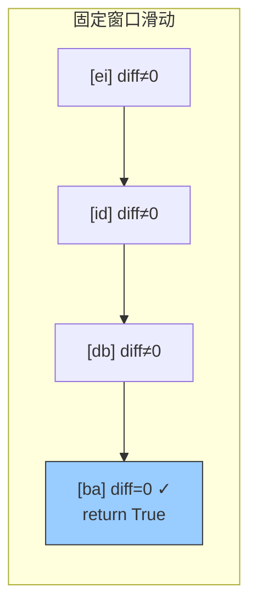

---

title: "字符串的排列"

difficulty: 中等

category: 滑动窗口

tags:

  - leetcode

  - 滑动窗口

  - sliding-window

created: "2026-07-21"

---

# 567. 字符串的排列（Permutation in String）

> 难度：中等 | 主题：滑动窗口、哈希表、字符串

## 题目

给你两个字符串 s1 和 s2，写一个函数来判断 s2 是否包含 s1 的排列。如果是返回 true，否则返回 false。即 s1 的排列之一是 s2 的子串。

**示例：**

```python

输入：s1 = "ab", s2 = "eidbaooo"

输出：true

```

---

## 思路
### 先讲个故事：藏宝图找标记

你手里有一张藏宝图（s1），上面标了若干个特殊符号（字符）各出现几次。你在一面大墙（s2）上用一个固定大小的取景框滑动，每滑一步就检查框内符号是否和藏宝图完全一致。

匹配上了？宝藏就在这里。没匹配？继续滑。

和 438 题几乎一样，只是本题只要判断"有没有"，不需要记录所有位置。

---

### 引导式推导：固定窗口 + 差异计数

判断 `s2` 是否包含 `s1` 的某个排列（异位词）。固定窗口大小为 `len(s1)`，在 `s2` 上滑动，检查每个窗口是否是 `s1` 的异位词。

```text

s1 = "ab", need = [1,1,0,0,...]  (a=1,b=1)

s2 = "eidbaooo"

窗口 "ei" → diff≠0

窗口 "id" → diff≠0

窗口 "db" → diff≠0

窗口 "ba" → window=[1,1,0,...] == need → diff=0 ✓ → return True

```



**核心洞察**：和 438 题完全相同的滑动窗口逻辑，只是找到第一个就返回 True。

---

## 代码

```python

def checkInclusion(self, s1, s2):

    if len(s1) > len(s2):        # s1 更长则不可能为 s2 的子串

        return False

    need = [0] * 26              # 仅小写字母，固定大小数组

    for ch in s1:

        need[ord(ch) - ord('a')] += 1  # 统计 s1 中每个字符的出现次数

    window = [0] * 26            # 窗口频率数组

    diff = 0                     # 差异字符种类数

    for i in range(26):

        if need[i] != 0:

            diff += 1            # 初始时所有需要的字符频率都不同

    left = 0

    for right in range(len(s2)):

        idx = ord(s2[right]) - ord('a')

        window[idx] += 1         # 右指针字符进入窗口

        if window[idx] == need[idx]:

            diff -= 1            # 频率刚好达标 → 差异 -1

        elif window[idx] == need[idx] + 1:

            diff += 1            # 频率从刚好变成超标 → 差异 +1

        if right - left + 1 > len(s1):  # 窗口超出 s1 的长度 → 收缩

            idx = ord(s2[left]) - ord('a')

            window[idx] -= 1

            if window[idx] == need[idx]:

                diff -= 1        # 频率从超标降回刚好达标 → 差异 -1

            elif window[idx] == need[idx] - 1:

                diff += 1        # 频率从刚好变成不足 → 差异 +1

            left += 1

        if right - left + 1 == len(s1) and diff == 0:

            return True          # 找到 s1 的排列，直接返回

    return False                 # 遍历完仍未找到 → 不存在

```

---

## 复杂度

| 指标 | 值 | 解释 |

|------|----|------|

| 时间 | O(n) | 遍历 s2 一次 |

| 空间 | O(1) | 26 个字母的固定数组 |

---

## 实战考量
### 频率分析

> **出现在**：和 438 题同族，考察固定窗口和字符频率。约 20% 的中等难度常会出排列/异位词相关题目。

### 延伸思考

**Q：如果 s1 有重复字符，怎么保证窗口内也正好有同样多的重复？**

A：频率表天然处理重复，不需要额外逻辑。

**Q：如果字符集很大（比如所有 ASCII），空间还是 O(1) 吗？**

A：严格来说是 O(字符集大小)，实践中如果字符集固定可以认为是 O(1)。

**Q：和 438 题有什么区别？**

A：438 题返回所有匹配位置的索引列表，本题只要判断是否存在（返回布尔值）。核心逻辑完全相同。

**Q：如果要求返回排列本身呢？**

A：找到匹配时用 `s2[left:left+len(s1)]` 截取子串返回。

### 易错点

- `len(s1) > len(s2)` 时直接返回 False

- 窗口收缩时机是 `right - left + 1 > len(s1)`

- diff 的增减条件判断要准确

---

## 生活类比

> **字符串的排列 → 藏宝图找标记**

>

> 你拿着一张符号清单（s1），在大墙（s2）上用固定大小的取景框滑动。

> 每滑一步就数数框内各符号数量——和清单完全一致？宝藏找到了。

>

> **固定窗口就是"移动的检查站"——每到一站就做一次全面比对。**

---

## 相关题目

| 题目 | 关系 |

|------|------|

| [[438找到字符串中所有字母异位词]] | 找所有异位词起始索引 |

| 76最小覆盖子串 | 不定长窗口找最小覆盖 |

---

→ 返回题单：[[LeetCode学习路线图#九、滑动窗口]]

## 速记卡（面试闪卡）

**Q1：一句话讲清「567. 字符串的排列（Permutation in String）」到底是什么？**

A：判断 s2 里有没有一段子串，正好是 s1 的某个排列（字母种类和数量都一致）。

**Q2：题目怎么理解？ —— 怎么理解？**

A：你拿一张符号清单（s1），在一面大墙（s2）上滑一个固定大小的取景框，每步比对框内符号是否和清单完全一致。这是排列/异位词判断（permutation / anagram check）。

**Q3：固定窗口怎么滑？ —— 怎么理解？**

A：窗口大小固定等于 len(s1)，在 s2 上一步步右移，每滑一步重数框内各字母频率，和清单对上就中标。这是固定窗口滑动（fixed-size sliding window）。

**Q4：怎么快速判断一致？ —— 怎么理解？**

A：用一个"差异计数器" diff 记有多少种字母频率不符：刚达标（window==need）就 -1，超标就 +1，归零即命中，像红绿灯变绿放行。这是差异计数（difference counter）。

**Q5：复杂度和实战怎么理解？ —— 怎么理解？**

A：和438题同族，区别只是找到第一个就返回 true、不用记录所有位置。时间 O(n)，空间 O(1)（26字母定长数组）。

**Q6：核心速记主线有哪些？**

- 题目：s2 中是否含 s1 的某一排列子串

- 核心：固定窗口大小 = len(s1)，滑窗比频率

- 技巧：diff 差异计数，归零即命中

- 实战：与 438 同族，找到即返回 true

**口诀**

A：排列像是藏宝图，

固定窗口墙上滑；

字母数目对得上，

差异归零就抓住。

## 相关链接

- [[笔记/Leetcode笔记/09_滑动窗口/03无重复字符的最长子串|无重复字符的最长子串]]

- [[笔记/Leetcode笔记/09_滑动窗口/30串联所有单词的子串|串联所有单词的子串]]

- [[笔记/Leetcode笔记/09_滑动窗口/76最小覆盖子串|最小覆盖子串]]

- [[笔记/Leetcode笔记/09_滑动窗口/209长度最小的子数组|长度最小的子数组]]

- [[笔记/Leetcode笔记/09_滑动窗口/239滑动窗口最大值|滑动窗口最大值]]

