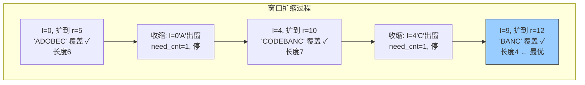

# 76. 最小覆盖子串（Minimum Window Substring）

> 难度：困难 | 主题：滑动窗口、哈希表、字符串

## 题目

给你一个字符串 s 和一个字符串 t，返回 s 中涵盖 t 所有字符的最小子串。如果 s 中不存在涵盖 t 所有字符的子串，则返回空字符串。

**示例：**
```python
输入：s = "ADOBECODEBANC", t = "ABC"
输出："BANC"
解释：覆盖 "ABC" 的最小子串是 "BANC"
```

---

## 思路

### 先讲个故事：赶集凑齐摊位

你去赶集，要买齐清单（t）上的所有商品。你在集市（s）上从左往右走，每走过一个摊位就把商品加入购物车。

购物车凑齐了？记下当前位置，然后试试从左边扔掉一些摊位——扔掉后还齐全吗？还齐全就继续扔，直到不够了停。这就是当前最优解。

一直走到集市尽头，最优解就是最短购物路线。

---

### 引导式推导：欠账计数法

用 `need` 统计 t 中每个字符还缺多少，`need_cnt` 记录还差几种字符。

```text
s = "ADOBECODEBANC", t = "ABC"

need = {A:1, B:1, C:1}, need_cnt = 3

r=0, 'A': need[A]=0, need_cnt=2
r=1, 'D': 不在 need 中
r=2, 'O': 不在 need 中
r=3, 'B': need[B]=0, need_cnt=1
r=4, 'E': 不在 need 中
r=5, 'C': need[C]=0, need_cnt=0 → 窗口已覆盖！
  记录 [0,5]，长度 6
  收缩: l=0 'A' 出窗, need[A]=1, need_cnt=1 → 不够了，停

r=6, 'O': 不在 need 中
r=7, 'D': 不在 need 中
r=8, 'E': 不在 need 中
r=9, 'B': need[B]=-1, need_cnt 不变（负值不减 need_cnt）
  收缩: l=1 'D' → l=2 'O' → l=3 'B' 出窗, need[B]=0, need_cnt=1
  → 不够了，停

r=10, 'A': need[A]=0, need_cnt=0 → 窗口已覆盖！
  记录 [4,10]，长度 7
  收缩: l=4 'C' 出窗, need[C]=1, need_cnt=1 → 不够了，停

r=11, 'N': 不在 need 中
r=12, 'C': need[C]=0, need_cnt=0 → 窗口已覆盖！
  记录 [9,12]，长度 4 ← 最优！
```



**为什么 `need[c] >= 0` 时 need_cnt 才减？** 因为负值表示某个字符多了，不减少欠账。

---

## 代码

```python
def minWindow(self, s, t):
    from collections import Counter
    need = Counter(t)           # t 中各字符需要的次数

    window = {}                 # 当前窗口内各字符的次数
    left = 0
    formed = 0                  # 窗口内已满足 need 要求的字符种类数
    ans = float('inf'), None, None  # (长度, 左边界, 右边界)

    for right in range(len(s)):
        char = s[right]
        window[char] = window.get(char, 0) + 1  # 右指针字符加入窗口

        # 如果该字符在 need 中，且窗口内该字符次数正好满足 need 要求
        if char in need and window[char] == need[char]:
            formed += 1

        # 当窗口已包含 t 中所有字符时，尝试收缩左边界
        while formed == len(need):
            if right - left + 1 < ans[0]:
                ans = (right - left + 1, left, right)  # 更新最短窗口

            char_left = s[left]
            window[char_left] -= 1   # 左指针字符移出窗口

            if char_left in need and window[char_left] < need[char_left]:
                formed -= 1          # 移出后不满足 need 要求

            left += 1

    if ans[1] is None:
        return ""               # 没找到
    return s[ans[1]:ans[2] + 1] # 切片右边界要 +1
```

---

## 复杂度

| 指标 | 值 | 解释 |
|------|----|------|
| 时间 | O(n) | 左右指针各遍历 s 一次 |
| 空间 | O(|Σ|) | 哈希表大小，最多字符集大小 |

---

## 实战考量

### 频率分析

> **出现在**：滑动窗口困难题，常见，考察对不定长窗口和状态维护的精细控制。字节/美团/腾讯压轴题，约 15% 的高难度常会出不定长窗口题。

### 延伸思考

**Q：如果 t 里有重复字符，怎么保证窗口内也正好有那么多？**
A：`window[char] == need[char]` 时才 `formed += 1`，多出来的不算。

**Q：如果 s 很长但 t 很短，有优化空间吗？**
A：先用 t 构建 need，只关注 need 里的字符，其他字符不影响 formed。

**Q：如果要求覆盖顺序也一致呢？**
A：变成子序列问题，用动态规划。

**Q：收缩条件为什么是 `formed == len(need)`？**
A：formed 记录的是「满足次数要求的字符种类数」，不是总字符数。当所有种类都满足时窗口才覆盖 t。

**Q：切片为什么右边界要 +1？**
A：Python 切片是左闭右开区间，`s[left:right+1]` 才能包含 right 位置的字符。

### 易错点

- `formed` 是种类数不是总数
- 收缩用 `while` 不是 `if`
- 切片右边界 +1
- 负值不影响 formed（字符多了不算满足）

---

## 生活类比

> **最小覆盖子串 → 赶集凑齐摊位**
>
> 你拿着购物清单在集市上走，从左往右扫过摊位。
> 购物车凑齐了？记下位置，然后从左边开始扔——扔到不够了停，这就是当前最优。
> 一直走到尽头，最短的那段就是答案。
>
> **不定长窗口就像"贪心购物"——凑够了就记，精简了再记，永远找最短路线。**

---

## 相关题目

| 题目 | 关系 |
|------|------|
| [[438找到字符串中所有字母异位词]] | 固定窗口版 |
| [[567字符串的排列]] | 固定窗口判断 |
| 03无重复字符的最长子串 | 另一类滑动窗口 |

---

→ 返回题单：[[LeetCode学习清单#九、滑动窗口]]
