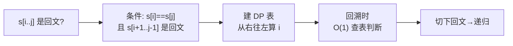
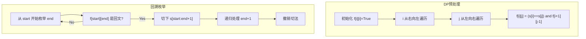

# 131. 分割回文串（Palindrome Partitioning）

> 难度：中等 | 主题：回溯 + DP 预处理回文

## 题目

给你一个字符串 s，请你将 s 分割成一些子串，使每个子串都是回文串。返回 s 所有可能的分割方案。

**示例**
```python
输入：s = "aab"
输出：[["a","a","b"],["aa","b"]]
```

---

## 思路

### 先讲个故事：切蛋糕，每块都要对称

小时候分蛋糕有个规矩：切下来的每一块都必须是**完美对称的**。
你拿着一把刀，从蛋糕左端开始，每切一刀都停一下看看——"这一块是对称的吗？是就留下，不是就换个切法"。

每次切完一块，就从切面的右端继续切剩下的部分，直到整条蛋糕切完。

这就是分割回文串的本质：在字符串里"切"出所有回文子串。

---

### 引导式推导：从暴切到预判

**直觉思路**：从 `start` 开始，枚举每个结束位置 `end`，如果 `s[start:end+1]` 是回文就切下，递归处理剩下的。

但这里有个问题：**同一个子串「是不是回文」会被反复判断几百次。**

比如 s = "aab"，你在不同分支里都会问 `s[0:1]="a"` 是回文吗 → 是
`s[0:2]="aa"` 是回文吗 → 是
`s[0:3]="aab"` 是回文吗 → 不是

这些判断结果不会变，为什么每次都要重新算？

**优化**：提前算好所有子串的回文性，查表 O(1) 判断。



---

### 两个核心步骤



**为什么 DP 遍历 i 要从右往左？**
因为 `f[i][j]` 依赖 `f[i+1][j-1]`（左下角）。i 从右往左保证了计算 `f[i][j]` 时 `f[i+1][j-1]` 已经算好了。

---

## 代码

```python
class Solution:
    def partition(self, s: str) -> list[list[str]]:
        n = len(s)
        f = [[True] * n for _ in range(n)]

        for i in range(n - 1, -1, -1):
            for j in range(i + 1, n):
                f[i][j] = (s[i] == s[j]) and f[i + 1][j - 1]

        res, path = [], []

        def dfs(i: int):
            if i == n:
                res.append(path[:])
                return
            for j in range(i, n):
                if f[i][j]:
                    path.append(s[i:j+1])
                    dfs(j + 1)
                    path.pop()

        dfs(0)
        return res
```

---

## 复杂度

| 指标 | 值 | 解释 |
|------|----|------|
| 时间 | O(n × 2ⁿ) | 2ⁿ⁻¹ 种切法，每种 O(n) 拷贝 |
| 空间 | O(n²) | DP 表存储回文状态 |

---

## 实战考量

### 频率分析

> **出现在**：美团/字节 回溯综合题，约 20% 的 AI Agent 常会考到回溯+DP组合。主要考察"两种算法配合"的思维。

### 延伸思考

**Q：为什么不用每次都判断回文？**
A：回溯过程中同一个子串会被反复判断。如果每次 O(n) 判断，总复杂度爆炸。DP 预处理 O(n²) 后 O(1) 查询，典型的空间换时间。

**Q：DP 遍历为什么 i 从右往左？**
A：`f[i][j]` 依赖 `f[i+1][j-1]`（左下角），i 从右往左保证计算 f[i][j] 时 f[i+1][j-1] 已算好。

**Q：复杂度为什么是 O(n × 2ⁿ)？**
A：长度为 n 的字符串，每个间隙可切可不切，共 2ⁿ⁻¹ 种切法，每种拷贝 O(n)。

**Q：如果只要最小分割次数呢？（132 题）**
A：用 DP 而非回溯：`dp[i] = min(dp[j] + 1)` 其中 `s[j:i]` 是回文。

**Q：回溯 dfs 里的 `path.pop()` 什么作用？**
A：撤销本次切割选择，让循环尝试下一个 end 位置。不 pop 的话 path 会越堆越多。

### 易错点

- DP i 必须从右往左
- `f` 初始化全 True（单字符天然回文）
- `res.append(path[:])` 必须拷贝
- `path.pop()` 不能忘

---

## 生活类比

> **切蛋糕 + 预制图纸**
>
> 把分割回文串想象成一个工厂流水线：
> 先派一个质检员把所有可能的蛋糕块测一遍（DP 预处理），标记"哪块是对称的"。
> 产线工人拿到质检表，每切一刀只看表就知道这块行不行，不用每次都去量。
> 切错了就退回去换个切法。
>
> **先建表，后下刀**——这是回溯+预处理的通用心法。

---

## 相关题目

| 题目 | 关系 |
|------|------|
| 05最长回文子串 | 回文 DP 同族，找最长 |
| 132分割回文串II | 找最小分割次数，纯 DP |
| [[647回文子串]] | 回文子串计数，中心扩展 |
| 78子集 | 回溯框架基础 |

---

→ 返回题单：[[LeetCode学习清单#十、回溯]]
