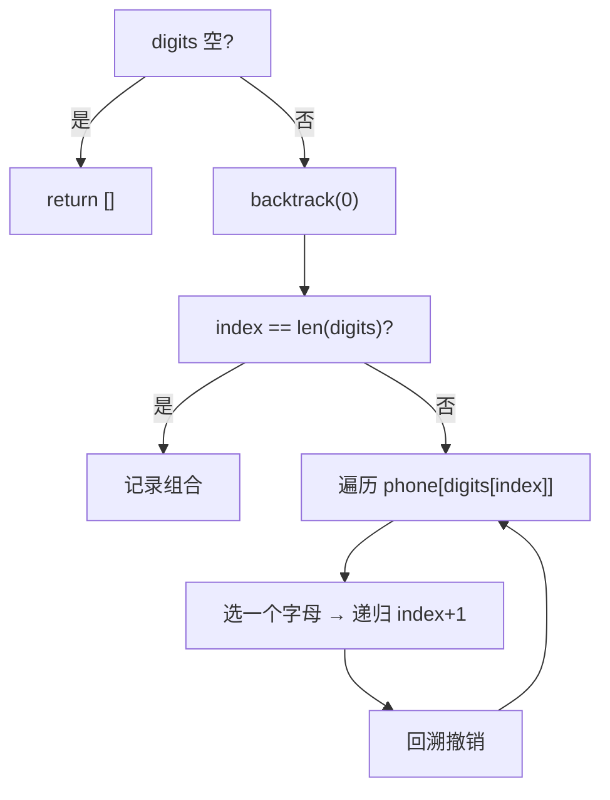
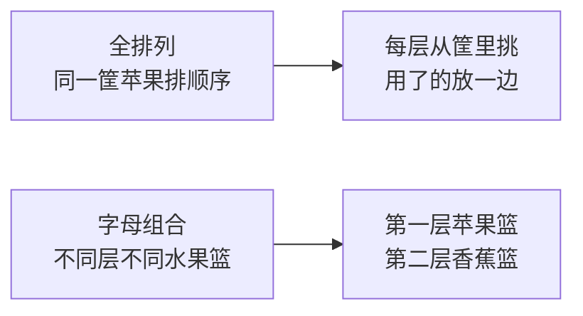

# 17. 电话号码的字母组合（Letter Combinations of a Phone Number）

> 难度：中等 | 主题：回溯——每层独立候选池

## 题目

给定一个仅包含数字 2-9 的字符串，返回所有它能表示的字母组合。数字到字母的映射与电话按键相同（2→abc, 3→def, 4→ghi, 5→jkl, 6→mno, 7→pqrs, 8→tuv, 9→wxyz）。注意 1 不对应任何字母。

**示例**
```python
输入：digits = "23"
输出：["ad","ae","af","bd","be","bf","cd","ce","cf"]
```

---

## 思路

### 先讲个故事：九宫格打字

老式诺基亚手机上，按 "23" 会怎样？
- 按 2 → a/b/c 里选一个
- 按 3 → d/e/f 里选一个

组合起来就是 3×3=9 种可能。每一个数字按键就是一层选择，每层的候选字母完全不同。

这和全排列的区别在于：**全排列是同一堆东西排顺序，这里是每层从不同的池子里挑一个。**

---

### 引导式推导：从树到模板

**第 1 步：画决策树**

输入 "23"：

```mermaid
graph TD
    root[""] --> a["a"]
    root --> b["b"]
    root --> c["c"]
    a --> ad["ad"]
    a --> ae["ae"]
    a --> af["af"]
    b --> bd["bd"]
    b --> be["be"]
    b --> bf["bf"]
    c --> cd["cd"]
    c --> ce["ce"]
    c --> cf["cf"]
```

每个叶子路径就是一个完整组合。

**第 2 步：看规律**

- 树深度 = 输入长度
- 每层分支 = 当前数字对应的字母数
- 叶子数 = 3^m × 4^n（m个3字母键，n个4字母键）

**第 3 步：模板化**



---

### 和全排列的关键区别

| 维度 | 全排列（46） | 字母组合（17） |
|------|-------------|---------------|
| 候选池 | 每层相同（全数组） | 每层不同（当前数字的字母） |
| 去重方式 | `used` 数组 | `index` 参数控制深度 |
| 回溯参数 | 无 `start`，有 `used` | 有 `index`，无 `used` |



---

## 代码

```python
class Solution:
    def letterCombinations(self, digits: str) -> list[str]:
        if not digits:
            return []
        phone = {
            '2': 'abc', '3': 'def', '4': 'ghi',
            '5': 'jkl', '6': 'mno', '7': 'pqrs',
            '8': 'tuv', '9': 'wxyz'
        }
        res, path = [], []

        def backtrack(index: int):
            if index == len(digits):
                res.append(''.join(path))
                return
            for ch in phone[digits[index]]:
                path.append(ch)
                backtrack(index + 1)
                path.pop()

        backtrack(0)
        return res
```

---

## 复杂度

| 指标 | 值 | 解释 |
|------|----|------|
| 时间 | O(3ᵐ × 4ⁿ) | m=3字母键数, n=4字母键数 |
| 空间 | O(m+n) | 递归栈深度 + path |

---

## 实战考量

### 频率分析

> **出现在**：华为/字节 一面回溯入门题，约 20% 从这题开始热身。难度友好，主要看你**能不能说清楚和全排列的区别**。

### 延伸思考

**Q：为什么不需要 `used` 数组？**
A：每层选的数字不同，天然不会重复选同一个元素。`index` 参数控制深度就够了。

**Q：时间复杂度怎么算？**
A：每个数字选一个字母，7 和 9 对应 4 个字母，其余 3 个。总组合数 = 3ᵐ × 4ⁿ。

**Q：和全排列（46 题）的区别是什么？**
A：排列每层候选池相同，需要 `used` 去重；本题每层候选池独立，只需要 `index` 控制深度。

**Q：空输入为什么返回 `[]` 而不是 `[""]`？**
A：题目说 digits 长度为 0 时返回空列表。返回 `[""]` 会多一个空字符串组合，不符合题意。

**Q：如果输入包含 0 或 1 呢？**
A：按题目约定 digits 只包含 2-9，不需要处理。如果真遇到了，可以映射为空字符串然后跳过。

### 易错点

- 空输入返回 `[]` 不是 `[""]`
- `res.append(''.join(path))` 把列表转字符串
- `path.pop()` 不能忘

---

## 生活类比

> **九宫格点菜**
>
> 每个按键是一个独立的菜系：2 号是川菜菜单、3 号是粤菜菜单……
> 你要从每个菜单里各选一道菜，凑一桌。
> 选完川菜的水煮鱼，不影响选粤菜的白切鸡——每层候选池互不干扰。
>
> **各层自治，互不相干——这就是"每层独立候选池"的回溯。**

---

## 相关题目

| 题目 | 关系 |
|------|------|
| 22括号生成 | 回溯同族（条件放括号） |
| [[46全排列]] | 回溯基础（used 数组） |
| 77组合 | 回溯基础（start 参数） |
| 17电话号码的字母组合 | 本题 |

---

→ 返回题单：[[LeetCode学习清单#十、回溯]]
