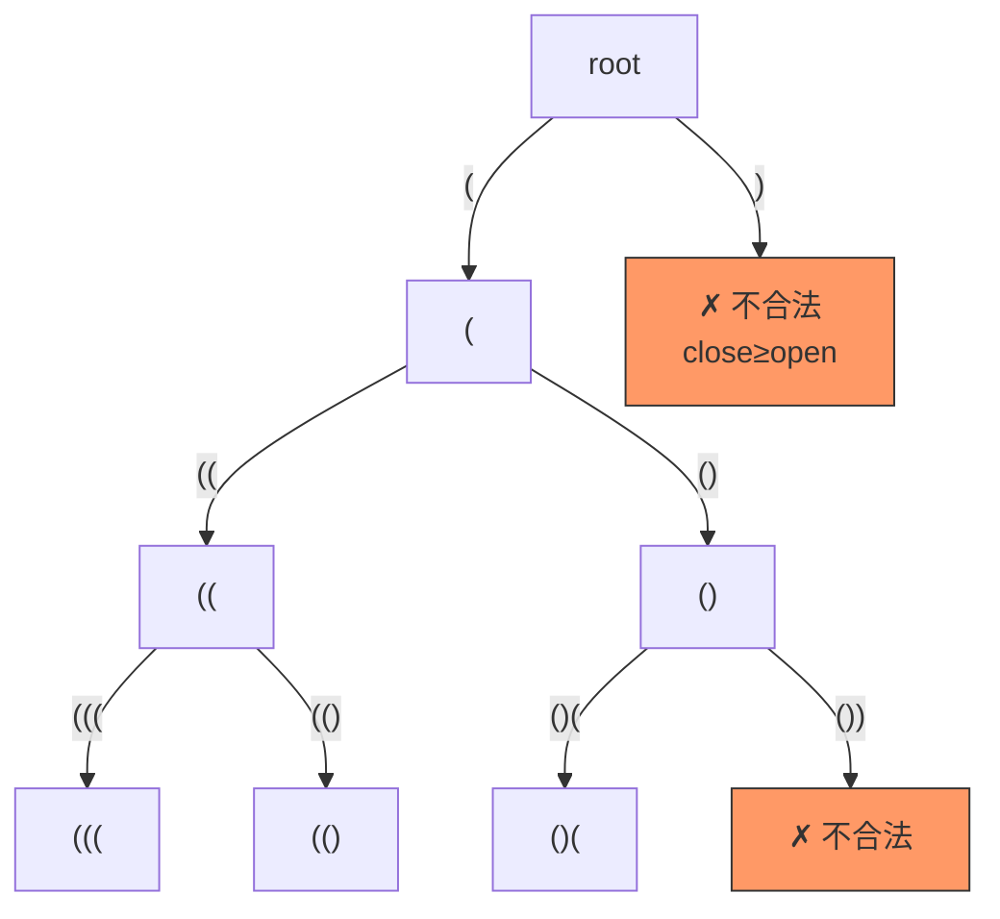

---

title: "括号生成"

difficulty: 中等

category: 回溯

tags:

  - leetcode

  - 回溯

  - backtracking

  - 数学

created: "2026-07-21"

---

# 22. 括号生成（Generate Parentheses）

> 难度：中等 | 主题：回溯——条件放括号

## 题目

数字 n 代表生成括号的对数，请你设计一个函数，用于能够生成所有可能的并且有效的括号组合。

**示例**

```python

输入：n = 3

输出：["((()))","(()())","(())()","()(())","()()()"]

```

---

## 思路
### 先讲个故事：装配流水线

工厂里有一条括号装配线。每个工位可以放左括号 `(` 或右括号 `)`，但要遵守两条铁律：

1. 左括号不能超过 n 个（原料有限）

2. **任何时候**，已放的右括号不能超过左括号（否则会出现 `)(` 这种废品）

只要遵守这两条，最终装出来的产品一定是合格品。

---

### 引导式推导：从暴力到剪枝

**第 1 层思维：暴力生成再校验**

生成所有 2²ⁿ 个括号序列，逐一检查是否合法。

但 2²ⁿ 增长太快——n=3 时 64 个序列，n=10 时就超过 100 万了。

**第 2 层思维：边生成边剪枝**

在生成过程中就保证有效性，需要的条件是：

| 条件 | 含义 | 为什么 |
|------|------|--------|
| `open < n` | 左括号没放满才能放 `(` | 不能超过 n 对 |
| `close < open` | 右括号少于左括号才能放 `)` | 保证前缀合法性 |

**第 3 层思维：深入理解 `close < open` 这个条件**

为什么 `close < open` 能保证最终序列一定合法？

```text

用数学归纳法想：

- 空串是合法的（0 个左 0 个右）

- 每次放 `(` → open+1，仍然合法

- 每次放 `)` → close+1，因为之前 close < open，所以 close+1 ≤ open，仍然合法

- 最终长度 2n 时，open=n, close=n，合法

```

**所以不需要事后校验！**

---

### 决策树可视化



---

## 代码

```python

class Solution:

    def generateParenthesis(self, n: int) -> list[str]:

        res = []

        def backtrack(cur: list[str], open_count: int, close_count: int):

            if len(cur) == 2 * n:

                res.append(''.join(cur))

                return

            if open_count < n:

                cur.append('(')

                backtrack(cur, open_count + 1, close_count)

                cur.pop()

            if close_count < open_count:

                cur.append(')')

                backtrack(cur, open_count, close_count + 1)

                cur.pop()

        backtrack([], 0, 0)

        return res

```

**注意**：两个 `if` 不是 `if-elif`——每一层可能同时满足两个条件（同时可以放 `(` 和 `)`）。

---

## 复杂度

| 指标 | 值 | 解释 |
|------|----|------|
| 时间 | O(4ⁿ / √n) | 卡特兰数 Cₙ = (2n)!/(n!(n+1)!) |
| 空间 | O(n) | 递归栈深度 2n |

---

## 实战考量
### 频率分析

> **出现在**：字节/阿里 一面回溯必考题，约 60% 常会考到回溯场景，其中 40% 用这题作为"条件驱动回溯"的代表。

### 延伸思考

**Q：为什么 `close < open` 是核心约束？**

A：保证不会出现 `)(` 这种非法前缀。任意前缀中右括号数不能超过左括号数，这是所有合法括号序列的充要条件。

**Q：时间复杂度为什么是卡特兰数？**

A：合法括号序列的数量 = 第 n 个卡特兰数。回溯的叶子节点数等于卡特兰数，每个叶子 O(1) 拼接。

**Q：为什么不需要事后校验括号合法性？**

A：按规则放出来的序列一定合法——`(` 不超 n，`)` 不超 `(`，保证了前缀合法且最终数量相等。这是"构造法"的思想。

**Q：为什么两个 `if` 不是 `if-elif`？**

A：每一层**可能同时**可以放 `(` 和放 `)`，这是两个独立的分支。用 `if-elif` 会漏掉一个分支。

### 易错点

- `cur.pop()` 必须写

- 两个 `if` 不是 `if-elif`

- 终止条件是 `len(cur) == 2 * n`

---

## 生活类比

> **排队打饭**

>

> 左括号是男生进食堂，右括号是女生进食堂。

> 规则是：任何时候，进食堂的女生人数不能超过男生人数（不然会出乱子）。

> 最后，男生和女生人数相等时，食堂正好满员。

>

> 只要遵守"女生数 ≤ 男生数"这个铁律，全程都不会出问题。

---

## 相关题目

| 题目 | 关系 |
|------|------|
| 17电话号码的字母组合 | 回溯同族（每层固定候选池） |
| [[32最长有效括号]] | 括号问题的 DP/栈解法 |
| [[46全排列]] | 回溯基础模板 |
| 22括号生成 | 本题 |

---

→ 返回题单：[[LeetCode学习路线图#十、回溯]]

## 速记卡（面试闪卡）

**Q1：一句话讲清「22. 括号生成（Generate Parentheses）」到底是什么？**

A：生成 n 对的所有合法括号组合：用回溯边生成边剪枝，靠「左不超 n、右不超左」保证前缀永远合法。

**Q2：题目：装配流水线铁律（backtracking with constraint） —— 怎么理解？**

A：生成所有 n 对有效括号，不是随便排。就像工厂装配线放 ( 或 )，两条铁律：左括号不超过 n 个（原料有限），且任何时刻右括号数不超过左括号数（否则出 )( 废品）。遵守这两条，装出来必合格。

**Q3：思路：close<open 为什么够（归纳法） —— 怎么理解？**

A：为什么只靠「close<open」就能保证最终合法？数学归纳：空串合法；放 ( → open+1 仍合法；放 ) 时因之前 close<open，close+1≤open 仍合法；到长度 2n 时 open=close=n。所以根本不需要事后校验——这是「构造法」思想。

**Q4：代码：双 if 回溯（两个独立分支） —— 怎么理解？**

A：回溯到长度 2n 就收工。open<n 才放 (；close<open 才放 )。注意两个 if 是并列不是 if-elif——同一层可能同时满足放 ( 和放 ) 两个分支，用 elif 会漏。每层记得 cur.pop() 回溯。

**Q5：复杂度与实战（卡特兰数 O(4ⁿ/√n)） —— 怎么理解？**

A：结果数 = 第 n 个卡特兰数 Cₙ=(2n)!/(n!(n+1)!)，时间 O(4ⁿ/√n)，空间 O(n) 递归栈。实战：字节/阿里一面回溯必考题，约 40% 用它代表「条件驱动回溯」。延伸：叶子数=卡特兰数，每个 O(1) 拼接；相关题 17 字母组合、46 全排列。

**Q6：核心速记主线有哪些？**

- 题目：生成 n 对全部合法括号组合

- 思路：左不超 n、右不超左，前缀必合法（构造法）

- 代码：双 if 并列递归，cur.pop() 回溯

- 复杂度：结果数=卡特兰数，时间 O(4ⁿ/√n)

- 实战：回溯必考题；别用 if-elif 漏分支

**口诀**

A：生成括号先谋规，

左不超n记心髓；

右超左时即刻退，

合法组合自然堆。

## 相关链接

- [[笔记/Leetcode笔记/10_回溯/77组合|组合]]

- [[笔记/Leetcode笔记/10_回溯/46全排列|全排列]]

- [[笔记/Leetcode笔记/10_回溯/39组合总和|组合总和]]

- [[笔记/Leetcode笔记/10_回溯/79单词搜索|单词搜索]]

- [[笔记/Leetcode笔记/10_回溯/47全排列II|全排列II]]

