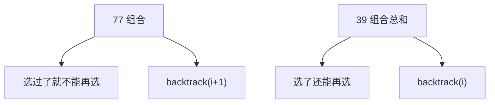
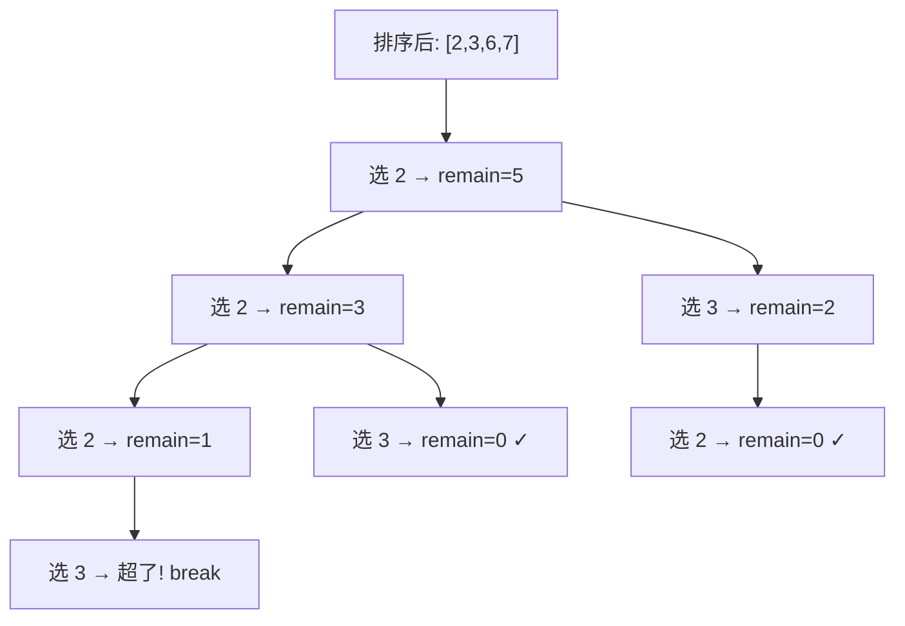

# 39. 组合总和（Combination Sum）

> 难度：中等 | 主题：回溯 + 排序剪枝，可重复选

## 题目

给你一个无重复元素的整数数组 candidates 和一个目标整数 target，找出 candidates 中可以使数字和为目标数 target 的所有不同组合。candidates 中的同一个数字可以无限制重复被选取。

**示例**
```python
输入：candidates = [2,3,6,7], target = 7
输出：[[2,2,3],[7]]
```

---

## 思路

### 先讲个故事：自助餐随便拿，但不能拿重样

自助餐厅里有一排菜：[2元区, 3元区, 6元区, 7元区]。
你拿着 7 块钱，每样菜可以拿无限份（只要不超预算），但**拿菜的顺序不重要**——拿一份 2 元菜再拿一份 3 元菜，和反过来一样。

关键约束：**只能从左往右走，不能回头**。这样 [2,3] 和 [3,2] 就不会同时出现。

---

### 引导式推导：从可重复到剪枝

**第 1 步：和第 77 题的区别**

77 题组合是 `[1, n]` 中选 k 个，每个数只能用一次（递归时 `i+1`）。
本题每个数可以用无限次（递归时 `i` 不动）。



**第 2 步：排序剪枝**

先把 candidates 排序。如果当前数 `x > remain`，后面更大的数一定也超——直接 `break`。



**第 3 步：剪枝前后对比**

```text
不剪枝：每个分支都会走到底，很多无效探索
剪枝后：x > remain 时整层砍掉（因为排序保证了后面的更大）
```

---

## 代码

```python
class Solution:
    def combinationSum(self, candidates: list[int], target: int) -> list[list[int]]:
        candidates.sort()
        res, path = [], []

        def dfs(start: int, remain: int):
            if remain == 0:
                res.append(path[:])
                return
            for i in range(start, len(candidates)):
                x = candidates[i]
                if x > remain:
                    break
                path.append(x)
                dfs(i, remain - x)
                path.pop()

        dfs(0, target)
        return res
```

---

## 复杂度

| 指标 | 值 | 解释 |
|------|----|------|
| 时间 | O(N^(T/M)) | N=数组长, M=最小值, T=target |
| 空间 | O(T/M) | 递归栈深度（最坏全选最小值） |

---

## 实战考量

### 频率分析

> **出现在**：字节/美团 一面回溯必考题，约 40% 常会从这题开始考察修剪优化意识。**30→40→90 系列的先导题**。

### 延伸思考

**Q：为什么 `dfs(i, remain - x)` 下标不改？**
A：允许重复选同一个元素。[2,2,3] 中 2 被选了两次，递归时 `start` 不能 +1。

**Q：为什么排序后 `x > remain` 可以 `break`？**
A：排序后后面的元素 ≥ x，最小的都超了，后面的更大，全部砍掉。

**Q：和 40 题的区别是什么？**
A：39 无重复元素且可重复选（`dfs(i)`）；40 有重复元素且不可重复选（`dfs(i+1)` + 同层去重）。

**Q：为什么用 `start` 参数控制不回头？**
A：组合不考虑顺序，[2,3] 和 [3,2] 是同一个组合。`start` 保证只往后选，自然避免了顺序重复。

**Q：如果 candidates 里有 0 呢？**
A：按题目约定所有元素为正整数。如果有 0 会导致无限递归（选 0 永远不减 remain）。

### 易错点

- `dfs(i, ...)` 不是 `dfs(i+1, ...)`
- 排序是剪枝前提
- `res.append(path[:])` 拷贝非引用
- `x > remain` 用 `break`（后面都更大），不是 `continue`

---

## 生活类比

> **自助餐的智慧**
>
> 你拿着 7 块钱进了自助餐厅。
> 先看一眼价目表，从最便宜的菜开始看（排序）。
> 如果连最便宜的都买不起了，更贵的想都别想（剪枝）。
> 拿起一份菜放到盘子里，如果超预算了就放回去试试别的（回溯）。
>
> **排序 + 剪枝 = 先看价目表，超了就扭头走人。**

---

## 相关题目

| 题目 | 关系 |
|------|------|
| [[40组合总和II]] | 有重复+不可重复选 |
| 77组合 | 固定长度版，不能重复 |
| 216组合总和III | 1-9 各用一次 |
| [[39组合总和]] | 本题 |

---

→ 返回题单：[[LeetCode学习清单#十、回溯]]
