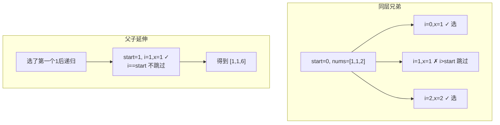
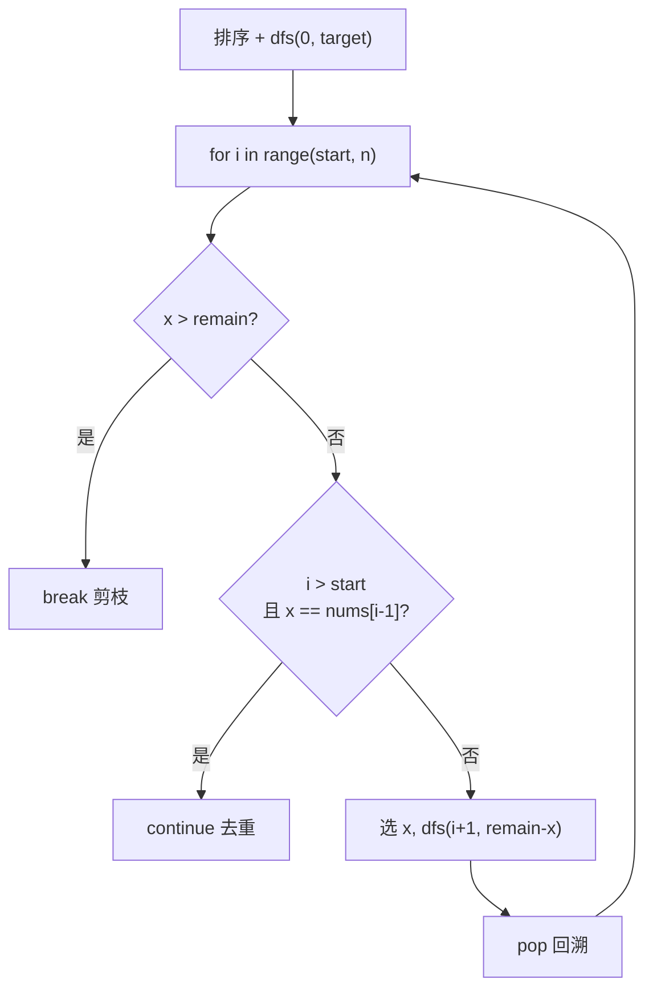

---

title: "组合总和II"

difficulty: 中等

category: 回溯

tags:

  - leetcode

  - 回溯

  - backtracking

  - 去重

created: "2026-07-21"

---

# 40. 组合总和 II（Combination Sum II）

> 难度：中等 | 主题：39 + 同层去重 + 不可重复选

## 题目

给定一个数组 candidates 和一个目标数 target，找出 candidates 中所有可以使数字和为 target 的组合。candidates 中的每个数字在每个组合中只能使用一次。

**示例**

```python

输入：candidates = [10,1,2,7,6,1,5], target = 8

输出：[[1,1,6],[1,2,5],[1,7],[2,6]]

```

---

## 思路
### 先讲个故事：菜市场买鸡蛋，每个只能用一次

你和邻居都去菜市场买菜，预算都是 8 块。

菜摊上有标价的菜，但**每样菜只能拿一份**（和 39 题不同）。

而且有些菜价格相同（比如有两个 1 块的鸡蛋），但它们是不同个——如果你拿第一个鸡蛋做番茄炒蛋，拿第二个鸡蛋做紫菜蛋花汤，那是同一种组合。

**关键**：同一层上，相同价格的菜，只用第一份试试就够了。

---

### 引导式推导：39 升级了两点

**与 39 题的关键区别：**

| 特性 | 39 | 40 |
|------|-----|-----|
| 元素是否重复 | 无重复 | **可能有重复** |
| 能否重复选同一个 | **可重复** | **每个只能用一次** |
| 递归参数 | `dfs(i, ...)` | `dfs(i+1, ...)` |
| 去重 | 不需要 | **同层去重** |

**同层去重为什么是 `i > start` 而不是 `i > 0`？**



`i > start` 区分了两种场景：

- **同层兄弟**：`i=1, start=0` → `i > start` → 跳过同值兄弟

- **父子延伸**：`i=1, start=1` → `i == start` → 不跳过，允许 `[1,1,6]`

---

### 决策流程图



---

## 代码

```python

class Solution:

    def combinationSum2(self, candidates: list[int], target: int) -> list[list[int]]:

        candidates.sort()

        res, path = [], []

        def dfs(start: int, remain: int):

            if remain == 0:

                res.append(path[:])

                return

            for i in range(start, len(candidates)):

                x = candidates[i]

                if x > remain:

                    break

                if i > start and x == candidates[i - 1]:

                    continue

                path.append(x)

                dfs(i + 1, remain - x)

                path.pop()

        dfs(0, target)

        return res

```

---

## 复杂度

| 指标 | 值 | 解释 |
|------|----|------|
| 时间 | O(2ⁿ × n) | 最坏每个元素选或不选 |
| 空间 | O(n) | 递归栈深度 |

---

## 实战考量
### 频率分析

> **出现在**：字节/美团 回溯去重题，约 30% 常会从 39 追问到这题。**核心考点是 `i > start` 的理解**。

### 延伸思考

**Q：为什么是 `i > start` 而不是 `i > 0`？**

A：`i > start` 区分同层兄弟（跳过）和父子延伸（允许）。`[1,1,6]` 中第二个 1 是第一个 1 的子节点，如果用 `i > 0` 会把 `[1,1,6]` 砍掉。

**Q：去重用 `continue` 还是 `break`？**

A：`continue`！同层后面可能还有不同值。`[1,1,2,3]` 跳过第二个 1 后还有 2 和 3。`break` 用于 `x > remain` 的剪枝。

**Q：为什么必须排序？**

A：不排序相同元素不挨着，`nums[i] == nums[i-1]` 去重失效。

**Q：和 39 题的区别？**

A：39 无重复 + 可重复选（`dfs(i)`）；40 有重复 + 不可重复选（`dfs(i+1)` + 同层去重）。

**Q：`dfs(i+1)` 和 `dfs(i)` 的区别？**

A：`dfs(i+1)` 表示当前元素用完后不能再用，`dfs(i)` 表示可以重复用。

### 易错点

- `i > start` 写成 `i > 0`

- 去重用 `continue` 不用 `break`

- `dfs(i+1)` 不是 `dfs(i)`

- 排序不能忘

---

## 生活类比

> **菜市场买菜，同价菜只尝一份**

>

> 你和邻居预算相同，各自买菜。

> 菜摊上可能有两个 1 块的鸡蛋。你拿第一个鸡蛋做番茄炒蛋，即使再拿第二个鸡蛋，做出来的还是番茄炒蛋（同样的组合）。

> 所以同层上相同价格的菜，试第一份就够了，后面的跳过。

> 但如果你已经拿了第一个鸡蛋，可以在下一层再拿第二个鸡蛋（做成 [鸡蛋, 鸡蛋] 的组合）。

>

> **兄弟去重，父子照用——这就是 `i > start` 的精髓。**

---

## 相关题目

| 题目 | 关系 |
|------|------|
| [[39组合总和]] | 无重复基础（可重复选） |
| 90子集II | 同样的排序+同层去重模板 |
| [[40组合总和II]] | 本题 |

---

→ 返回题单：[[LeetCode学习路线图#十、回溯]]

## 速记卡（面试闪卡）

**Q1：一句话讲清「40. 组合总和 II（Combination Sum II）」到底是什么？**

A：在可含重复数的数组里凑出和为 target 的组合，每个数只用一次，同层要去重。

**Q2：题目：菜市场同价菜（combination sum with duplicates） —— 怎么理解？**

A：你和邻居预算相同去买菜，每样菜只能拿一份，且两个 1 块鸡蛋是不同个——拿第一个做番茄炒蛋、再拿第二个还是同种组合。所以同层相同价只试第一份。

**Q3：思路：同层去重 i>start（backtracking dedup） —— 怎么理解？**

A：在 39 基础上加两点：递归 `dfs(i+1)` 保证每个数只用一次；同层用 `i>start and x==nums[i-1]` 跳过重复兄弟，但父子延伸（i==start）放行，从而保留 [1,1,6]。像兄弟去重、父子照用。

**Q4：代码：排序 + 剪枝（sort + prune） —— 怎么理解？**

A：先排序让相同数相邻；`for i in range(start,n)` 中 `x>remain` 就 break 剪枝，重复则 `continue`（不是 break）。选 x 后 `dfs(i+1, remain-x)`，回溯 pop。

**Q5：复杂度与实战（O(2ⁿ·n) time） —— 怎么理解？**

A：时间最坏 O(2ⁿ·n)，空间 O(n)。字节美团约 30% 从 39 追问到此，核心考点就是 `i>start` 而非 `i>0`；同层去重用 continue 别用 break。

**Q6：核心速记主线有哪些？**

- 题目：数组凑 target 组合，每数用一次、同层去重

- 思路：dfs(i+1) 不重复选，i>start 跳同值兄弟

- 代码：先排序，x>remain break，重复 continue

- 复杂度：时间 O(2ⁿ·n)、空间 O(n)

- 实战：i>start 非 i>0，去重用 continue

**口诀**

A：同价菜只尝一份先，

兄弟重复跳一边；

子承父业接着选，

组合不漏也不偏。

## 相关链接

- [[笔记/Leetcode笔记/10_回溯/47全排列II|全排列II]]

- [[笔记/Leetcode笔记/10_回溯/90子集II|子集II]]

- [[笔记/Leetcode笔记/10_回溯/39组合总和|组合总和]]

- [[笔记/Leetcode笔记/10_回溯/77组合|组合]]

- [[笔记/Leetcode笔记/10_回溯/17电话号码的字母组合|电话号码的字母组合]]

