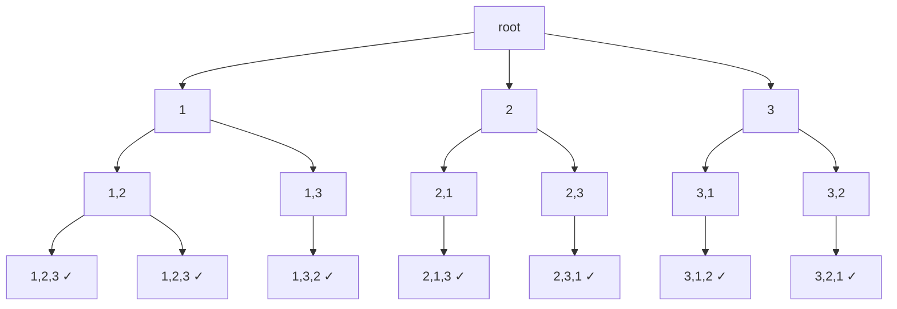

---

title: "全排列"

difficulty: 中等

category: 回溯

tags:

  - leetcode

  - 回溯

  - backtracking

created: "2026-07-21"

---

# 46. 全排列（Permutations）

> 难度：中等 | 主题：回溯——path + used

## 题目

给定一个不含重复数字的数组 nums，返回其所有可能的全排列。你可以按任意顺序返回答案。

**示例**

```python

输入：nums = [1,2,3]

输出：[[1,2,3],[1,3,2],[2,1,3],[2,3,1],[3,1,2],[3,2,1]]

```

---

## 思路
### 先讲个故事：排队拍照，位置不能重复站

老师带 3 个学生去拍照，要排成一排。

- 第 1 个位置：3 个人都能站

- 第 2 个位置：剩下 2 个人能站

- 第 3 个位置：最后 1 个人站

总共 3×2×1 = 6 种排法。

关键：**每个人只能站一个位置**，站过就不能再站了。

---

### 引导式推导：从决策树到模板

**第 1 步：画决策树**



**第 2 步：核心洞察**

每层选择一个未使用过的元素。用 `used` 数组标记已选元素，避免重复使用。到叶子时 path 长度 == n，加入结果。

**第 3 步：排列 vs 组合**

| 维度 | 排列（46） | 组合（77） |
|------|-----------|-----------|
| 顺序 | [1,2] 和 [2,1] 不同 | [1,2] 和 [2,1] 相同 |
| 每层候选 | 扫全数组 | 从 start 开始 |
| 去重方式 | `used` 数组 | `start` 参数 |

---

## 代码

```python

class Solution:

    def permute(self, nums: list[int]) -> list[list[int]]:

        n = len(nums)

        res, path = [], []

        used = [False] * n

        def dfs(i: int):

            if i == n:

                res.append(path[:])

                return

            for j in range(n):

                if not used[j]:

                    path.append(nums[j])

                    used[j] = True

                    dfs(i + 1)

                    path.pop()

                    used[j] = False

        dfs(0)

        return res

```

**为什么不用 `start` 参数？** 排列每层都能选任意未使用的元素，不需要限制起始位置。

---

## 复杂度

| 指标 | 值 | 解释 |
|------|----|------|
| 时间 | O(n × n!) | n! 个排列，每个拷贝长度 n |
| 空间 | O(n) | 递归栈 + used 数组 |

---

## 实战考量
### 频率分析

> **出现在**：字节/阿里 一面回溯必考题，约 50% 常会考到排列模板。**核心考点是排列和组合的区别**。

### 延伸思考

**Q：为什么 `dfs` 不需要 `start` 参数？**

A：排列每层都能选任意未使用的元素，不需要限制起始位置，只需要 `used` 标记已选。

**Q：为什么 `used` 数组的 True/False 切换必须在递归前后？**

A：递归前标记 True 表示"正在用"，递归后恢复 False 表示"用完了还回去"，让其他分支能用这个元素。

**Q：交换法（原地交换）的优缺点？**

A：省 `used` 数组空间，但结果不是字典序，且实践中容易写错交换还原逻辑。

**Q：时间复杂度为什么是 O(n × n!)？**

A：n! 个排列，每个排列拷贝长度为 n 的 path。

**Q：全排列 II（47 题）的区别？**

A：47 有重复元素，需要排序 + 同层去重 `not used[i-1]`。

### 易错点

- `used` 数组的 True/False 切换必须在递归前后

- `res.append(path[:])` 必须拷贝

- `path.pop()` 和 `used[j] = False` 都要还原

- 每层扫全数组（`for j in range(n)`），不是从 start 开始

---

## 生活类比

> **排队拍照，每人只能站一个位置**

>

> 老师喊"第一个位置，谁来？"——3 个人举手。

> 选了小明站第一个，第二个位置就只剩 2 个人能选了。

> 选了小红站第二个，第三个位置只剩小刚。

> 拍完照，小刚退回队伍（回溯），小红也退回，换小刚站第二个……

>

> **用过就标记，退回就还原——这就是排列回溯的 `used` 数组。**

---

## 相关题目

| 题目 | 关系 |
|------|------|
| [[47全排列II]] | 有重复进阶（排序+同层去重） |
| 17电话号码的字母组合 | 每层候选池独立的变体 |
| 77组合 | 组合基础（start 参数） |
| [[46全排列]] | 本题 |

---

→ 返回题单：[[LeetCode学习路线图#十、回溯]]

## 速记卡（面试闪卡）

**Q1：一句话讲清「46. 全排列（Permutations）」到底是什么？**

A：全排列是把 n 个不同元素排出所有顺序，本质是回溯里"选过就标记、退回就还原"。

**Q2：题目与决策树 —— 怎么理解？**

A：给一个无重复数字的数组，返回所有可能的排列。就像老师带学生拍照，第一个位置 3 人都能站、第二个剩 2 人、第三个剩 1 人，3×2×1=6 种（permutation）。

**Q3：核心机制——used 数组 —— 怎么理解？**

A：每层选一个未用过的元素，用 used 数组标记已选，到叶子 path 满就收。好比每人只能站一个位置，站过打勾，拍完照把人退回队伍让别的分支用（backtracking）。

**Q4：代码要点——为什么不用 start —— 怎么理解？**

A：排列每层都能选任意未用元素，所以不用组合那种 start 参数，只用 used 标记。递归前后必须 True→False 切换，且 res.append(path[:]) 要拷贝，否则全串味（DFS）。

**Q5：复杂度与易错点 —— 怎么理解？**

A：时间 O(n×n!)，n! 个排列每个拷贝长度 n；空间 O(n)。字节/阿里一面必考题，核心区分就在排列(used)与组合(start)（time complexity）。

**Q6：核心速记主线有哪些？**

- 本质：每层选未用元素，used 标记避免重复

- 还原：递归前后 used 切换，path 要拷贝

- 区别：排列用 used，组合用 start 参数

- 复杂度：时间 O(n×n!)，空间 O(n)

**口诀**

A：拍照排位不重复，用过打勾退回原；

每层全扫不守位，used 标中记载圈；

拷贝路径防串味，前后切换要周全；

排列组合区分清，一面稳过笑开颜。

## 相关链接

- [[笔记/Leetcode笔记/10_回溯/47全排列II|全排列II]]

- [[笔记/Leetcode笔记/10_回溯/17电话号码的字母组合|电话号码的字母组合]]

- [[笔记/Leetcode笔记/10_回溯/22括号生成|括号生成]]

- [[笔记/Leetcode笔记/10_回溯/77组合|组合]]

- [[笔记/Leetcode笔记/10_回溯/39组合总和|组合总和]]

