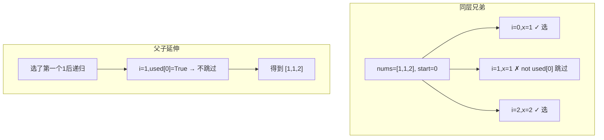

---

title: "全排列II"

difficulty: 中等

category: 回溯

tags:

  - leetcode

  - 回溯

  - backtracking

  - 去重

created: "2026-07-21"

---

# 47. 全排列 II（Permutations II）

> 难度：中等 | 主题：46 + 排序 + 同层去重

## 题目

给定一个可包含重复数字的序列 nums，按任意顺序返回所有不重复的全排列。

**示例**

```python

输入：nums = [1,1,2]

输出：[[1,1,2],[1,2,1],[2,1,1]]

```

---

## 思路
### 先讲个故事：双胞胎排队，谁先谁后不重要

学校有对双胞胎兄弟，长得一模一样。老师让他们和另一个同学排队拍照。

问题是：如果双胞胎弟弟站第一个、哥哥站第二个，和哥哥站第一个、弟弟站第二个——拍出来的照片**一模一样**。

怎么办？**规定双胞胎按编号大小站**：编号小的先站，编号大的后站。这样就不会重复了。

---

### 引导式推导：46 的升级

**与 46 题的区别：** 数组有重复元素。

单纯用 used 数组不够，需要在同一层跳过相同值：

```python

if used[i]: continue

if i > 0 and nums[i] == nums[i-1] and not used[i-1]: continue

```

**为什么是 `not used[i-1]`？**



`not used[i-1]` 表示同一层的前一个相同元素未被使用（回溯回来了），此时跳过避免重复。如果 `used[i-1]` 是 True，说明这是下一层递归，不应跳。

---

## 代码

```python

class Solution:

    def permuteUnique(self, nums: list[int]) -> list[list[int]]:

        nums.sort()

        res, path = [], []

        used = [False] * len(nums)

        def dfs():

            if len(path) == len(nums):

                res.append(path[:])

                return

            for i in range(len(nums)):

                if used[i]:

                    continue

                if i > 0 and nums[i] == nums[i-1] and not used[i-1]:

                    continue

                used[i] = True

                path.append(nums[i])

                dfs()

                path.pop()

                used[i] = False

        dfs()

        return res

```

---

## 复杂度

| 指标 | 值 | 解释 |
|------|----|------|
| 时间 | O(n × n!) | 最坏 n! 个排列 |
| 空间 | O(n) | 递归栈 + used 数组 |

---

## 实战考量
### 频率分析

> **出现在**：字节/阿里 回溯去重题，约 30% 常会从 46 追问到这题。**核心考点是 `not used[i-1]` 的理解**。

### 延伸思考

**Q：为什么是 `not used[i-1]` 而不是 `used[i-1]`？**

A：两种写法都行，但逻辑不同。`not used[i-1]` 表示「前一个相同值没被选 → 你在同层兄弟 → 跳过」；`used[i-1]` 表示「前一个相同值被选了 → 你在同层兄弟 → 跳过」。两种都能去重，`not` 写法效率更高（剪枝更早）。

**Q：为什么必须排序？**

A：不排序相同元素不挨着，`nums[i] == nums[i-1]` 去重失效。

**Q：去重用 `continue` 还是 `break`？**

A：`continue`！后面可能还有不同值可以选。

**Q：和 46 题的区别？**

A：46 无重复元素，不需要排序和去重；47 有重复元素，排序后同层去重。

### 易错点

- `not used[i-1]` 写成 `used[i-1]`（结果可能对但效率差）

- 排序不能忘

- `used[i]` 的 True/False 切换

- 去重用 `continue` 不用 `break`

---

## 生活类比

> **双胞胎排队，规定谁先谁后**

>

> 双胞胎长得一样，站位互换拍出来效果相同。

> 规定：双胞胎按编号排序，编号小的先站。

> 这样同层兄弟中，编号大的那个直接跳过，不重复尝试。

> 但如果是父子关系（第一个已经被选了），第二个还能继续选（站下一层）。

>

> **排序 + 同层去重 = 给双胞胎排队定规矩。**

---

## 相关题目

| 题目 | 关系 |
|------|------|
| [[46全排列]] | 无重复基础版 |
| [[40组合总和II]] | 组合场景的同层去重 |
| 90子集II | 子集场景的同层去重 |
| [[47全排列II]] | 本题 |

---

→ 返回题单：[[LeetCode学习路线图#十、回溯]]

## 速记卡（面试闪卡）

**Q1：一句话讲清「47. 全排列 II（Permutations II）」到底是什么？**

A：在含重复数字的序列里生成所有不重复的全排列，排序后同层跳过相同值。

**Q2：题目理解 —— 重复元素带来啥麻烦？ —— 怎么理解？**

A：像双胞胎排队拍照：兄弟互换站位拍出来一模一样，算重复。你要的是不重复的全体排列。英文：Permutations II。

**Q3：核心思路 —— 怎么避开重复？ —— 怎么理解？**

A：像给双胞胎定规矩：先按编号排序，同层遇到相同值且前一相同值已回溯回来就跳过。父子层则照常选。英文：Same-level Dedupe。

**Q4：代码实现 —— 那行关键判断？ —— 怎么理解？**

A：像发牌登记：used[i] 标已选；i>0 且 nums[i]==nums[i-1] 且 not used[i-1] 就 continue 跳过同层兄弟。英文：Backtracking + used[]。

**Q5：复杂度与实战 —— 为什么必须排序？ —— 怎么理解？**

A：像先排队再分身：不排序相同元素不挨着，去重失效；用 continue 而非 break，后面还有不同值可挑。英文：Sort-then-Prune。

**Q6：核心速记主线有哪些？**

- 先 nums.sort()，让相同元素相邻才能去重

- 同层去重：i>0 且 nums[i]==nums[i-1] 且 not used[i-1] 时跳过

- used[i-1] 为真说明在下一层递归，不跳过

- 去重用 continue 不是 break；used 状态正确切换

- 与 46 区别：46 无重复不需排序去重

**口诀**

A：重复排列孪生扰，

排序同层去重巧；

前兄未选即跳过的，

不重不漏全周到。

## 相关链接

- [[笔记/Leetcode笔记/10_回溯/90子集II|子集II]]

- [[笔记/Leetcode笔记/10_回溯/40组合总和II|组合总和II]]

- [[笔记/Leetcode笔记/10_回溯/46全排列|全排列]]

- [[笔记/Leetcode笔记/10_回溯/51N皇后|N皇后]]

- [[笔记/Leetcode笔记/10_回溯/78子集|子集]]

