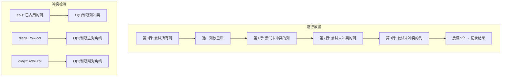

---

title: "N皇后"

difficulty: 困难

category: 回溯

tags:

  - leetcode

  - 回溯

  - backtracking

  - 数组

created: "2026-07-21"

---

# 51. N 皇后（N-Queens）

> 难度：困难 | 主题：回溯、数组、剪枝

## 题目

按照国际象棋的规则，皇后可以攻击与之处在同一行、同一列或同一斜线上的棋子。n 皇后问题研究的是如何将 n 个皇后放置在 n×n 的棋盘上，并且使皇后彼此之间不能相互攻击。给你一个整数 n，返回所有不同的 n 皇后问题的解决方案。

**示例**

```python

输入：n = 4

输出：[[".Q..","...Q","Q...","..Q."],["..Q.","Q...","...Q",".Q.."]]

```

---

## 思路
### 先讲个故事：选秀节目抢座位

选秀节目有 n 个选手抢 n 个座位。规则：

- 每排只能坐一个人（每行一个皇后）

- 每列只能坐一个人（每列一个皇后）

- 对角线方向也不能坐人（斜线攻击）

主持人喊"第一排，谁来坐？"——n 个人举手。选了一个人坐第一排后，第二排就少了一些选择（他占的列和对角线不能坐了）。

如果选到某一排发现没座位能坐了——退回去换人（回溯）。

---

### 引导式推导：逐行放置 + 冲突检测

**第 1 层：逐行放置**

每行确定一个皇后的列位置。回溯树深度为 n，每层分支数为 n。

**第 2 层：冲突检测优化**

用三个集合检测冲突：

- `cols`：已占用的列

- `diag1`：r + c 值（主对角线）

- `diag2`：r - c 值（副对角线）



**对角线性质**：同一主对角线上 r+c 为常数，同一副对角线上 r-c 为常数。

---

## 代码

```python

class Solution:

    def solveNQueens(self, n: int) -> list[list[str]]:

        result = []

        board = []

        cols = set()

        diag1 = set()

        diag2 = set()

        def backtrack(row: int):

            if row == n:

                result.append(['.' * c + 'Q' + '.' * (n - 1 - c) for c in board])

                return

            for col in range(n):

                if col in cols or (row - col) in diag1 or (row + col) in diag2:

                    continue

                board.append(col)

                cols.add(col)

                diag1.add(row - col)

                diag2.add(row + col)

                backtrack(row + 1)

                board.pop()

                cols.remove(col)

                diag1.remove(row - col)

                diag2.remove(row + col)

        backtrack(0)

        return result

```

---

## 复杂度

| 指标 | 值 | 解释 |
|------|----|------|
| 时间 | O(n!) | 第一行 n 种，第二行最多 n-1 种，... |
| 空间 | O(n) | 递归栈 + 三个集合 |

---

## 实战考量
### 频率分析

> **出现在**：字节/阿里 回溯经典题，约 25% 常会考到。**考察回溯框架和剪枝能力**。

### 延伸思考

**Q：怎么检查两个皇后是否在对角线上？**

A：`abs(r1 - r2) == abs(c1 - c2)`，或用集合 `r1 - c1 == r2 - c2`（主对角线）/ `r1 + c1 == r2 + c2`（副对角线）。

**Q：如果只返回方案数不返回具体方案呢？**

A：去掉 board 存储，只需要计数，代码更简洁。

**Q：n 最大能到多少？**

A：本题 n <= 9，实际回溯可以处理到 n=14 左右。更大的 n 需要位运算优化。

**Q：能不能用位运算优化？**

A：可以，用三个整数表示列和对角线的占用状态，状态压缩回溯，更快但更难理解。

### 易错点

- 回溯时记得撤销所有状态（board + cols + diag1 + diag2）

- 字符串构造时边界 `n - 1 - c`

- 对角线检查用两个集合

---

## 生活类比

> **选秀节目抢座位**

>

> n 个选手抢 n 个座位，每排一个、每列一个、对角线也不能撞。

> 主持人从第一排开始喊人，选了一个人就划掉他的列和对角线。

> 第二排从剩下的位置里选，继续划。

> 选到某一排发现没位置了——退回去换人，把划掉的恢复（回溯）。

>

> **逐行放置 + 集合剪枝 = 主持人喊人选座，划掉不能坐的位置。**

---

## 相关题目

| 题目 | 关系 |
|------|------|
| 52N皇后II | 只返回方案数 |
| 37解数独 | 类似填空格回溯 |
| 79单词搜索 | 二维回溯应用 |
| [[51N皇后]] | 本题 |

---

→ 返回题单：[[LeetCode学习路线图#十、回溯]]

## 速记卡（面试闪卡）

**Q1：一句话讲清「51. N 皇后（N-Queens）」到底是什么？**

A：在 n×n 棋盘放 n 个互相不攻击的皇后，求所有摆法。

**Q2：思路：逐行放置 + 三集合剪枝 —— 怎么理解？**

A：选秀抢座位：每排一个、每列一个、斜线也不能撞。主持人从第一排喊人，落座就划掉他的列和对角线——回溯（Backtracking）就是「没座了就退回去换人」。

**Q3：代码：集合记录冲突 —— 怎么理解？**

A：用三个集合（Set）分别记占用的列、主对角线、副对角线，O(1) 判断冲突；放下皇后就加进去，撤回就 remove——状态回溯（State Backtracking）干干净净。

**Q4：复杂度：时间与空间 —— 怎么理解？**

A：第一行 n 种、第二行最多 n-1 种……时间复杂度（Time Complexity）O(n!) 阶乘爆炸；空间复杂度（Space Complexity）O(n)，花在递归栈加三个集合上。

**Q5：生活类比：主持人喊座 —— 怎么理解？**

A：N 皇后（N-Queens）就是主持人喊人选座的游戏：每排一个、每列一个、对角线不撞。喊到某排没座了，把划掉的恢复（回溯 Backtracking），换个人接着喊。

**Q6：核心速记主线有哪些？**

- 逐行放置每行一皇后

- 三集合记列与对角线

- 回溯记得撤销状态

- 时间 O(n!) 空间 O(n)

**口诀**

A：N 后落子逐行排，

列斜不撞记心怀。

卡住回退重洗牌，

回溯还原摆出来。

## 相关链接

- [[笔记/Leetcode笔记/10_回溯/47全排列II|全排列II]]

- [[笔记/Leetcode笔记/10_回溯/78子集|子集]]

- [[笔记/Leetcode笔记/10_回溯/77组合|组合]]

- [[笔记/Leetcode笔记/10_回溯/22括号生成|括号生成]]

- [[笔记/Leetcode笔记/10_回溯/79单词搜索|单词搜索]]

