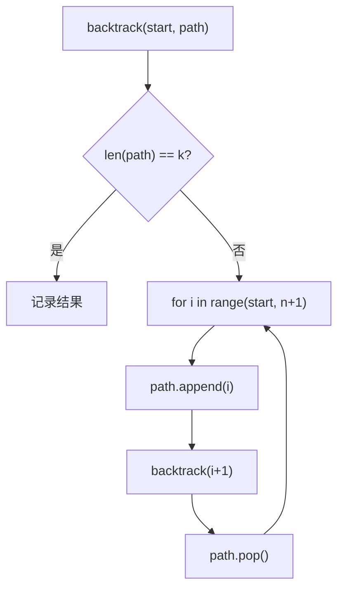

---

title: "组合"

difficulty: 中等

category: 回溯

tags:

  - leetcode

  - 回溯

  - backtracking

created: "2026-07-21"

---

# 77. 组合（Combinations）

> 难度：中等 | 主题：回溯、组合

## 题目

给定两个整数 n 和 k，返回范围 [1, n] 中所有可能的 k 个数的组合。你可以按任何顺序返回答案。

**示例**

```python

输入：n = 4, k = 2

输出：[[1,2],[1,3],[1,4],[2,3],[2,4],[3,4]]

```

---

## 思路
### 先讲个故事：抽奖箱，每次只能摸一张

抽奖箱里有 1~n 号球，你要摸 k 张出来。

规则：**摸出来的球按从小到大排列**。摸出 [1,2] 和 [2,1] 算同一种结果。

怎么保证不重复？**从左往右摸，摸过的球不再摸第二次。**

---

### 引导式推导：从模板到剪枝

**第 1 步：回溯模板（最基础版）**



**第 2 步：剪枝优化**

如果剩余可选数不够凑满 k，提前终止。

```python

# 但只剩 n - start + 1 个可选

if k - len(path) > n - start + 1:

    return

```

**第 3 步：组合 vs 排列**

| 维度 | 组合（77） | 排列（46） |

|------|-----------|-----------|

| 顺序 | [1,2] 和 [2,1] 相同 | [1,2] 和 [2,1] 不同 |

| 每层候选 | 从 start 开始 | 扫全数组 |

| 去重方式 | `start` 参数 | `used` 数组 |

---

## 代码

```python

class Solution:

    def combine(self, n: int, k: int) -> list[list[int]]:

        result = []

        path = []

        def backtrack(start: int):

            if k - len(path) > n - start + 1:

                return

            if len(path) == k:

                result.append(path[:])

                return

            for i in range(start, n + 1):

                path.append(i)

                backtrack(i + 1)

                path.pop()

        backtrack(1)

        return result

```

---

## 复杂度

| 指标 | 值 | 解释 |

|------|----|------|

| 时间 | O(C(n,k) × k) | C(n,k) 个组合，每个拷贝长度 k |

| 空间 | O(k) | 递归栈深度 k |

---

## 实战考量
### 频率分析

> **出现在**：字节/美团 一面回溯入门题，约 30% 从这题开始。**核心考点是组合和排列的区别**。

### 延伸思考

**Q：如果允许重复选同一个数呢？**

A：递归时 `backtrack(i)` 而不是 `i+1`，类似 [[39组合总和]]。

**Q：如果要求组合和为 target 呢？**

A：类似 [[39组合总和]]，加目标和剪枝。

**Q：怎么求所有子集？**

A：不是长度达到 k 才记录，而是每步都记录当前 path，类似 78子集。

**Q：为什么递归从 `i+1` 开始不是 `start+1`？**

A：`i+1` 保证不回头选之前的元素。`start+1` 会跳过一些合法组合。

### 易错点

- `path[:]` 必须拷贝

- 递归从 `i+1` 开始不是 `start+1`

- 剪枝条件用 `>` 不是 `>=`

- 从 1 开始不是 0

---

## 生活类比

> **抽奖箱，摸 k 张球**

>

> 箱子里有 1~n 号球，你要摸 k 张。

> 为了不重复，你定了个规矩：**从左往右摸，摸过的球不再摸**。

> 摸到第 k 张，记下结果，退回去换一张再摸。

>

> **start 参数 = "从哪里开始摸"，保证不回头。**

---

## 相关题目

| 题目 | 关系 |

|------|------|

| 78子集 | 求所有子集 |

| [[39组合总和]] | 组合和为 target，可重复选 |

| [[46全排列]] | 考虑顺序 |

| 77组合 | 本题 |

---

→ 返回题单：[[LeetCode学习路线图#十、回溯]]

## 速记卡（面试闪卡）

**Q1：一句话讲清「77. 组合（Combinations）」到底是什么？**

A：《组合》用回溯从 1~n 中无放回地选 k 个数，start 参数保证不重复。

**Q2：题目 —— 怎么理解？**

A：像摸球不回头：给 n、k，返回 [1,n] 中所有可能的 k 个数组合；题目（Problem）要的是所有组合。

**Q3：思路 —— 怎么理解？**

A：像抽奖箱摸 k 张：从左往右摸、摸过不再摸，递归回溯（Backtracking）加剪枝（剩余不够提前停）；组合与排列区别在于不关心顺序。

**Q4：代码 —— 怎么理解？**

A：backtrack(start)：满 k 记录，for i in range(start,n+1) 选 i、递归 i+1、pop 回退；代码（Code）path[:] 须拷贝。

**Q5：复杂度 —— 怎么理解？**

A：像枚举所有组合：时间 O(C(n,k)×k) 拷贝长度 k，空间 O(k) 递归栈；复杂度（Complexity）随组合数爆炸。

**Q6：核心速记主线有哪些？**

- 题目：从 1~n 选 k 个不重复组合

- 思路：回溯加剪枝，start 防回头重复

- 代码：backtrack 递归 i+1，path 拷贝

- 复杂度：时间 O(C(n,k)×k)，空间 O(k)

**口诀**

A：组合摸球走，

start 防回头；

满k即记录，

回溯剪枝收。

## 相关链接

- [[笔记/Leetcode笔记/10_回溯/39组合总和|组合总和]]

- [[笔记/Leetcode笔记/10_回溯/40组合总和II|组合总和II]]

- [[笔记/Leetcode笔记/10_回溯/17电话号码的字母组合|电话号码的字母组合]]

- [[笔记/Leetcode笔记/10_回溯/22括号生成|括号生成]]

- [[笔记/Leetcode笔记/10_回溯/79单词搜索|单词搜索]]

