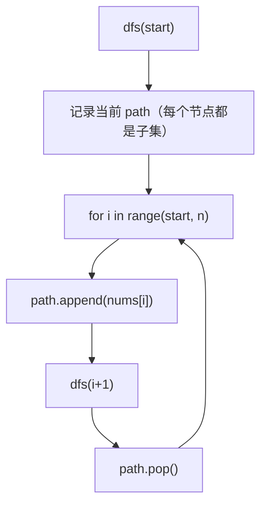
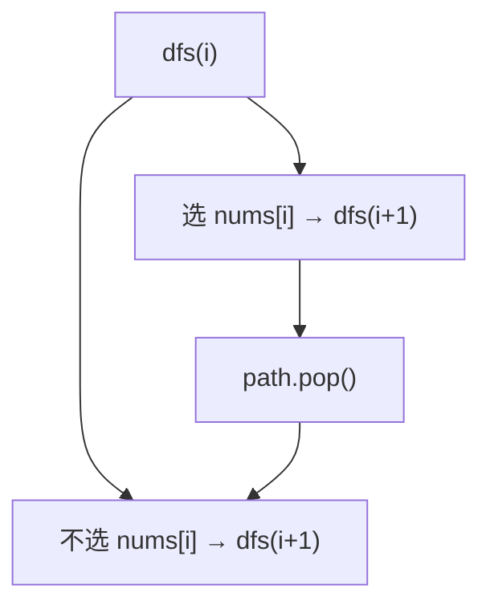

---

title: "子集"

difficulty: 中等

category: 回溯

tags:

  - leetcode

  - 回溯

  - backtracking

created: "2026-07-21"

---

# 78. 子集（Subsets）

> 难度：中等 | 主题：回溯模板——for 循环 + start

## 题目

给你一个整数数组 nums，数组中的元素互不相同。返回该数组所有可能的子集（幂集）。解集不能包含重复的子集。

**示例**

```python

输入：nums = [1,2,3]

输出：[[],[1],[2],[3],[1,2],[1,3],[2,3],[1,2,3]]

```

---

## 思路
### 先讲个故事：打包行李，每件衣服带或不带

出门旅行，行李箱里有 [T恤, 裤子, 帽子] 三件。

每件衣服有两个选择：**带 or 不带**。

- 带 T恤，带裤子，带帽子 → [T恤, 裤子, 帽子]

- 带 T恤，带裤子，不带帽子 → [T恤, 裤子]

- 带 T恤，不带裤子，带帽子 → [T恤, 帽子]

- ...

2³ = 8 种可能（包括什么都不带 → 空集）。

---

### 引导式推导：两种思路

**第 1 层：for 循环版（推荐）**



关键区别：**在每个节点都记录路径**，不只是叶子节点。

**第 2 层：选/不选版**



**两种思路对比：**

| 维度 | for 循环版 | 选/不选版 |
|------|-----------|----------|
| 记录时机 | 每个节点 | 只在叶子 |
| 递归树 | n 叉树 | 二叉树 |
| 去重场景 | 统一模板（90题） | 需要额外处理 |

---

## 代码

```python

class Solution:

    def subsets(self, nums: list[int]) -> list[list[int]]:

        res, path = [], []

        def dfs(start: int):

            res.append(path[:])

            for i in range(start, len(nums)):

                path.append(nums[i])

                dfs(i + 1)

                path.pop()

        dfs(0)

        return res

```

选/不选版：

```python

def dfs(i: int):

    if i == len(nums):

        res.append(path[:])

        return

    path.append(nums[i])

    dfs(i + 1)

    path.pop()

    dfs(i + 1)

```

---

## 复杂度

| 指标 | 值 | 解释 |
|------|----|------|
| 时间 | O(n·2ⁿ) | 2ⁿ 个子集，每个拷贝长度 n |
| 空间 | O(n) | 递归栈深度 |

---

## 实战考量
### 频率分析

> **出现在**：字节/美团 一面回溯入门题，约 25% 常会考到。**核心考点是子集和组合的区别**。

### 延伸思考

**Q：为什么 `res.append(path[:])` 放在 `dfs` 开头而不是结尾？**

A：子集问题每个节点都是有效结果（包括空集），而组合问题只有叶子节点是有效结果。所以子集在进入递归时就记录当前路径。

**Q：for 循环版和选/不选版有什么区别？**

A：for 循环版在每个节点记录路径，适合子集类问题；选/不选版只在叶子记录，递归树是二叉树。for 循环版与 90 题模板统一，便于迁移到去重场景。

**Q：为什么不会重复？**

A：`start` 参数保证每次只从当前索引往后选，不会回头选之前的元素，避免 `[1,2]` 和 `[2,1]` 同时出现。

**Q：时间复杂度为什么是 O(n·2ⁿ)？**

A：2ⁿ 个子集，每个子集拷贝长度为 n 的 path（最坏情况）。

### 易错点

- `res.append(path[:])` 拷贝非引用

- `path.pop()` 选完记得撤销

- for 循环版在每个节点记录路径；选/不选版只在叶子记录

- `dfs(i+1)` 不是 `dfs(i)`

---

## 生活类比

> **打包行李，每件衣服带或不带**

>

> 你面前摊着 T恤、裤子、帽子三件。

> 从 T恤开始：先拿起来（带），递归处理下一件；放下（不带），继续递归下一件。

> 每一步都是一个完整的行李组合——不一定等到全部选完才记录。

>

> **每个节点都是子集——这就是"进递归就记录"的含义。**

---

## 相关题目

| 题目 | 关系 |
|------|------|
| 90子集II | 有重复进阶（排序+同层去重） |
| 77组合 | 固定长度版 |
| [[39组合总和]] | 组合和为 target |
| 78子集 | 本题 |

---

→ 返回题单：[[LeetCode学习路线图#十、回溯]]

## 速记卡（面试闪卡）

**Q1：一句话讲清「78. 子集（Subsets）」到底是什么？**

A：返回一个数组所有不包含重复的子集（幂集）。

**Q2：思路 —— 怎么理解？**

A：像打包行李每件带或不带：从 T恤 开始，拿/放递归下一件，每个节点都是完整组合。核心 Backtracking（回溯）每个节点都记录路径。

**Q3：代码 —— 怎么理解？**

A：for 循环版：dfs(start) 开头就 res.append(path[:])，再 for i in range(start,n) 选 nums[i]、dfs(i+1)、pop。start 保证不回头选避免重复。

**Q4：复杂度 —— 怎么理解？**

A：时间 O(n·2ⁿ)（2ⁿ 个子集各拷贝长度 n 的 path），空间 O(n)（递归栈深度）。

**Q5：实战考量 —— 怎么理解？**

A：字节/美团一面回溯入门，核心考点是子集 vs 组合区别——子集每个节点都记录（含空集），组合只在叶子。易错：append 要拷贝、pop 撤销。

**Q6：核心速记主线有哪些？**

- 每件元素带或不带，2ⁿ 个子集含空集

- 回溯每个节点都记录路径（非仅叶子）

- start 参数避免回头选，防 [1,2]/[2,1] 重复

- 时间 O(n·2ⁿ)，append 用 path[:] 拷贝

**口诀**

A：子集像装箱

带否各一方

每步都记录

2的n次方

## 相关链接

- [[笔记/Leetcode笔记/10_回溯/90子集II|子集II]]

- [[笔记/Leetcode笔记/10_回溯/47全排列II|全排列II]]

- [[笔记/Leetcode笔记/10_回溯/51N皇后|N皇后]]

- [[笔记/Leetcode笔记/10_回溯/77组合|组合]]

- [[笔记/Leetcode笔记/10_回溯/22括号生成|括号生成]]

