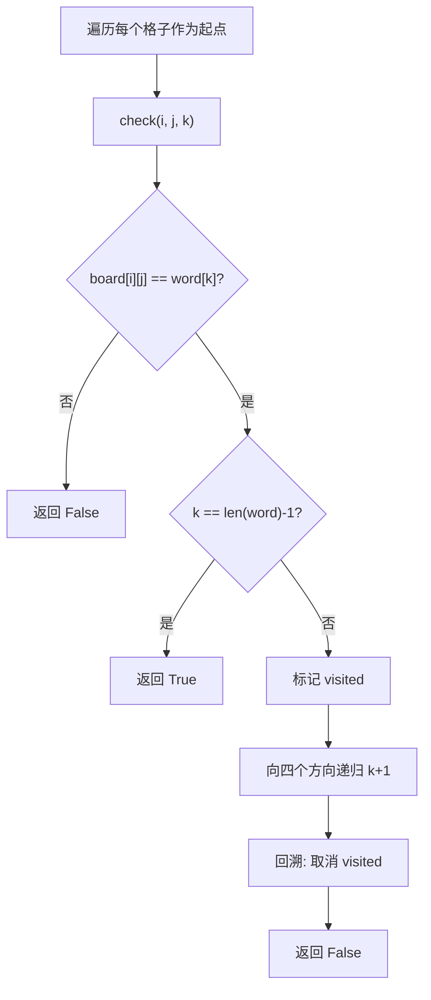

---

title: "单词搜索"

difficulty: 中等

category: 回溯

tags:

  - leetcode

  - 回溯

  - backtracking

  - 二维网格

created: "2026-07-21"

---

# 79. 单词搜索（Word Search）

> 难度：中等 | 主题：回溯 + visited 标记

## 题目

给定一个 m x n 二维字符网格 board 和一个字符串单词 word。如果 word 存在于网格中，返回 true；否则返回 false。单词必须按照字母顺序，通过相邻的单元格内的字母构成。

**示例**

```python

输入：board = [["A","B","C","E"],["S","F","C","S"],["A","D","E","E"]], word = "ABCCED"

输出：true

```

---

## 思路
### 先讲个故事：寻宝游戏，每步只能走相邻格子

你拿到一张藏宝图（二维网格），要按顺序踩过字母拼出单词。

规则：

- 从任意格子出发

- 每次只能走上下左右相邻的格子

- **踩过的格子不能再踩**（visited 标记）

- 找到完整单词就赢了

---

### 引导式推导：DFS 回溯 + 剪枝

**核心流程：**



**关键优化：** 第一次 4 方向，之后每次 3 方向（不能往回走），所以是 3^L 而不是 4^L。

---

## 代码

```python

class Solution:

    def exist(self, board: list[list[str]], word: str) -> bool:

        h, w = len(board), len(board[0])

        visited = [[False] * w for _ in range(h)]

        def check(i: int, j: int, k: int) -> bool:

            if board[i][j] != word[k]:

                return False

            if k == len(word) - 1:

                return True

            visited[i][j] = True

            for di, dj in ((0,1), (0,-1), (1,0), (-1,0)):

                ni, nj = i + di, j + dj

                if 0 <= ni < h and 0 <= nj < w and not visited[ni][nj]:

                    if check(ni, nj, k + 1):

                        return True

            visited[i][j] = False

            return False

        return any(check(i, j, 0) for i in range(h) for j in range(w))

```

---

## 复杂度

| 指标 | 值 | 解释 |
|------|----|------|
| 时间 | O(M × N × 3^L) | M×N 个起点，每个 3^L 路径 |
| 空间 | O(M × N) | visited 数组 |

---

## 实战考量
### 频率分析

> **出现在**：字节/美团 回溯题，约 20% 常会考到。**考察二维网格回溯和剪枝**。

### 延伸思考

**Q：为什么 `visited` 要在递归前设为 True，递归后重置为 False？**

A：同一条路径不能重复踩同一个格子，但不同路径之间互不影响。重置是回溯的核心——撤销选择，让其他路径可以走这个格子。

**Q：时间复杂度为什么是 O(M × N × 3^L)？**

A：M×N 个起点，每个起点最多探索 3^L 条路径（第一次 4 方向，之后每次 3 方向，因为不能往回走）。

**Q：能不能不新建 `visited` 数组，原地修改 board？**

A：可以：`board[i][j] = '#'` 标记已访问，回溯时还原原字符。省空间但需说明会修改输入。

**Q：如果 word 很长怎么办？**

A：3^L 指数增长，需要剪枝：统计 board 和 word 的字符频率，word 中某个字符比 board 中多就直接返回 False。

### 易错点

- `visited[i][j]` 必须重置

- 先判断当前字符匹配再判断 `k == len(word)-1`

- 四方向索引不能越界

---

## 生活类比

> **寻宝游戏，踩过的格子不能再踩**

>

> 拿着藏宝图，按顺序踩字母拼单词。

> 每踩一个格子就插个小旗（visited），表示"我来过"。

> 走到死胡同就拔掉小旗退回来（回溯），换条路试试。

>

> **插旗 → 走 → 拔旗退 → 换路——这就是二维回溯的标准动作。**

---

## 相关题目

| 题目 | 关系 |
|------|------|
| 200岛屿数量 | 二维网格 DFS 基础 |
| [[51N皇后]] | 二维回溯进阶 |
| 208实现Trie前缀树 | Trie 优化（单词搜索 II） |
| 79单词搜索 | 本题 |

---

→ 返回题单：[[LeetCode学习路线图#十、回溯]]

## 速记卡（面试闪卡）

**Q1：一句话讲清「79. 单词搜索（Word Search）」到底是什么？**

A：单词搜索是在二维字符网格中，沿上下左右相邻格子按顺序拼出目标单词的回溯题。

**Q2：题目 —— 怎么理解？**

A：像拿着藏宝图按顺序踩字母：从任意格子出发，每次只能走上下左右相邻格，踩过的格子插旗标记（visited）不能再踩，拼完整单词才算赢。Word Search（单词搜索）。

**Q3：思路 —— 怎么理解？**

A：像寻宝时插旗走迷宫：DFS 往四个方向试探，进入格子插旗（标记 visited），走不通就拔旗退回换路（回溯）。关键优化：第一次 4 方向、之后 3 方向，复杂度 3^L 而非 4^L。Depth-First Search（深度优先搜索）。

**Q4：代码 —— 怎么理解？**

A：像按固定套路探路：写 check(i,j,k) 递归，先判当前字母是否匹配，匹配则标记 visited、向四方向递归 k+1，返回前撤销标记（回溯）。越界与已访问都要兜住。Backtracking（回溯）。

**Q5：复杂度 —— 怎么理解？**

A：像评估探宝成本：时间 O(M×N×3^L)（M×N 个起点，每个最多 3^L 条路径），空间 O(M×N) 给 visited 数组。Time/Space Complexity（时间与空间复杂度）。

**Q6：核心速记主线有哪些？**

- 题目：二维网格中按相邻字母顺序拼出目标单词

- 思路：DFS + 回溯 + visited 标记，第一次 4 方向之后 3 方向

- 代码：check 递归，匹配即标记、四方向试探、返回撤销

- 复杂度：时间 O(M×N×3^L)，空间 O(M×N)

**口诀**

A：网格踩字走相邻，插旗标记防重走

不通拔旗换条路，DFS 回溯是正途

首步四向后三步，三的 L 次幂记熟

时间 M N 乘三 L，空间网格一整张

## 相关链接

- [[笔记/Leetcode笔记/10_回溯/77组合|组合]]

- [[笔记/Leetcode笔记/10_回溯/22括号生成|括号生成]]

- [[笔记/Leetcode笔记/10_回溯/47全排列II|全排列II]]

- [[笔记/Leetcode笔记/10_回溯/51N皇后|N皇后]]

- [[笔记/Leetcode笔记/10_回溯/78子集|子集]]

