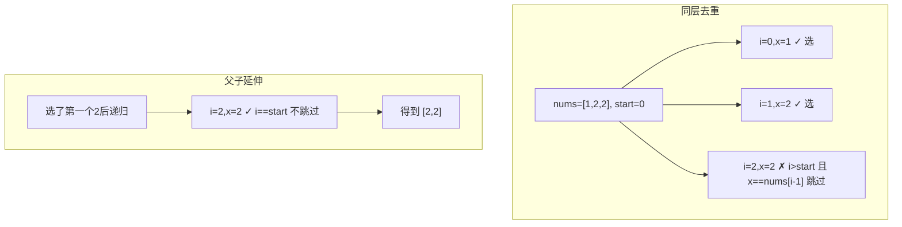

# 90. 子集 II（Subsets II）

> 难度：中等 | 主题：78 + 排序 + 同层去重

## 题目

给你一个整数数组 nums，其中可能包含重复元素，请你返回该数组所有可能的子集（幂集）。解集不能包含重复的子集。

**示例**
```python
输入：nums = [1,2,2]
输出：[[],[1],[1,2],[1,2,2],[2],[2,2]]
```

---

## 思路

### 先讲个故事：打包行李，双胞胎衣服只带一套

出门旅行，行李箱里有 [T恤, 牛仔裤, 牛仔裤]——两件一模一样的牛仔裤。
带哪件拍出来效果都一样，所以**同层只试一件就够了**。

---

### 引导式推导：78 的一行升级

**与 78 题的区别：** 数组有重复，需要去重。

去重逻辑同 40 题（组合总和 II）：排序后，同一层跳过相同值。



**关键**：`i > start` 区分同层兄弟（跳过）和父子延伸（合法——产生 `[2,2]`）。

---

## 代码

```python
class Solution:
    def subsetsWithDup(self, nums: list[int]) -> list[list[int]]:
        nums.sort()
        res, path = [], []

        def dfs(start: int):
            res.append(path[:])
            for i in range(start, len(nums)):
                if i > start and nums[i] == nums[i - 1]:
                    continue
                path.append(nums[i])
                dfs(i + 1)
                path.pop()

        dfs(0)
        return res
```

---

## 复杂度

| 指标 | 值 | 解释 |
|------|----|------|
| 时间 | O(n·2ⁿ) | 2ⁿ 个子集，每个拷贝长度 n |
| 空间 | O(n) | 递归栈深度 |

---

## 实战考量

### 频率分析

> **出现在**：字节/美团 回溯去重题，约 25% 常会从 78 追问到这题。**核心考点是 `i > start` 的理解**。

### 延伸思考

**Q：为什么是 `i > start` 而不是 `i > 0`？**
A：和 40 题一样，`i > start` 区分同层兄弟（跳过）和父子延伸（允许）。`[2,2]` 是合法子集，第二个 2 是第一个 2 的子节点，必须保留。

**Q：去重用 `continue` 还是 `break`？**
A：`continue`！同层后面可能还有不同值。`[1,2,2,3]` 跳过第二个 2 后还有 3 可以选。

**Q：为什么必须排序？**
A：不排序相同元素不挨着，去重条件 `nums[i] == nums[i-1]` 失效。

**Q：和 78 题的区别？**
A：78 无重复元素，不需要排序和去重；90 有重复元素，模板上加一行去重。

### 易错点

- 必须先排序
- `i > start` 不是 `i > 0`
- 去重用 `continue` 不用 `break`
- 与 78 只差一行，模板统一

---

## 生活类比

> **打包行李，双胞胎衣服只带一套**
>
> 行李箱里有两件一模一样的牛仔裤，带哪件效果都一样。
> 你定了个规矩：**同层只试第一件**。
> 但如果你已经拿了一件（父子关系），下一层还能再拿第二件（凑成 [牛仔裤, 牛仔裤]）。
>
> **兄弟去重，父子照用——这就是 `i > start` 的精髓。**

---

## 相关题目

| 题目 | 关系 |
|------|------|
| 78子集 | 无重复基础版 |
| [[40组合总和II]] | 同样的排序+同层去重模板 |
| [[47全排列II]] | 排列场景的同层去重 |
| 90子集II | 本题 |

---

→ 返回题单：[[LeetCode学习清单#十、回溯]]
