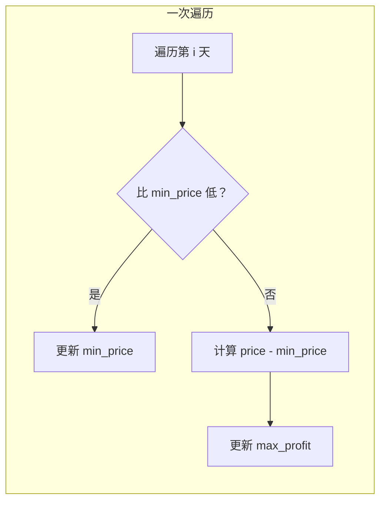

# 121. 买卖股票的最佳时机

> 难度：简单 | 主题：贪心——一次遍历

## 题目

给定一个数组 prices，第 i 个元素表示第 i 天的股价。只能买卖**一次**（先买后卖），求最大利润。如果不能获利，返回 0。

**示例：**
```text
[7,1,5,3,6,4] → 5
第 2 天买（1），第 5 天卖（6），利润 5
```

---

## 思路

### 先讲个故事：集市上的古董商

你是个古董商，只能**进一件货、出一件货**。你知道未来每天的报价，问哪天买哪天卖赚最多？

直觉：你不会在最高点买，也不会在最低点卖（因为必须先买后卖）。真正的约束是——你只能在**过去的最低点**买，在**未来的某天**卖。

每天唯一能做的决策就是：**如果今天卖，利润 = 今天价格 - 历史最低价**。所有天的利润取最大，就是答案。

---

### 引导式推导：从暴力到贪心

**第 1 层：暴力 O(n²)**
枚举所有 (i, j) 买卖对，i < j，取利润最大值。

**第 2 层：一次遍历 O(n)**

```python
min_price = inf
max_profit = 0
for price in prices:
    min_price = min(min_price, price)
    max_profit = max(max_profit, price - min_price)
```

**为什么贪心成立？**

历史最低价不会因为后面的价格改变。每天的最佳卖出利润 = 当天价 - 之前最低价。全局最优就是所有天的局部最优的最大值。



---

## 代码

```python
def maxProfit(self, prices: list[int]) -> int:
    min_price = float('inf')
    max_profit = 0
    for price in prices:
        max_profit = max(price - min_price, max_profit)  # 先算利润
        min_price = min(price, min_price)                # 再更新最低价
    return max_profit
```

也可用 DP（hold/cash 两状态），扩展性强但本题贪心更简洁。

---

## 复杂度

| 指标 | 值 | 解释 |
|------|----|------|
| 时间 | O(n) | 遍历一次 |
| 空间 | O(1) | 两个变量 |
| 暴力 | O(n²) | 枚举所有买卖对 |

---

## 实战考量

### 频率分析

> **股票系列基础题**，约 40% 常会从此题开始考察贪心或 DP。一面热身常见。

### 延伸思考

**Q：为什么贪心是对的？不会错过最优解吗？**
A：每天的最佳卖出利润 = 当天价 - 之前最低价。全局最优是所有天中该值的最大值。贪心维护"之前最低价"保证了每个局部最优都是当天最优，取 max 即全局最优。

**Q：为什么先算利润再更新最低价？**
A：假设今天卖出，用今天之前的最低价算利润；然后才考虑今天是否成为以后的最低价。顺序反了会导致用今天的价格买今天卖（利润 0）。

**Q：如果允许多次交易呢？**
A：→ 122买卖股票的最佳时机II，累加所有正差价。

**Q：如果最多两次呢？**
A：→ 123买卖股票的最佳时机III，五状态 DP 状态机。

**Q：DP 状态机怎么写？**
A：`cash = max(cash, hold + price)`，`hold = max(hold, -price)`。是股票系列（含冷冻期、手续费）的统一模板。

### 易错点

- `min_price` 初始化为 `inf` 不是 0
- 先算利润再更新最低价——逻辑顺序不能反
- 全局最低可能出现在最佳卖出之后，不能先找最低再找最高

---

## 生活类比

> **集市古董商 → 一次遍历**
>
> 你每天逛集市，记下见过的最便宜的古董价格。
> 如果今天价格比之前高，算算能赚多少；如果比之前低，更新"见过的最低价"。
> 逛完集市，你带走的是"最大可能的利润"。
>
> 贪心的本质就是：**每天做局部最优决策（记录最低价、计算当天利润），最后取全局最大**。

---

## 相关题目

| 题目 | 关系 |
|------|------|
| 122买卖股票的最佳时机II | 无限次交易，累加正差价 |
| [[309最佳买卖股票时机含冷冻期]] | 含冷冻期，状态机 DP |
| 123买卖股票的最佳时机III | 最多两次，五状态 DP |
| [[53最大子数组和]] | 类似贪心 + 一次遍历 |

---

→ 返回题单：[[LeetCode学习清单#十一、贪心]]

## 速记卡（面试闪卡）

**Q1：一句话讲清「121. 买卖股票的最佳时机」到底是什么？**
A：给定一个数组 prices，第 i 个元素表示第 i 天的股价。只能买卖**一次**（先买后卖），求最大利润。如果不能获利，返回 0。
**示例：**
---

**Q2：题目 —— 怎么理解？**
A：给定一个数组 prices，第 i 个元素表示第 i 天的股价。只能买卖**一次**（先买后卖），求最大利润。如果不能获利，返回 0。
**示例：**
---

**Q3：思路 —— 怎么理解？**
A：你是个古董商，只能**进一件货、出一件货**。你知道未来每天的报价，问哪天买哪天卖赚最多？
直觉：你不会在最高点买，也不会在最低点卖（因为必须先买后卖）。真正的约束是——你只能在**过去的最低点**买，在**未来的某天**卖。
每天唯一能做的决策就是：**如果今天卖，利润 = 今天价格 - 历史最低价**。所有天的利润取最大，就是答案。

**Q4：代码 —— 怎么理解？**
A：也可用 DP（hold/cash 两状态），扩展性强但本题贪心更简洁。
---

**Q5：复杂度 —— 怎么理解？**
A：| 指标 | 值 | 解释 |
|------|----|------|
| 时间 | O(n) | 遍历一次 |
| 空间 | O(1) | 两个变量 |
| 暴力 | O(n²) | 枚举所有买卖对 |
---

**Q6：核心速记主线有哪些？**
A：抓住这几根：题目、思路、代码、复杂度、实战考量、生活类比。

