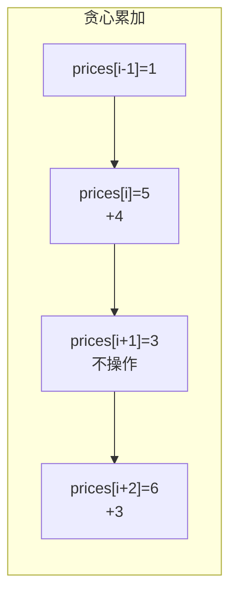

# 122. 买卖股票的最佳时机 II

> 难度：中等 | 主题：贪心——累加正差价

## 题目

给定数组 prices，可以**无限次**买卖（但不能同时持有）。每次买卖赚差价，求最大总利润。

**示例：**
```text
[7,1,5,3,6,4] → 7
第 2 天买第 3 天卖（+4），第 4 天买第 5 天卖（+3），总利润 7
```

---

## 思路

### 先讲个故事：菜市场的鱼贩

你是菜市场鱼贩，每天鱼价都在变。你可以**每天买卖无数次**，但不能空手套白狼——手里没鱼就不能卖。

你发现一个规律：只要今天比昨天贵，昨天买今天卖就能赚。虽然单次赚得不多，但积少成多。

关键是你不需要预测未来，只需要看**相邻两天**就够了。

---

### 引导式推导：从峰谷到累加

**直觉误区**：很多人想找"谷底买、峰顶卖"，但这需要知道未来走势。

**正确的贪心**：只要 prices[i] > prices[i-1]，就在 i-1 买入、i 卖出。把所有正差价累加。

```python
for i in range(1, len(prices)):
    if prices[i] > prices[i-1]:
        profit += prices[i] - prices[i-1]
```

**为什么等价于峰谷策略？**

累加所有上涨段 = 在谷底买入、峰顶卖出。因为中间的回调被拆成了"卖出再买入"。



---

## 代码

```python
def maxProfit(self, prices):
    profit = 0
    for i in range(1, len(prices)):
        if prices[i] > prices[i-1]:
            profit += prices[i] - prices[i-1]
    return profit
```

---

## 复杂度

| 指标 | 值 | 解释 |
|------|----|------|
| 时间 | O(n) | 遍历一次 |
| 空间 | O(1) | 一个变量 |

---

## 实战考量

### 频率分析

> **贪心入门题**，常作为 121 的追问出现，考察对问题性质的洞察。

### 延伸思考

**Q：为什么不需要找峰谷？**
A：因为可以当天卖出再买入。连续上涨的每一天都可以赚差价，累加等价于在谷底买、峰顶卖。

**Q：如果只能交易一次呢？**
A：→ 121买卖股票的最佳时机，维护最低价和最大差值。

**Q：如果最多交易 k 次呢？**
A：DP 状态机，`dp[i][k][0/1]` 表示第 i 天交易 k 次后持有/不持有的最大利润。

**Q：如果有冷冻期呢？**
A：→ [[309最佳买卖股票时机含冷冻期]]，卖出后第二天不能买入。

### 易错点

- 不需要同时持有才能卖，每次正差值独立累加
- 不是找峰谷差值，是所有正差值之和

---

## 生活类比

> **鱼贩子 → 累加正差价**
>
> 你不需要知道鱼价会不会涨到天上去。
> 只要今天比昨天贵 1 块，你就赚这 1 块。
> 明天比今天又贵 1 块，再赚 1 块。
>
> **积小胜为大胜**，就是 II 和 I 的本质区别。

---

## 相关题目

| 题目 | 关系 |
|------|------|
| 121买卖股票的最佳时机 | 只能交易一次 |
| 123买卖股票的最佳时机III | 最多两次 |
| [[309最佳买卖股票时机含冷冻期]] | 含冷冻期，状态机 DP |
| 714买卖股票的最佳时机含手续费 | 含手续费，状态机 DP |

---

→ 返回题单：[[LeetCode学习清单#十一、贪心]]
