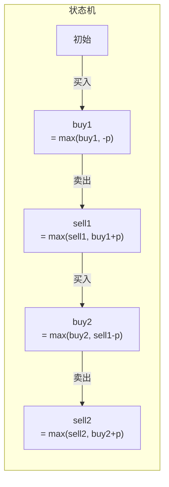

# 123. 买卖股票的最佳时机 III

> 难度：困难 | 主题：DP——状态机

## 题目

给定数组 prices，最多可以完成**两笔交易**（买入+卖出算一笔），求最大利润。

**示例：**
```text
[3,3,5,0,0,3,1,4] → 6
第 4 天买（0），第 6 天卖（3），第 7 天买（1），第 8 天卖（4），利润 = 3 + 3 = 6
```

---

## 思路

### 先讲个故事：炒股只能买卖两次

你账户里最多同时持有 1 股。你最多能来回倒腾两次。

相当于你的人生有两次"上车下车"机会。每天你可以：
- 空仓 → 买（第一次上车）
- 持有 → 卖（第一次下车）
- 空仓 → 买（第二次上车）
- 持有 → 卖（第二次下车）

---

### 引导式推导：从切割到状态机

**暴力直觉**：把数组切成两段，每段各做一次 121买卖股票的最佳时机，取两段和的最大值。O(n²)。

**状态机优化**：每天有 4 个状态：



状态转移就是"保持当前状态"或"从上一个状态过来"。

---

## 代码

```python
def maxProfit(prices):
    buy1 = buy2 = float('-inf')
    sell1 = sell2 = 0

    for p in prices:
        buy1 = max(buy1, -p)            # 第一次买入：要么不买，要么用现金买
        sell1 = max(sell1, buy1 + p)    # 第一次卖出：要么不卖，要么卖
        buy2 = max(buy2, sell1 - p)     # 第二次买入：用第一次卖出的利润
        sell2 = max(sell2, buy2 + p)    # 第二次卖出

    return sell2
```

---

## 复杂度

| 指标 | 值 | 解释 |
|------|----|------|
| 时间 | O(n) | 一次遍历 |
| 空间 | O(1) | 4 个变量 |

---

## 实战考量

### 频率分析

> **股票系列进阶题**，约 20% 常会从 121 一路追问到 III 或 IV，考察 DP 状态机泛化能力。

### 延伸思考

**Q：状态更新顺序为什么是 buy1 → sell1 → buy2 → sell2？**
A：依赖关系——buy2 依赖 sell1（需要第一次卖出的钱才能第二次买），sell2 依赖 buy2。如果乱序，可能用当天的值更新，变成同一天买卖。

**Q：buy1/buy2 为什么初始化为负无穷？**
A：表示"不可能"状态。第一天不可能已经完成了第一次卖出，所以 sell1=0 即可。buy1 初始为 -p 的相反数。

**Q：怎么推广到 K 笔交易？**
A：→ 188买卖股票的最佳时机IV，用两个数组 `buy[k]` 和 `sell[k]` 循环更新。

### 易错点

- buy1/buy2 初始为负无穷（或 `-prices[0]`）
- 更新顺序不能乱
- sell2 是最终答案，不是 max(sell1, sell2)

---

## 生活类比

> **两次上车下车 → 四状态 DP**
>
> 你最多坐两趟公交车。
> 第一次上车花钱（buy1），下车收钱（sell1）。
> 第二次上车花钱（buy2），下车收钱（sell2）。
>
> 每天你都可以决定"上不上车"或"下不下车"。
> 状态机的本质就是：**把人生压缩成几个状态，每天做一次选择**。

---

## 相关题目

| 题目 | 关系 |
|------|------|
| 121买卖股票的最佳时机 | 1 笔交易 |
| 122买卖股票的最佳时机II | 无限笔交易 |
| 188买卖股票的最佳时机IV | K 笔交易，本题的泛化 |
| [[309最佳买卖股票时机含冷冻期]] | 含冷冻期 |

---

→ 返回题单：[[LeetCode学习清单#十一、贪心]]

## 速记卡（面试闪卡）

**Q1：一句话讲清「123. 买卖股票的最佳时机 III」到底是什么？**
A：给定数组 prices，最多可以完成**两笔交易**（买入+卖出算一笔），求最大利润。
**示例：**
---

**Q2：题目 —— 怎么理解？**
A：给定数组 prices，最多可以完成**两笔交易**（买入+卖出算一笔），求最大利润。
**示例：**
---

**Q3：思路 —— 怎么理解？**
A：你账户里最多同时持有 1 股。你最多能来回倒腾两次。
相当于你的人生有两次"上车下车"机会。每天你可以：
空仓 → 买（第一次上车）
持有 → 卖（第一次下车）
空仓 → 买（第二次上车）
持有 → 卖（第二次下车）
---
**暴力直觉**：把数组切成两段，每段各做一次 121买卖股票的最佳时机，取两段和的最大值。O(n²)。
**状态机优化**：每天有 4 个状态：
状态转移就是"保持当前状态"或"从上一个状态过来"。
---

**Q4：代码 —— 怎么理解？**
A：---

**Q5：复杂度 —— 怎么理解？**
A：| 指标 | 值 | 解释 |
|------|----|------|
| 时间 | O(n) | 一次遍历 |
| 空间 | O(1) | 4 个变量 |
---

**Q6：核心速记主线有哪些？**
A：抓住这几根：题目、思路、代码、复杂度、实战考量、生活类比。

