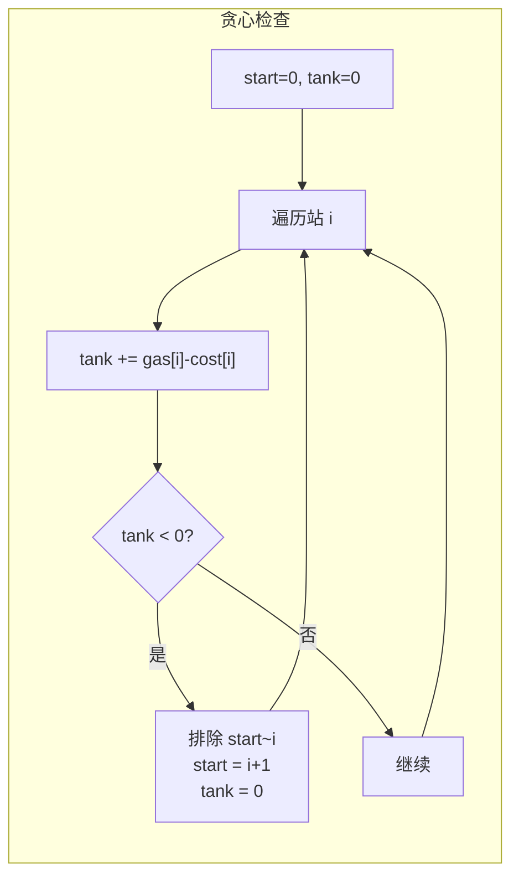

# 134. 加油站

> 难度：中等 | 主题：贪心——失败区间排除

## 题目

环形路线有 n 个加油站，gas[i] 是第 i 站的油量，cost[i] 是 i→i+1 的油耗。油箱无限，找能绕一圈的起点，否则返回 -1。

**示例：**
```text
gas = [1,2,3,4,5], cost = [3,4,5,1,2] → 3
从站 3 出发，剩余油量：4→3→2→1→0→(回到站 3 时有油)
```

---

## 思路

### 先讲个故事：沙漠越野

你开一辆越野车穿越沙漠环形路线。每个补给站能加一定量的油，到下个站的油耗是固定的。

你发现一个规律：如果从起点 A 出发，到站 B 就没油了，那么 A 到 B 之间的任何一个站都不能作为起点。

为什么？因为你从 A 出发时油最多（油箱空的，出发时加的油全在），经过每个站还有盈余。从中间站出发，起点就少了 A 到中间站积累的盈余，更到不了 B。

---

### 引导式推导：从暴力到贪心排除

**核心定理**：如果总油量 ≥ 总消耗，一定有解。

**贪心策略**：
1. 遍历每个站，维护 `tank`（当前油量）和 `start`（候选起点）
2. 如果 `tank < 0`，说明从 start 到当前站之间的任何站都不能作为起点
3. 从下一站重新开始



---

## 代码

```python
def canCompleteCircuit(self, gas, cost):
    n = len(gas)
    total_tank = 0
    curr_tank = 0
    start = 0

    for i in range(n):
        total_tank += gas[i] - cost[i]
        curr_tank += gas[i] - cost[i]

        if curr_tank < 0:
            start = i + 1
            curr_tank = 0

    return start if total_tank >= 0 else -1
```

---

## 复杂度

| 指标 | 值 | 解释 |
|------|----|------|
| 时间 | O(n) | 遍历一次 |
| 空间 | O(1) | 几个变量 |
| 暴力 | O(n²) | 试每个起点 |

---

## 实战考量

### 频率分析

> **贪心经典题**，约 25% 一面考察"失败区间整体排除"的思维。

### 延伸思考

**Q：怎么证明 total ≥ 0 就一定有解？**
A：反证法。如果所有起点都失败，总消耗 > 总供给，与 total ≥ 0 矛盾。因为每次失败都会消耗一段的净油量，累加所有段的消耗 > 总油量。

**Q：为什么 start 到 i 之间都不能作为起点？**
A：从 start 出发积累的盈余都用来走到 i 了还欠费。从中间任何站出发，少了前面积累的盈余，更走不到 i+1。

**Q：如果不要求环形，只走一段呢？**
A：变成最大子数组和（[[53最大子数组和]]），Kadane 算法。

### 易错点

- `curr_tank < 0` 时重置，不是 `<= 0`
- 返回前判断 `total_tank >= 0`
- start 可能超出范围（此时 total_tank < 0 返回 -1）

---

## 生活类比

> **沙漠越野 → 失败区间排除**
>
> 你从 A 出发到 C 没油了，证明 A、B 都不能作为起点。
> 因为从 A 出发时油量是最满的（刚加完），经过 B 还有盈余都到不了 C；
> 从 B 出发油量更少（少了 A 到 B 的盈余），更到不了 C。
>
> **一个区间整体排除**，就是贪心最性感的地方。

---

## 相关题目

| 题目 | 关系 |
|------|------|
| [[45跳跃游戏II]] | 类似范围覆盖 |
| [[53最大子数组和]] | Kadane 算法，类似贪心 |
| [[55跳跃游戏]] | 可达性判断 |

---

→ 返回题单：[[LeetCode学习清单#十一、贪心]]
