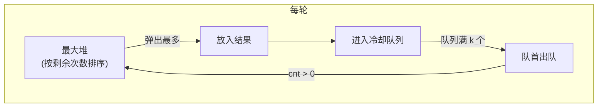

---

title: "K距间隔重排字符串"

difficulty: 困难

category: 贪心

tags:

  - leetcode

  - 贪心

created: "2026-07-21"

---

# 358. K 距离间隔重排字符串

> 难度：困难 | 主题：贪心 + 最大堆 + 冷却队列

## 题目

给定非空字符串 s 和整数 k，重排使**相同字符间隔 ≥ k**。存在返回任意方案，否则返回空串。

**示例：**

```text

s = "aabbcc", k = 3 → "abcabc"

```

---

## 思路
### 先讲个故事：排课表的冷却规则

你是教务处长，同一门课不能连续两天上，必须间隔至少 k 天。最频繁的课是"瓶颈"——它决定了排课表的最短周期。

你要做的：每次选**剩余课时最多**且已"冷却结束"的课来排。

---

### 引导式推导：从直觉到堆+队列

**暴力直觉**：生成所有排列检查条件。不可行。

**贪心思路**：每次选"剩余次数最多且距上次放置超过 k"的字符。

**最大堆 + 冷却队列**：



堆保证总是选剩余次数最多的字符。冷却队列保证间隔 ≥ k。

---

## 代码

```python

from collections import Counter, deque

import heapq

def rearrangeString(s, k):

    if k <= 1:

        return s

    counter = Counter(s)

    heap = [(-cnt, ch) for ch, cnt in counter.items()]

    heapq.heapify(heap)

    queue = deque()

    res = []

    while heap:

        cnt, ch = heapq.heappop(heap)

        cnt = -cnt

        res.append(ch)

        cnt -= 1

        queue.append((cnt, ch))

        if len(queue) >= k:

            old_cnt, old_ch = queue.popleft()

            if old_cnt > 0:

                heapq.heappush(heap, (-old_cnt, old_ch))

    return ''.join(res) if len(res) == len(s) else ""

```

---

## 复杂度

| 指标 | 值 | 解释 |
|------|----|------|
| 时间 | O(n log C) | C ≤ 26，常数级 |
| 空间 | O(n) | 结果 + 队列 |

---

## 实战考量
### 频率分析

> **困难题但思路固定**，约 15% 常会出，重点考察"冷却队列 + 最大堆"的配合。

### 延伸思考

**Q：为什么用最大堆而不是普通队列？**

A：必须优先放剩余次数最多的字符，否则后面可能不够位置放，导致无解。

**Q：怎么判断无解？**

A：堆空了但结果还没完成 → 剩余字符放不进冷却间隙。

**Q：和 [[621任务调度器]] 的区别？**

A：621 是 CPU 任务调度，间隔用 time 单位，公式法可解；本题要求具体排列，必须模拟。

### 易错点

- k ≤ 1 时直接返回原串

- 堆空了但结果没完成 → 无解

- 冷却队列长度达到 k 时才出队

---

## 生活类比

> **排课表 → 最大堆 + 冷却队列**

>

> 数学课最多，优先排数学。排完一节进"冷却池"。

> 等冷却池里的课"解冻"了，才能再次排。

>

> 这就像自助餐厅的限流：最受欢迎的菜多备几份，

> 但每个人拿完后必须等别人轮一圈才能再拿。

---

## 相关题目

| 题目 | 关系 |
|------|------|
| [[621任务调度器]] | 类似冷却概念，但 621 用公式法 |
| 767重构字符串 | 间隔至少 2 的简化版 |

---

→ 返回题单：[[LeetCode学习路线图#十一、贪心]]

## 速记卡（面试闪卡）

**Q1：一句话讲清「358. K 距离间隔重排字符串」到底是什么？**

A：重排字符串让相同字符至少隔 k 个位置，能排就排，排不出来返回空串。

**Q2：题目怎么理解？ —— 怎么理解？**

A：教务排课：同一门课不能连着上，得隔 k 天；最受欢迎的课是瓶颈，决定最短排课周期。这是 K 距冷却间隔重排（K-distance interval rearrangement）。

**Q3：为什么用最大堆？ —— 怎么理解？**

A：每次优先排"剩余课时最多"的课，像总先发最抢手的菜，否则后面没位置放导致无解。这是按剩余次数排序的最大堆（max-heap by remaining count）。

**Q4：冷却队列干嘛的？ —— 怎么理解？**

A：排完一节就进"冷却池"，等池子满 k 节（前 k 个都轮过一圈）才解冻、允许再排，从而卡住间隔。这是冷却队列（cooldown queue）。

**Q5：复杂度和实战怎么理解？ —— 怎么理解？**

A：困难题但套路固定，约15%会出，重点考堆+队列的配合。时间 O(n log C)（C≤26），空间 O(n)。

**Q6：核心速记主线有哪些？**

- 题目：相同字符间隔 ≥ k，否则返回空

- 核心：最大堆选剩余最多的，冷却队列控间隔

- 无解：堆空了结果还没凑齐

- 实战：困难题套路固定，考堆+队列配合

**口诀**

A：重排字符串隔k距，

最大堆里挑最频；

排完进冷却队列，

满k才放再登场。

## 相关链接

- [[笔记/Leetcode笔记/11_贪心/122买卖股票的最佳时机II|买卖股票的最佳时机II]]

- [[笔记/Leetcode笔记/11_贪心/134加油站|加油站]]

- [[笔记/Leetcode笔记/11_贪心/121买卖股票的最佳时机|买卖股票的最佳时机]]

- [[笔记/Leetcode笔记/11_贪心/45跳跃游戏II|跳跃游戏II]]

- [[笔记/Leetcode笔记/11_贪心/763划分字母区间|划分字母区间]]

